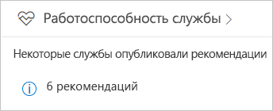
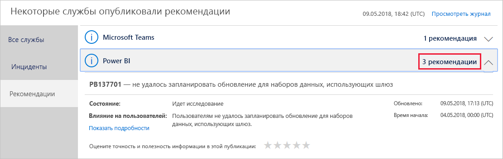
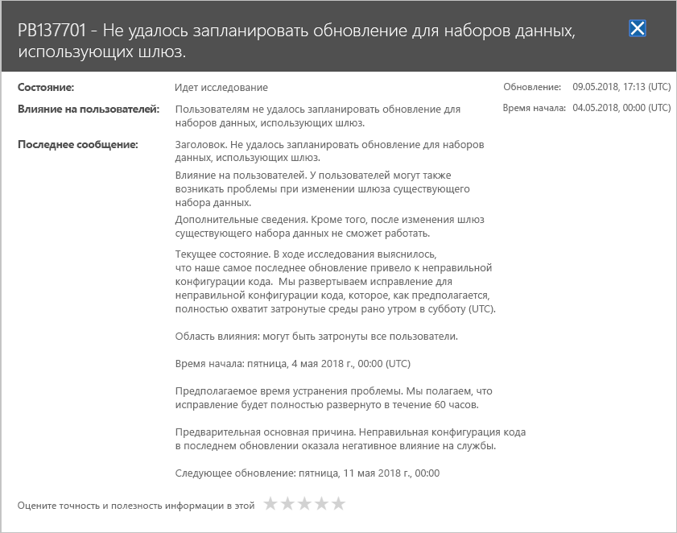

# Отслеживание работоспособности службы Power BI в Office 365

Центр администрирования Microsoft 365 предоставляет важные средства для администраторов Power BI. Эти средства предоставляют текущие и исторические сведения о работоспособности службы. Для получения такой информации требуется одна из следующих ролей:

* Администратор службы Power BI

* Глобальный администратор Office 365

Дополнительные сведения о ролях см. в разделе [Роли администратора, связанные с Power BI](service-admin-administering-power-bi-in-your-organization.md#administrator-roles-related-to-power-bi).

1. Войдите в [Центр администрирования Microsoft 365](https://portal.office.com/adminportal).

1. На панели навигации слева выберите **Показать все** > **Работоспособность** > **Работоспособность службы**. Появится страница "Работоспособность службы":

    

1. В списке **Все службы** выберите **Advisories** (Рекомендации) или **Инциденты** и просмотрите результаты. На снимке экрана ниже отображается одна из трех активных рекомендаций.

    

1. Чтобы просмотреть дополнительные сведения, выберите **Показать подробности** для нужного элемента. На снимке экрана ниже представлена панель дополнительных сведений с актуальными обновлениями состояния.

    

    Прокрутите вниз, чтобы просмотреть другие сведения, а затем закройте эту панель.

1. Чтобы увидеть исторические данные о всех службах, в правом верхнем углу страницы **Работоспособность службы** выберите **Просмотреть журнал**. Выберите вариант **За последние 7 дней** или **За последние 30 дней**. 

1. Чтобы вернуться к актуальной информации о работоспособности службы, выберите **Просмотреть текущее состояние**.