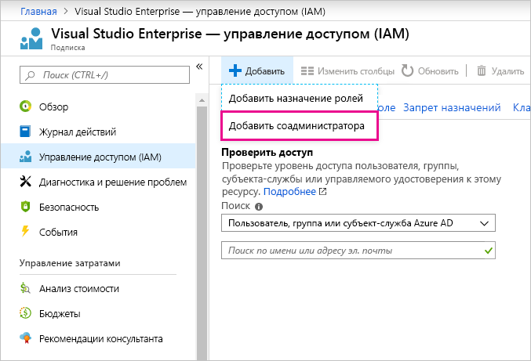

# Использование одних и тех же учетных данных для входа в Power BI и Azure

Если вы являетесь пользователем Power BI и Azure, вы можете использовать одинаковые учетные данные входа для обеих служб, чтобы не вводить пароль дважды.

Вход в Power BI выполняется с использованием вашей учетной записи в организации, связанной с вашим рабочим или учебным адресом электронной почты.  Вход в Azure выполняется с использованием учетной записи Майкрософт или вашей учетной записи в организации.

Если вы хотите использовать одинаковые учетные данные входа для Azure и Power BI, зарегистрироваться в Azure необходимо с использованием вашей учетной записи в организации.

**Что делать, если регистрация в Azure была выполнена с использованием учетной записи Майкрософт?**

Добавьте вашу учетную запись в организации в качестве соадминистратора в Azure, выполнив следующие шаги:

1. Войдите на [портал Azure](http://portal.azure.com/). Если вы являетесь пользователем в нескольких каталогах Azure, выберите **Подписки** и установите фильтр для отображения только того каталога и тех подписок, которые требуется изменить.

1. В области навигации выберите **Управление доступом (IAM)** , **Добавить** \> **Добавить соадминистратора**.

    

1. Введите адрес электронной почты, связанный с вашей учетной записью в организации, и выберите **Добавить**.

1. При очередном входе на портал Azure используйте ваш адрес электронной почты в организации.

Появились дополнительные вопросы? [Ответы на них см. в сообществе Power BI.](http://community.powerbi.com/)
