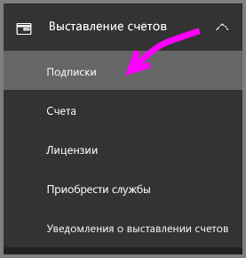
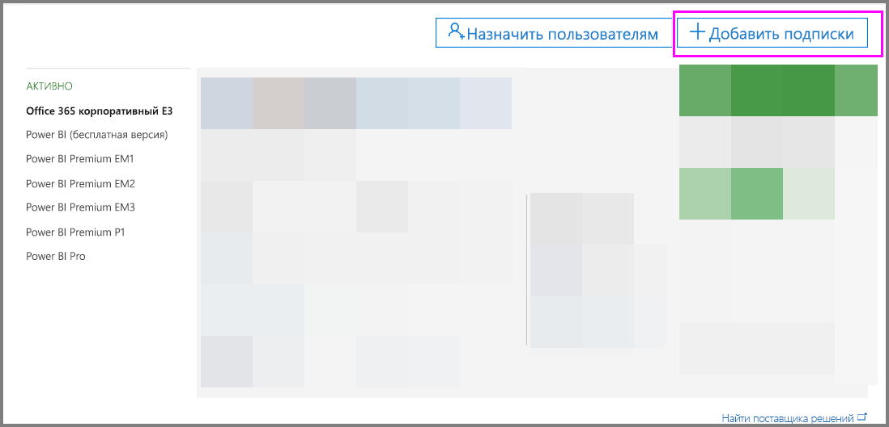
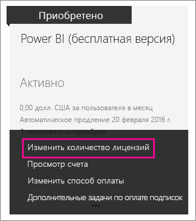
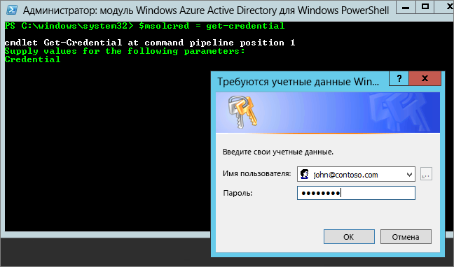

# <a name="power-bi-licensing-in-your-organization"></a>Лицензирование Power BI в организации

В службе Power BI пользователи имеют возможности, определенные на основе двух следующих типов лицензий.

* **На пользователя** - *бесплатное лицензирование и лицензирование Power BI Pro*. Бесплатная лицензия предоставляет доступ к некоторым функциям службы Power BI. Лицензия Pro предоставляет доступ ко всему содержимому и всем возможностям службы Power BI, включая совместный доступ к содержимому и совместную работу с другими пользователями Pro. Публиковать и использовать содержимое в рабочих областях приложения, совместно использовать панели мониторинга, а также подписываться на панели мониторинга и отчеты могут только пользователи с лицензией Pro. Дополнительные сведения см. в разделе [Функции службы Power BI по типам лицензий](service-features-license-type.md).

* **На основе емкости** - *лицензирование Power BI Premium*. Premium предоставляет выделенную емкость для более стабильной работы и поддержки более крупных объемов данных в Power BI. В том, что касается отдельных пользователей, версия Premium также позволяет широко распространять контент пользователям Pro, и при этом для просмотра этого контента получателями лицензии Pro не требуются. Дополнительные сведения см. в статье [Что такое Power BI Premium?](service-premium.md)

В этой статье рассматривается лицензирование "на пользователя" с точки зрения администратора.

## <a name="manage-power-bi-pro-licenses"></a>Управление лицензиями Power BI Pro

Администраторы могут приобретать и назначать лицензии Power BI Pro; они также могут зарегистрироваться для получения бесплатной пробной версии Power BI Pro для своей организации. Отдельные пользователи также могут зарегистрироваться для получения бесплатной пробной версии Power BI Pro.

### <a name="purchasing-power-bi-pro"></a>Приобретение Power BI Pro

Лицензии Power BI Pro можно приобрести через Microsoft Office 365 или через сертифицированного партнера корпорации Майкрософт. После приобретения лицензий они назначаются отдельным пользователям. Дополнительные сведения см. в разделе [Приобретение и назначение лицензий Power BI Pro](service-admin-purchasing-power-bi-pro.md).

### <a name="power-bi-pro-trial-for-individuals"></a>Бесплатная пробная версия Power BI Pro для отдельных пользователей

Сотрудники организации могут самостоятельно зарегистрироваться для бесплатной пробной версии Power BI Pro. Дополнительные сведения см. в разделе [Регистрация отдельного пользователя в Power BI](service-self-service-signup-for-power-bi.md).

Те, кто использует пробную версию Power BI Pro, не отображаются на портале администрирования Office 365 как пользователи пробной версии Power BI Pro (они отображаются как бесплатные пользователи Power BI). Однако они отображаются как пользователи пробной версии Power BI Pro на странице управления хранилищем в Power BI.

### <a name="power-bi-pro-trial-for-organizations"></a>Бесплатная пробная версия Power BI Pro для организаций

Если вы хотите приобрести и развернуть лицензии на бесплатную пробную версию Power BI для нескольких пользователей в организации без необходимости принятия условий пробной версии по отдельности каждым пользователем, зарегистрируйтесь для получения бесплатной пробной версии Power BI Pro для своей организации.

Прежде чем приступить к регистрации, учтите следующие обстоятельства.

* Для регистрации необходимо быть членом роли [**глобального администратора** или **администратора выставления счетов**](https://support.office.com/article/about-office-365-admin-roles-da585eea-f576-4f55-a1e0-87090b6aaa9d?ui=en-US&rs=en-US&ad=US) в Office 365.

* В организации можно использовать только одну пробную версию для клиента. Это означает, что в клиенте уже используется пробная версия Power BI Pro, ее нельзя применить снова. Если вам нужна помощь, обратитесь в [службу поддержки Office 365 по вопросам выставления счетов](https://support.office.microsoft.com/en-us/article/contact-support-for-business-products-admin-help-32a17ca7-6fa0-4870-8a8d-e25ba4ccfd4b?CorrelationId=552bbf37-214f-4202-80cb-b94240dcd671&ui=en-US&rs=en-US&ad=US).

1. Перейдите в [Центр администрирования Office 365](https://portal.office.com/adminportal/home#/homepage).

1. В левой панели навигации выберите **Выставление счетов**, а затем **Подписки**.

   

1. Выберите **Добавить подписки** справа.

   

1. В разделе **Другие планы** наведите указатель мыши на многоточие (**. . .**) для Power BI Pro и выберите **Начать использовать бесплатную пробную версию**.

    

1. На экране подтверждения заказа выберите **Try now** (Попробовать).

1. В квитанции заказа нажмите кнопку **Продолжить**.

Теперь можно [назначить лицензии в Office 365](https://support.office.com/article/assign-licenses-to-users-in-office-365-for-business-997596b5-4173-4627-b915-36abac6786dc).

## <a name="manage-power-bi-free-licenses"></a>Управление бесплатными лицензиями Power BI

Пользователи в организации могут получить доступ к службе Power BI двумя разными способами. Он может зарегистрироваться в Power BI в индивидуальном порядке, либо ему может быть назначена лицензия Powre BI через портал администрирования Office 365.

Разрешив индивидуальную регистрацию, администраторы организации могут освободить себя от части обязанностей: благодаря этому пользователи, которых интересует служба Power BI, смогут оформлять на нее бесплатную подписку.

Однако отключение индивидуальной регистрации пользователей обеспечивает больший контроль и является оптимальным вариантом, если необходим аудит использования службы.

### <a name="power-bi-free-for-individuals"></a>Бесплатная версия Power BI для отдельных пользователей

По умолчанию сотрудники организации могут самостоятельно зарегистрироваться для бесплатной лицензии Power BI. Дополнительные сведения см. в разделе [Регистрация отдельного пользователя в Power BI](service-self-service-signup-for-power-bi.md).

О том, как заблокировать самостоятельную регистрацию пользователей, см. в разделе [Включение и отключение самостоятельной регистрации пользователей в Azure Active Directory](service-admin-licensing-organization.md#enable-or-disable-individual-user-sign-up-in-azure-active-directory) далее в этой статье.

### <a name="requesting-and-assigning-free-licenses"></a>Запрос и назначение бесплатных лицензий

Если вы планируете централизованно управлять запросами и назначениями лицензий, сначала проверьте, имеется ли у вас безлимитный блок лицензий Power BI (бесплатная версия).

Этот блок лицензий становится доступным после того, как кто-либо в первый раз зарегистрируется в Power BI в индивидуальном порядке. Во время этого процесса вашей организации выделяется такой блок лицензий, и одна из них назначается зарегистрировавшемуся пользователю.

1. В центре администрирования Office 365 перейдите в раздел **Выставление счетов** > **Лицензии** и проверьте наличие безлимитного (**unlimited**) блока бесплатных лицензий.

    

1. Если этот блок доступен, можно приступить к [назначению лицензий в Office 365](https://support.office.com/article/assign-licenses-to-users-in-office-365-for-business-997596b5-4173-4627-b915-36abac6786dc). Если этот блок недоступен, можно выбрать один из следующих двух вариантов.

    * Зарегистрировать сотрудника вашей организации индивидуально, что инициирует создание безлимитного блока.

    * Перейти к следующей процедуре, где выполняется регистрация для получения фиксированного количества лицензий.

Если безлимитный блок лицензий Power BI (бесплатная версия) недоступен и вы не хотите делать индивидуальную регистрацию, выполните следующую процедуру.

1. Перейдите в [Центр администрирования Office 365](https://portal.office.com/admin/default.aspx).

1. В левой области навигации выберите **Выставление счетов** > **Подписки**.

1. Выберите **Добавить подписки** справа.

1. В разделе **Другие планы** наведите указатель мыши на многоточие (**. . .**) для Power BI (бесплатная версия) и выберите **Купить**.

    

1. Укажите интересующее вас количество лицензий и выберите **Быстрый заказ** или **Добавить в корзину**.

1. Введите информацию, необходимую для оформления заказа.

    Вам не придется оплачивать покупку, хотя потребуется указать данные кредитной карты либо выбрать оплату по счету.

1. Теперь можно [назначить лицензии в Office 365](https://support.office.com/article/assign-licenses-to-users-in-office-365-for-business-997596b5-4173-4627-b915-36abac6786dc).

1. Если затем вы захотите добавить лицензии, вернитесь на страницу **Добавления подписок** и выберите **Изменить количество лицензий** для бесплатной версии Power BI.

    

### <a name="enable-or-disable-individual-user-sign-up-in-azure-active-directory"></a>Включение и отключение самостоятельной регистрации пользователей в Azure Active Directory

Администратор может разрешать или запрещать самостоятельную регистрацию пользователей в Azure Active Directory (AAD). В этом разделе показывается, как управлять регистрациями с помощью команд PowerShell. Дополнительные сведения об Azure PowerShell см. в статье [Общие сведения об Azure PowerShell](/powershell/azure/overview).

Для управления регистрацией используется параметр AAD **AllowAdHocSubscriptions**. В большинстве клиентов он имеет значение *true*, то есть индивидуальная регистрация разрешена. Если вы приобрели Power BI через партнера, этот параметр может быть установлен в значение *false*, что означает, что индивидуальная регистрация запрещена. При изменении значения параметра с *true* на *false* новые пользователи в вашей организации не смогут регистрироваться индивидуально. Пользователи, которые зарегистрировались в Power BI до изменения этого параметра, сохраняют свои лицензии.

1. Войдите в Azure Active Directory с использованием учетных данных Office 365. В первой строке следующего скрипта PowerShell запрашиваются учетные данные. Вторая строка используется для подключения к Azure Active Directory.

    ```powershell
     $msolcred = get-credential
     connect-msolservice -credential $msolcred
    ```

   

1. После входа выполните следующую команду, чтобы определить, как настроен ваш клиент в настоящий момент.

    ```powershell
     Get-MsolCompanyInformation | fl AllowAdHocSubscriptions
    ```
1. Чтобы включить ($true) или отключить ($false) параметр **AllowAdHocSubscriptions**, выполните следующую команду.

    ```powershell
     Set-MsolCompanySettings -AllowAdHocSubscriptions $true
    ```

## <a name="next-steps"></a>Дальнейшие действия

[Самостоятельная регистрация в Power BI](service-self-service-signup-for-power-bi.md)  

[Приобретение и назначение лицензий Power BI Pro](service-admin-purchasing-power-bi-pro.md)

Появились дополнительные вопросы? [Попробуйте задать вопрос в сообществе Power BI.](http://community.powerbi.com/)