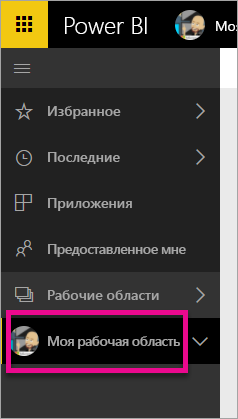
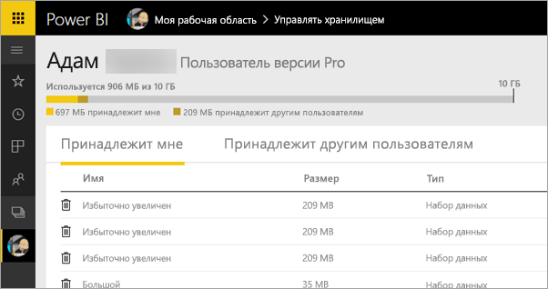
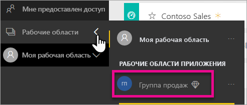
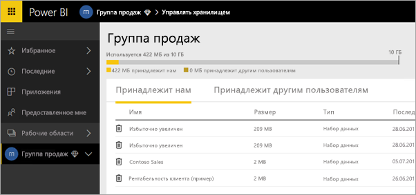
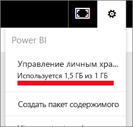
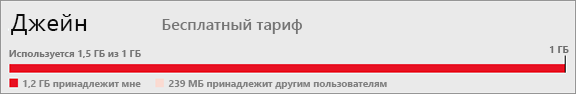

# Управление хранилищем данных
Узнайте, как управлять хранилищем данных рабочей области пользователя или приложения, чтобы обеспечить публикацию отчетов и наборов данных.

Рабочие области пользователей и приложений располагают собственными объемами данных

* Пользователям с бесплатной лицензией или уровнем Pro предоставляется хранилище с максимальным объемом 10 ГБ.
* Пользователи уровня Pro могут создавать рабочие области приложений с максимальным объемом хранилища 10 ГБ для каждой.

На уровне клиента совокупный объем не может превышать 10 ГБ на пользователя с лицензией Pro для всех таких пользователей и рабочих областей приложений.

Сведения о других возможностях см. в разделе [Power BI, модель ценообразования](https://powerbi.microsoft.com/pricing).

В максимальный допустимый объем хранилища включены наборы данных и отчеты Excel — ваши и других пользователей, которые предоставили вам общий доступ к этим ресурсам. Наборы данных представляют собой любые загруженные или подключенные источники данных, включая используемые файлы Power BI Desktop и книги Excel. Кроме того, емкость хранилища включает следующее:

* диапазоны Excel, закрепленные на панели мониторинга;
* локальные визуализации служб отчетности, закрепленные на панели мониторинга Power BI;
* переданные изображения.

Размер совместно используемой панели мониторинга зависит от того, что закреплено на ней. Например, если закрепить элементы из двух отчетов, которые являются частью двух разных наборов данных, то размер панели мониторинга будет соответствующий.

<a name="manage"/>

## Управление принадлежащими вам элементами
Контролируйте объем хранилища, используемый в вашей учетной записи Power BI, и управляйте учетной записью.

1. Для управления хранилищем перейдите в раздел **Моя рабочая область** на панели навигации.
   
    
2. Щелкните в правом верхнем углу значок шестеренки  \> **Управление личным хранилищем**.
   
    На верхней панели отображаются сведения об использованном объеме хранилища из максимально допустимого.
   
    
   
    Наборы данных и отчеты разделены по двум вкладкам:
   
    **Принадлежит мне** — отчеты и наборы данных, загруженные в вашу учетную запись Power BI, в том числе наборы данных таких служб, как Salesforce и Dynamics CRM.  
    **Принадлежит другим пользователям** — другие пользователи предоставили вам общий доступ к этим отчетам и наборам данных.
3. Чтобы удалить набор данных или отчет, щелкните значок корзины .

Имейте в виду, что у вас или другого пользователя могут быть отчеты и панели мониторинга, сформированные на основе набора данных. После удаления такого набора данных связанные с ним отчеты и панели мониторинга перестанут работать.

## Управление рабочей областью приложения
1. Щелкните стрелку рядом с пунктом **Рабочие области** \> выберите имя рабочей области.
   
    
2. Щелкните в правом верхнем углу значок шестеренки  \> **Управление хранилищем группы**.
   
    На верхней панели отображаются сведения об использованном объеме хранилища группы из максимально допустимого.
   
    
   
    Наборы данных и отчеты разделены по двум вкладкам:
   
    **Принадлежит нам** — это отчеты и наборы данных, загруженные вами или другим пользователем в учетную запись группы Power BI, в том числе наборы данных таких служб, как Salesforce и Dynamics CRM.
    **Принадлежит другим пользователям** — другие пользователи предоставили вашей группе общий доступ к этим отчетам и наборам данных.
3. Чтобы удалить набор данных или отчет, щелкните значок корзины .
   
   > [!NOTE]
   > Любой член группы с разрешением на изменение рабочей области приложения имеет право удалять из нее наборы данных и отчеты.
   > 
   > 

Имейте в виду, что у вас или другого пользователя в группе могут быть отчеты и панели мониторинга, сформированные на основе набора данных. После удаления такого набора данных связанные с ним отчеты и панели мониторинга перестанут работать.

## Ограничения наборов данных
В Power BI нельзя импортировать наборы данных объемом больше 1 ГБ. Если вы выбрали сохранение возможностей Excel вместо импорта данных, ограничение будет составлять 250 МБ для набора данных.

## Что происходит при достижении предела
При достижении максимально допустимой емкости данных служба выдаст сообщения. 

При щелчке по значку шестеренки  вы увидите красную полосу, означающую, что вы превысили ограничение на объем данных.

Соответствующее указание появится также в разделе **Управление личным хранилищем**.

 

 При попытке выполнить действие, в результате которого одно из ограничений может быть превышено, появляется сообщение о превышении лимита. Вы сможете [управлять](#manage) хранилищем и уменьшать объем содержащихся в нем данных в соответствии с ограничениями.

 

 Появились дополнительные вопросы? [Попробуйте задать вопрос в сообществе Power BI.](http://community.powerbi.com/)

