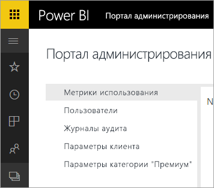

# Служба Power BI для Office 365 снята с учета
Power BI для Office 365 (предыдущая версия Power BI) заменена на текущую версию службы [Power BI](https://powerbi.microsoft.com). Пользователи, использовавшие **Power BI для Office 365**, могут пользоваться текущей версией Power BI. [Дополнительные сведения о Power BI](service-get-started.md).

## Портал администрирования
Портал администрирования **Power BI для Office 365** больше не доступен. Для управления подпиской Power BI администраторы могут использовать новый [портал администрирования](https://app.powerbi.com/admin-portal).

Дополнительные сведения см. в разделе [Портал администрирования Power BI](service-admin-portal.md).

## Дальнейшие действия
[Приступая к работе с Power BI](service-get-started.md)

[Начало работы с Power BI Desktop](desktop-getting-started.md)

[Администрирование Power BI в организации](service-admin-administering-power-bi-in-your-organization.md)
