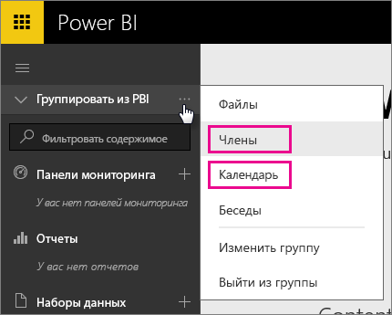
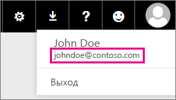

# Выделенные пользователи Office 365. Известные проблемы
Power BI теперь поддерживается для выделенных пользователей Office 365.  Если вы являетесь выделенным пользователем Office 365, то можете выполнить вход с учетной записью из данного клиента и использовать Power BI. В настоящее время известны две проблемы.

## Группы
При выборе пункта **Члены** или **Календарь** в контекстном меню группы пользователь будет перенаправлен на приложение работы с электронной почтой.  Пункты **Файлы** и **Беседы** работают должным образом.

## Приложение для iPhone — вход с использованием именного домена приводит к ошибке
При выполнении входа в приложение для iPhone использование учетных данных с именным доменом может привести к ошибке.

*Ошибка входа*  
*Произошла непредвиденная внутренняя ошибка. Повторите попытку.*

Чтобы обойти эту проблему, при входе вместо именного домена используйте адрес электронной почты, который отображается при щелчке значка пользователя в службе Power BI.

Появились дополнительные вопросы? [Ответы на них см. в сообществе Power BI.](http://community.powerbi.com/)

