# Администрирование Power BI на портале администрирования

На портале администрирования можно управлять *клиентом* Power BI для вашей организации. Портал предоставляет такие возможности, как метрики использования, доступ к Центру администрирования Office 365 и разные параметры.

Портал администрирования со всеми функциями доступен для всех пользователей, которым назначена роль глобального администратора в Office 365 или роль администратора службы Power BI. Если у вас нет этих ролей, вы увидите на портале только пункт **Параметры емкости**. Дополнительные сведения о роли администратора службы Power BI см. в [этой статье](service-admin-role.md).

## Переход к порталу администрирования

Чтобы получить доступ к порталу администрирования Power BI, учетная запись в Office 365 или Azure Active Directory должна быть отмечена как **глобальный администратор** или иметь роль администратора службы Power BI. Дополнительные сведения о роли администратора службы Power BI см. в [этой статье](service-admin-role.md). Чтобы перейти к порталу администрирования Power BI, выполните следующие действия.

1. Выберите значок настройки (шестеренка) в верхней правой части окна службы Power BI.

1. Выберите **Портал администрирования**.

    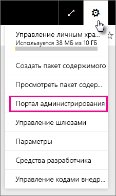

На портале есть семь вкладок. Сведения о каждой из них представлены ниже.

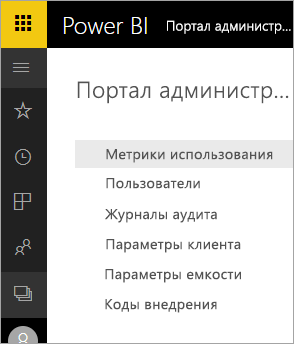

* [Метрики использования](#usage-metrics)
* [Пользователи](#users)
* [Журналы аудита](#audit-logs)
* [Параметры клиента](#tenant-settings)
* [Параметры Premium](#premium-settings)
* [Коды внедрения](#embed-codes)
* [Визуальные элементы организации](#organization-visuals)

## Метрики использования

Вкладка **Метрики использования** позволяет отслеживать использование Power BI в вашей организации. Он также позволяет узнать, какие пользователи и группы наиболее активны в Power BI для вашей организации.

> [!NOTE]
> При первом доступе к панели мониторинга или при ее повторном открытии после длительного периода ее неиспользования отображается экран загрузки, так как загрузка панели мониторинга может занимать некоторое время.

Когда панель мониторинга загрузится, отобразится два раздела с плитками. Первый раздел содержит данные об использовании для отдельных пользователей, а второй — аналогичные сведения для групп в организации.

Ниже показано содержимое каждой плитки:

* Точное число всех панелей мониторинга, отчетов и наборов данных в рабочей области пользователя.
  
    

* Самая востребованная панель мониторинга по числу пользователей, которые могут получать к ней доступ. Например, если у вас есть панель мониторинга, доступ к которой вы предоставили трем пользователям, также добавленная в пакет содержимого, к которому подключены два разных пользователя, для нее будет отображаться число 6 (1 + 3 + 2).
  
    

* Самое популярное содержимое, к которому подключаются пользователи. Это может быть любое содержимое, к которому могут перейти пользователи с помощью функции получения данных, например пакеты содержимого SaaS, пакеты содержимого организации, файлы или базы данных.
  
    

* Представление основных пользователей на основе числа их панелей мониторинга (как созданных ими, так и тех, к которым им предоставлен доступ).
  
    

* Представление основных пользователей на основе числа их отчетов.
  
    

Во втором разделе показаны те же сведения, но для групп. Эти плитки позволяют понять, какие группы в организации являются наиболее активными и какое содержимое они используют.

Эти данные помогут вам получить реальные сведения о том, как люди используют Power BI в вашей организации, а также определить пользователей и группы, которые проявляют наибольшую активность.

## Пользователи

Вы можете управлять пользователями Power BI, администраторами и группами в Центре администрирования Office 365. На вкладке **Пользователи** содержится ссылка для перехода в Центр администрирования для вашего клиента.

## Журналы аудита

Вы можете управлять журналами аудита Power BI в центре Безопасности и соответствия требованиям Office 365. На вкладке **Журналы аудита** содержится ссылка для перехода в центр Безопасности и соответствия требованиям для вашего клиента. [Дополнительные сведения](service-admin-auditing.md)

Чтобы использовать журналы аудита, включите параметр [**Создание журналов аудита для учета внутренних действий и обеспечения соответствия требованиям**](#create-audit-logs-for-internal-activity-auditing-and-compliance).

## Параметры клиента

Вкладка **Параметры клиента** позволяет управлять функциями, которые предоставляются для пользователей вашей организации. Некоторые функции могут не подходить для вашей организации, если вам нужно обеспечить высокий уровень конфиденциальности данных или предоставить определенную функцию отдельной группе.

На следующем рисунке показаны первые два раздела вкладки **Параметры клиента**.

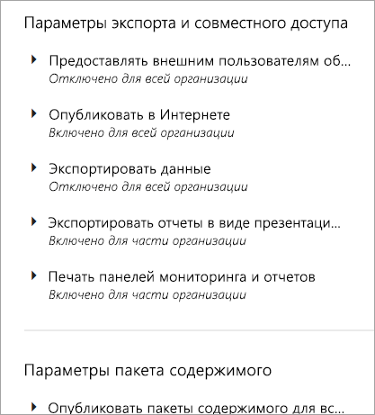

> [!NOTE]
> До того как измененные параметры вступят в силу для всех пользователей в клиенте, может пройти до 10 минут.

Параметры могут иметь три состояния.

* **Отключено для всей организации**. Никто в вашей организации не может использовать эту функцию.

    

* **Включено для всей организации**. Любой пользователь из вашей организации может использовать эту функцию.

    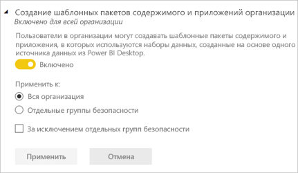

* **Включено для части организации**. Определенный круг пользователей или групп в вашей организации могут использовать эту функцию.

    Вы можете включить эту функцию для всей организации, за исключением определенной группы пользователей.

    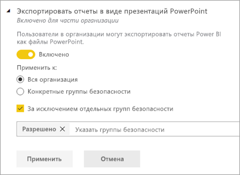

    Кроме того, эту функцию можно включить только для определенной группы пользователей, за исключением отдельных сотрудников. Так определенные пользователи не будут иметь доступ к функции, даже если они входят в группу с правами доступа к этой функции.

    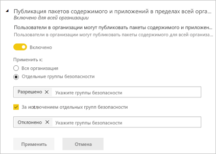

Следующие несколько разделов содержат общие сведения о различных типах параметров клиента.

## Параметры рабочей области

### Создание рабочих областей (предварительная версия)

Пользователи в организации могут создавать рабочие области приложений для совместной работы над панелями мониторинга, отчетами и другим содержимым. [Дополнительные сведения](service-create-the-new-workspaces.md)

## Параметры экспорта и совместного доступа

### Параметр "Предоставлять внешним пользователям общий доступ к контенту"

Пользователи в вашей организации могут предоставлять внешним пользователям общий доступ к информационным панелям. [Дополнительные сведения](service-share-dashboards.md#share-a-dashboard-or-report-with-people-outside-your-organization)

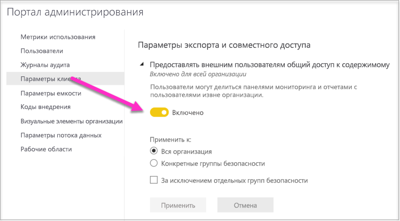

Ниже показано сообщение, которое отображается при предоставлении общего доступа внешнему пользователю.

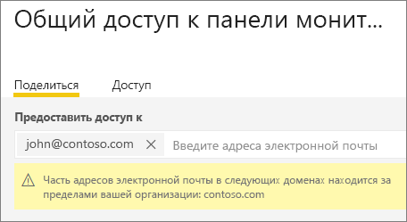

### Опубликовать в Интернете

Пользователи в организации могут публиковать отчеты в Интернете. [Дополнительные сведения](service-publish-to-web.md)

Ниже показано меню **Файл** для отчета с включенным параметром **Опубликовать в Интернете**.

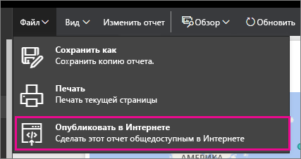

Отображаемые в пользовательском интерфейсе параметры зависят от настроек параметра **Опубликовать в Интернете**.

|Избранное |Включена для всей организации |Отключена для всей организации |Конкретные группы безопасности   |
|---------|---------|---------|---------|
|**Опубликовать в Интернете** в меню **Файл** отчета.|Включена для всех|Не отображается никому|Отображается только авторизованным пользователям и группам.|
|**Управление кодами внедрения** в меню **Параметры**|Включена для всех|Включена для всех|Включена для всех  Параметр * **Удалить** доступен для авторизованных пользователей или групп. Параметр * **Получить коды** доступен для всех.|
|Параметр **Коды внедрения** на портале администратора|Состояние отражает одно из следующих значений: * Активен * Не поддерживается * Заблокирован|Отображается состояние **Отключено**|Состояние отражает одно из следующих значений: * Активен * Не поддерживается * Заблокирован  Если пользователь не авторизовался в соответствии с настройками клиента, отображается состояние **Нарушено**.|
|Существующие опубликованные отчеты|Все включены|Все отключены|Отчеты продолжают отображаться для всех.|

### Экспортировать данные

Пользователи в организации могут экспортировать данные с плитки или из визуализации. [Дополнительные сведения](visuals/power-bi-visualization-export-data.md)

Ниже показан параметр для экспорта данных из плитки.

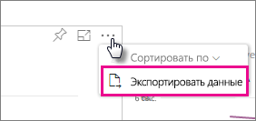

> [!NOTE]
> Если отключить параметр **Экспортировать данные**, пользователи не смогут использовать функцию **анализа в Excel**, а также функцию динамического подключения к службе Power BI.

### Экспорт отчетов в презентации PowerPoint или PDF-документы

Пользователи в организации могут экспортировать отчеты Power BI в виде файлов PowerPoint или PDF-документов. [Дополнительные сведения](consumer/end-user-powerpoint.md)

Ниже показано меню **Файл** для отчета с включенным параметром **Экспорт отчетов в презентации PowerPoint или PDF-документы**.

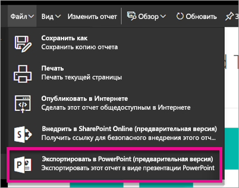

### Печать панелей мониторинга и отчетов

Пользователи в организации могут распечатывать информационные панели и отчеты. [Дополнительные сведения](consumer/end-user-print.md)

Ниже показана функция печати панели мониторинга.

Ниже показано меню **Файл** для отчета с включенным параметром **Печать панелей мониторинга и отчетов**.

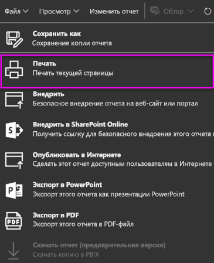

## Пакет содержимого и параметры приложения

### Публикация пакетов содержимого и приложений в пределах всей организации

Пользователи в организации могут публиковать пакеты содержимого и приложения для всей организации, а не только для определенных групп. [Дополнительные сведения](service-organizational-content-pack-manage-update-delete.md)

Ниже показан параметр **Вся моя организация** при создании пакета содержимого.

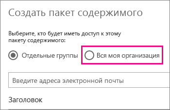

### Создание приложений-шаблонов

Пользователи в организации могут создавать приложения-шаблоны, в которых используются наборы данных, созданные в Power BI Desktop. См. дополнительные сведения о [приложениях-шаблонах](template-content-pack-authoring.md).

### Принудительно отправлять приложения конечным пользователям

Пользователи могут отправлять приложения конечным пользователям напрямую без установки из AppSource. [Дополнительные сведения](service-create-distribute-apps.md)

## Вкладка "Параметры интеграции"

### Параметр "Задавать вопросы о данных с помощью Кортаны"

Пользователи в организации могут задавать вопросы о своих данных с помощью Кортаны. [Дополнительные сведения](service-cortana-enable.md)

> [!NOTE]
> Этот параметр применяется ко всей организации и не ограничивается определенными группами.

### Параметр "Использовать анализ в Excel для работы с локальными наборами данных"

Пользователи в организации могут просматривать локальные наборы данных Power BI и взаимодействовать с ними в Excel. [Дополнительные сведения](service-analyze-in-excel.md)

> [!NOTE]
> Если отключить параметр **Экспортировать данные**, пользователи не смогут использовать функцию **анализа в Excel**.

### Использовать ArcGIS Maps for Power BI

Пользователи в организации могут использовать визуализацию ArcGIS Maps for Power BI от Esri. [Дополнительные сведения](visuals/power-bi-visualization-arcgis.md)

### Использование глобального поиска для Power BI (предварительная версия)

Пользователи в организации могут использовать внешние функции поиска на основе службы "Поиск Azure". Например, с помощью Кортаны можно получать важные сведения непосредственно из панелей мониторинга и отчетов Power BI. [Дополнительные сведения](service-cortana-intro.md)

## Параметры настраиваемых визуальных элементов

### Добавление и использование настраиваемых визуальных элементов

Пользователи в организации могут взаимодействовать с настраиваемыми визуальными элементами. [Дополнительные сведения](power-bi-custom-visuals.md)

> [!NOTE]
> Этот параметр применяется ко всей организации и не ограничивается определенными группами.

### Разрешить только сертифицированные визуальные элементы

Пользователи в организации, которым предоставлены разрешения на добавление и использование настраиваемых визуальных элементов, обозначенные с помощью параметра "Добавление и использование настраиваемых визуальных элементов", будут иметь возможность использовать только [сертифицированные настраиваемые визуальные элементы](https://go.microsoft.com/fwlink/?linkid=2002010) (несертифицированные визуальные элементы будут заблокированы, и при их использовании отобразится сообщение об ошибке). 

## Вкладка "Параметры визуальных элементов R"

### Взаимодействие с визуальными элементами R и их публикация

Пользователи в организации могут взаимодействовать с визуальными элементами, созданными при помощи R-скриптов, и делиться ими. [Дополнительные сведения](visuals/service-r-visuals.md)

> [!NOTE]
> Этот параметр применяется ко всей организации и не ограничивается определенными группами.

## Параметры аудита и использования

### Создание журналов аудита для аудита внутренних действий и обеспечения соответствия требованиям

Пользователи в организации могут отслеживать действия других пользователей в Power BI при помощи аудита. [Дополнительные сведения](service-admin-auditing.md)

Для сбора записей журнала аудита этот параметр должен быть включен. После включения аудита его данные могут отобразиться с задержкой до 48 часов. Если данные не отображаются сразу, проверьте журналы аудита позже. Аналогичная задержка возможна при получении разрешения на просмотр журналов аудита: доступ к ним может быть предоставлен не сразу.

> [!NOTE]
> Этот параметр применяется ко всей организации и не ограничивается определенными группами.

### Метрики использования для создателей содержимого

Пользователи в организации могут просматривать метрики использования созданных ими панелей мониторинга и отчетов. [Дополнительные сведения](service-usage-metrics.md)

### Данные отдельных пользователей в метриках использования для создателей содержимого

В метриках использования для создателей содержимого будут отражены имена и адреса электронной почты пользователей, которые обращаются к содержимому. [Дополнительные сведения](service-usage-metrics.md)

Данные пользователей включены для метрик использования по умолчанию, а сведения об учетной записи создателя содержимого включаются в отчет на основе метрик. Если вы не хотите включать эту информацию для некоторых или всех пользователей, отключите функцию для указанных групп безопасности или для всей организации. В таком случае сведения об учетной записи будут отображаться в отчете *Без имени*.

## Вкладка "Параметры панели мониторинга"

### Параметр "Классификация данных для панелей мониторинга"

Пользователи в организации могут отмечать панели мониторинга, используя классификации, определяющие уровни безопасности. [Дополнительные сведения](service-data-classification.md)

> [!NOTE]
> Этот параметр применяется ко всей организации и не ограничивается определенными группами.

## Параметры разработчика

### Внедрение содержимого в приложениях

Пользователи в организации могут внедрить панели мониторинга и отчеты Power BI в приложения SaaS. Если отключить этот параметр, пользователи не смогут использовать REST API для внедрения содержимого Power BI в приложение. [Дополнительные сведения](developer/embedding.md)

## Параметры потоков данных (предварительная версия)

### Создание и использование потоков данных (предварительная версия)

Пользователи в организации могут создавать и использовать потоки данных. Общие сведения о потоках данных. [Самостоятельная подготовка данных в Power BI (предварительная версия)](service-dataflows-overview.md). Чтобы включить потоки данных в емкости Premium, см. [Настройка рабочих нагрузок](service-admin-premium-workloads.md).

> [!NOTE]
> Этот параметр применяется ко всей организации и не ограничивается определенными группами.

## Параметры приложений-шаблонов (предварительная версия)

Приложениями-шаблонами управляют два параметра. 

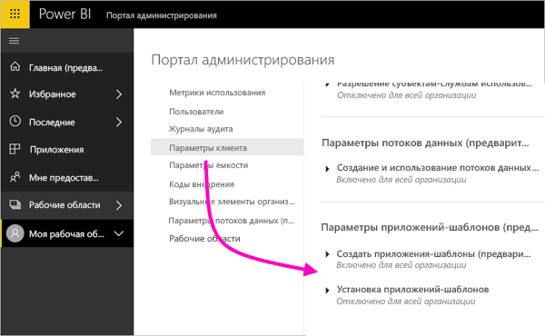

Первый параметр, **Создание приложений-шаблонов**, позволяет определять в организации пользователей, которые могут создавать приложения-шаблоны. Затем создатели могут распространять эти приложения среди клиентов вне вашей организации через AppSource или иным методом.

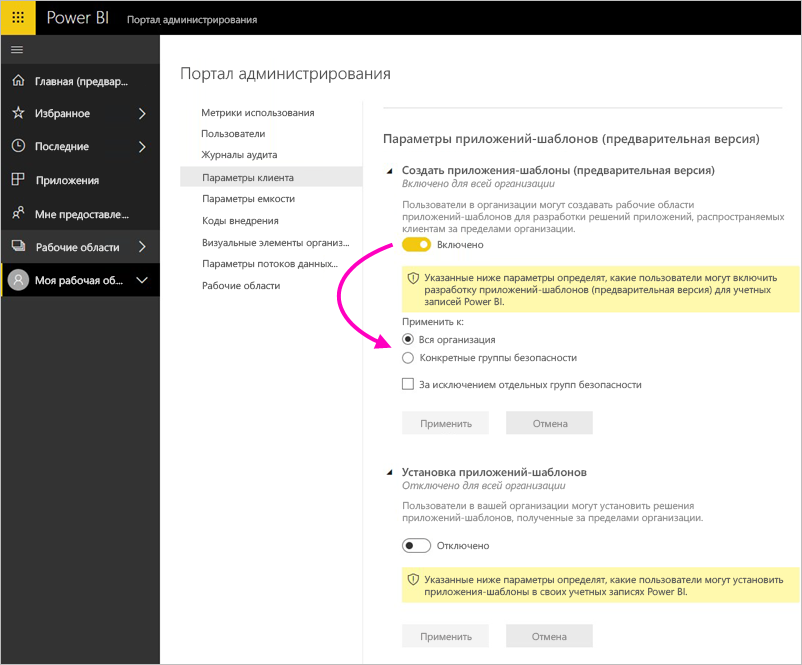

Второй параметр, **Установка приложений-шаблонов**, позволяет определять в организации пользователей, которые могут скачивать и устанавливать приложения-шаблоны из AppSource или другого источника.

## Параметры емкости

### Power BI Premium

На вкладке **Power BI Premium** можно управлять любыми емкостями Power BI Premium (номер SKU Em или P), приобретенными для вашей организации. Вкладка **Power BI Premium** будет отображаться для всех пользователей вашей организации, но они смогут увидеть ее содержимое, только если им назначена роль *администратора емкости* или пользователя с назначенными разрешениями. Если у пользователей нет разрешений, появляется следующее сообщение.

### Power BI Embedded

Вкладка **Power BI Embedded** позволяет просматривать емкости Power BI Embedded (номер SKU А), приобретенные для клиента. Так как вы можете приобрести только номер SKU A в Azure, вы можете [управлять емкостями Embedded в Azure](developer/azure-pbie-create-capacity.md) на **портале Azure**.

Дополнительные сведения о том, как управлять параметрами Power BI Embedded (номер SKU A), см. в статье [Что такое Power BI Embedded в Azure?](developer/azure-pbie-what-is-power-bi-embedded.md)

## Коды внедрения

Как администратор, вы можете просматривать коды внедрения, созданные для вашего клиента. Коды можно также отзывать или удалять. [Дополнительные сведения](service-publish-to-web.md)

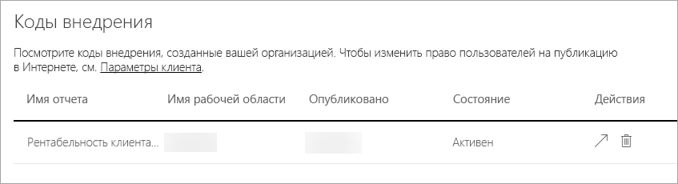

## Визуальные элементы организации

Вкладка **Визуальные элементы организации** позволяет развертывать и администрировать пользовательские визуальные элементы в вашей организации. С помощью визуальных элементов организации можно легко развертывать собственные визуальные элементы в организации, которые авторы отчетов могут затем найти и импортировать в свои отчеты из Power BI Desktop. [Дополнительные сведения](power-bi-custom-visuals-organization.md)

> [!WARNING]
> Пользовательский визуальный элемент может содержать код, угрожающий безопасности или конфиденциальности. Перед развертыванием в репозитории организации убедитесь в надежности автора и источника пользовательского визуального элемента.

Ниже показаны все пользовательские визуальные элементы, которые развернуты в репозитории организации.

### Добавление нового пользовательского визуального элемента

Чтобы добавить пользовательский визуальный элемент в список, сделайте следующее. 

1. В области справа выберите **Добавить пользовательский визуальный элемент**.

    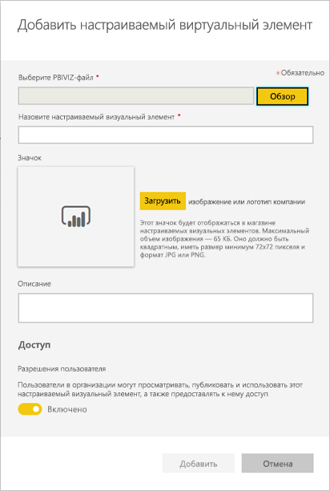

1. Заполните форму **Добавление пользовательского визуального элемента**:

    * **Выберите файл с расширением .pbiviz** (обязательно). Выберите файл пользовательского визуального элемента для отправки. Поддерживаются только пользовательские визуальные элементы API с контролем версий (определение см. в этой статье).

    Прежде чем передавать пользовательский визуальный элемент, проверьте его на предмет безопасности, конфиденциальности и соответствия корпоративным стандартам.

    * **Присвойте имя пользовательскому визуальному элементу** (обязательно). Укажите краткое название визуального элемента, чтобы пользователи Power BI Desktop могли понять его назначение.

    * **Значок**. Добавьте файл значка, который будет отображаться в пользовательском интерфейсе Power BI Desktop.

    * **Описание**. Введите краткое описание визуального элемента, чтобы предоставить пользователю контекст и дополнительные сведения.

1. Выберите **Добавить**, чтобы инициировать запрос на отправку. При успешном выполнении вы увидите в списке новый элемент. В случае сбоя может поступить соответствующее сообщение об ошибке.

### Удаление пользовательского визуального элемента из списка

В репозитории выберите значок корзины для визуального элемента, который нужно удалить без возможности восстановления.

> [!IMPORTANT]
> Удаление необратимо. После удаления визуальный элемент сразу же перестает отображаться в имеющихся отчетах. Даже если вы отправите визуальный элемент еще раз, он не заменит тот, который был удален. Тем не менее пользователи могут импортировать новый визуальный элемент, чтобы заменить экземпляр, который у них есть в отчетах.

### Отключение пользовательского визуального элемента в списке

Чтобы отключить визуальный элемент в хранилище организации, щелкните значок с шестеренкой. Отключите пользовательский визуальный элемент в разделе **Доступ**.

После этого он не будет отображаться в имеющихся отчетах и появится сообщение об ошибке ниже.

*Этот пользовательский визуальный элемент больше недоступен. Для получения дополнительных сведений свяжитесь со своим администратором.*

Кроме того, визуальные элементы, добавленные в закладки, продолжают работать.

После любых обновлений или изменений, внесенных администратором, пользователи Power BI Desktop должны перезапустить приложение или обновить браузер в службе Power BI, чтобы увидеть обновления.

### Обновление визуального элемента

Чтобы обновить визуальный элемент в хранилище организации, щелкните значок с шестеренкой. Найдите и отправьте новую версию визуального элемента.

Убедитесь, что идентификатор визуального элемента не изменен. Предыдущий файл заменяется новым для всех отчетов в организации. Но если новая версия визуального элемента может нарушить структуру данных или функциональность визуального элемента предыдущей версии, не заменяйте предыдущую версию. Вместо этого создайте запись для новой версии визуального элемента. Например, добавьте новый номер версии (версия X.X) к заголовку нового указанного визуального элемента. Таким образом будет понятно, что это тот же визуальный элемент только с обновленным номером версии. Это позволит не нарушить функциональные возможности существующих отчетов. Еще раз убедитесь, что идентификатор визуального элемента не изменен. При следующем входе в репозиторий организации из Power BI Desktop пользователи смогут импортировать новую версию и получат запрос на замену текущей версии в отчете.

Дополнительную информацию см. в статье [Часто задаваемые вопросы о пользовательских визуальных элементах](https://docs.microsoft.com/power-bi/power-bi-custom-visuals-faq#organizational-custom-visuals)

## Хранилище потоков данных (предварительная версия)

По умолчанию данные, используемые в Power BI, хранятся во внутренней памяти, предоставляемой Power BI. С помощью интеграции потоков данных и Azure Data Lake Storage 2-го поколения (ADLS 2-го поколения) вы можете хранить свои потоки данных в корпоративной учетной записи Azure Data Lake Storage 2-го поколения. Дополнительную информацию см. в статье [Потоки данных и интеграция Azure Data Lake (предварительная версия)](service-dataflows-azure-data-lake-integration.md).

## Рабочие области (предварительная версия)

От имени администратора можно просмотреть рабочие области вашего клиента. Список рабочих областей можно отсортировать и отфильтровать для отображения сведений о каждой рабочей области. Обратите внимание, что столбцы таблицы соответствуют свойствам, которые возвращает команда [REST API администратора Power BI](/rest/api/power-bi/admin) для рабочих областей. Личные рабочие области принадлежат типу **PersonalGroup**, устаревшие рабочие области — типу **Group** и современные рабочие области — типу **Workspace**. Дополнительные сведения см. в статье [Создание рабочих областей в Power BI (предварительная версия)](service-create-the-new-workspaces.md).

## Дальнейшие действия

[Администрирование Power BI в организации](service-admin-administering-power-bi-in-your-organization.md) [Основные сведения о роли администратора Power BI](service-admin-role.md)  
[Аудит Power BI в организации](service-admin-auditing.md)  

Появились дополнительные вопросы? [Попробуйте задать вопрос в сообществе Power BI.](http://community.powerbi.com/)
