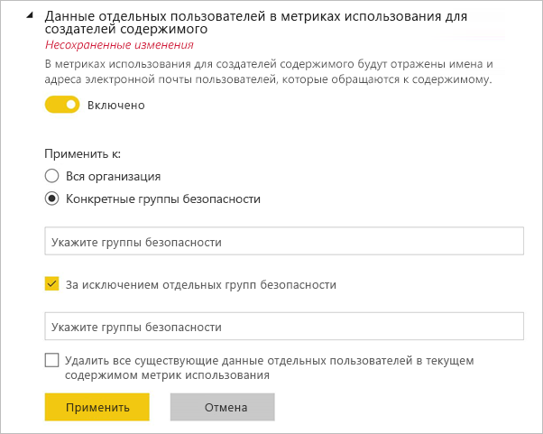
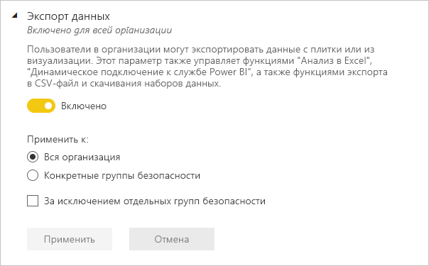
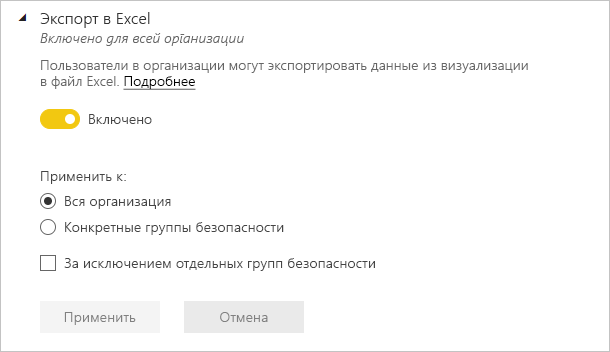
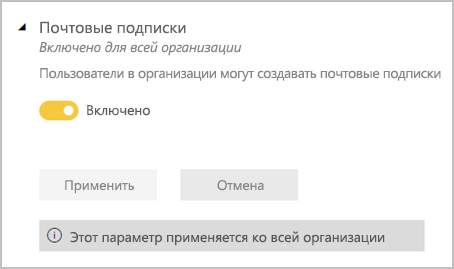
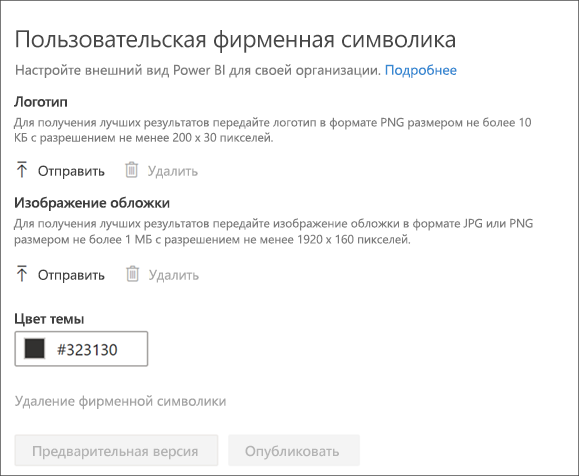

# Администрирование Power BI на портале администрирования

На портале администрирования можно управлять *клиентом* Power BI для вашей организации. Портал включает метрики использования, доступ к Центру администрирования Microsoft 365 и параметры.

Портал администрирования со всеми функциями доступен для всех пользователей, которым назначена роль глобального администратора в Office 365 или роль администратора службы Power BI. Если у вас нет этих ролей, вы увидите на портале только пункт **Параметры емкости**. Дополнительные сведения о роли администратора службы Power BI см. в [этой статье](service-admin-role.md).

## Переход к порталу администрирования

Чтобы получить доступ к порталу администрирования Power BI, учетная запись в Office 365 или Azure Active Directory (Azure AD) должна быть отмечена как **глобальный администратор** или иметь роль администратора службы Power BI. Дополнительные сведения о роли администратора службы Power BI см. в [этой статье](service-admin-role.md). Чтобы перейти к порталу администрирования Power BI, выполните следующие действия.

1. Выберите значок настройки (шестеренка) в верхней правой части окна службы Power BI.

1. Выберите **Портал администрирования**.

    

На портале есть девять вкладок. Сведения о каждой из них представлены ниже.

* [Метрики использования](#usage-metrics)
* [Пользователи](#users)
* [Журналы аудита](#audit-logs)
* [Параметры клиента](#tenant-settings)
* [Параметры емкости](#capacity-settings)
* [Коды внедрения](#embed-codes)
* [Визуальные элементы организации](#organizational-visuals).
* [Хранилище потоков данных (предварительная версия)](#dataflowStorage)
* [Рабочие области](#workspaces)
* [Пользовательская фирменная символика](#custom-branding)

## Метрики использования

Вкладка **Метрики использования** позволяет отслеживать использование Power BI в вашей организации. Он также позволяет узнать, какие пользователи и группы наиболее активны в Power BI для вашей организации. 

> [!NOTE]
> При первом доступе к панели мониторинга или при ее повторном открытии после длительного периода ее неиспользования отображается экран загрузки, так как загрузка панели мониторинга может занимать некоторое время.

Когда панель мониторинга загрузится, отобразится два раздела с плитками. Первый раздел содержит данные об использовании для отдельных пользователей, а второй — аналогичные сведения для групп в организации.

Ниже показано содержимое каждой плитки:

* Точное число всех панелей мониторинга, отчетов и наборов данных в рабочей области пользователя.
  
    

* Самая востребованная панель мониторинга по числу пользователей, которые могут получать к ней доступ. Например, если у вас есть панель мониторинга, доступ к которой вы предоставили трем пользователям, также добавленная в пакет содержимого, к которому подключены два разных пользователя, для нее будет отображаться число 6 (1 + 3 + 2).
  
    

* Самое популярное содержимое, к которому подключаются пользователи. Это может быть любое содержимое, к которому могут перейти пользователи с помощью функции получения данных, например пакеты содержимого SaaS, пакеты содержимого организации, файлы или базы данных.
  
    

* Представление основных пользователей на основе числа их панелей мониторинга (как созданных ими, так и тех, к которым им предоставлен доступ).
  
    

* Представление основных пользователей на основе числа их отчетов.
  
    

Во втором разделе показаны те же сведения, но для групп. Эти плитки позволяют понять, какие группы в организации являются наиболее активными и какое содержимое они используют.

Эти данные помогут вам получить реальные сведения о том, как люди используют Power BI в вашей организации, а также определить пользователей и группы, которые проявляют наибольшую активность.

## Управление использованием метрик

Отчеты на основе метрик использования — это функция, которую администратор Power BI или Office 365 может включать или выключать. Администраторы могут управлять доступом отдельных пользователей к метрикам использования. По умолчанию эти сведения **включены** для всех пользователей в организации.

Администраторы могут определить, будут ли создатели видеть в метриках использования данные об отдельных пользователях. 

Сведения о самих отчетах вы найдете в статье [Мониторинг метрик использования для панелей мониторинга и отчетов Power BI](service-usage-metrics.md).

### Метрики использования для создателей содержимого

1. На портале администрирования выберите **Параметры клиента** > **Метрики использования для создателей содержимого**.

    

1. Включите (или выключите) метрики использования и щелкните **Применить**.

    

### Данные по отдельным пользователям в метриках использования

По умолчанию данные пользователей включены для метрик использования, а сведения об учетной записи потребителя содержимого включаются в отчет на основе метрик. Если вы не хотите включать эту информацию для некоторых или всех пользователей, отключите функцию для указанных групп безопасности или для всей организации. В таком случае данные учетных записей будут отображаться в отчете с отметкой *Без имени*.

### Удаление всего существующего содержимого для метрик использования

Отключая метрики использования для всей организации, администраторы могут выбрать одно или оба из следующих действий:

- **Удалить все содержимое существующих метрик использования** . Сюда относятся все существующие плитки отчетов и панелей мониторинга, созданные с помощью отчетов на основе метрик использования и наборов данных. Этот параметр блокирует доступ к данным метрик использования для всех корпоративных пользователей, которые уже могли работать с ними. 
- **Удалить все существующие данные отдельных пользователей в текущем содержимом метрик использования** . Этот параметр блокирует доступ к данным метрик использования для всех корпоративных пользователей, которые уже могли работать с ними. 

Будьте внимательны, так как эта операция является необратимой.

## Пользователи

Вы можете управлять пользователями Power BI, администраторами и группами в Центре администрирования Microsoft 365. На вкладке **Пользователи** содержится ссылка для перехода в Центр администрирования для вашего клиента.

## Журналы аудита

Вы можете управлять журналами аудита Power BI в центре Безопасности и соответствия требованиям Office 365. На вкладке **Журналы аудита** содержится ссылка для перехода в центр Безопасности и соответствия требованиям для вашего клиента. [Дополнительные сведения](service-admin-auditing.md)

Чтобы использовать журналы аудита, включите параметр [**Создание журналов аудита для учета внутренних действий и обеспечения соответствия требованиям**](#create-audit-logs-for-internal-activity-auditing-and-compliance).

## Параметры клиента

Вкладка **Параметры клиента** позволяет управлять функциями, которые предоставляются для пользователей вашей организации. Некоторые функции могут не подходить для вашей организации, если вам нужно обеспечить высокий уровень конфиденциальности данных или предоставить определенную функцию отдельной группе.

На следующем рисунке показано несколько параметров на вкладке **Параметры клиента**.

> [!NOTE]
> До того как измененные параметры вступят в силу для всех пользователей в клиенте, может пройти до 10 минут.

Параметры могут иметь три состояния.

* **Отключено для всей организации**. Никто в вашей организации не может использовать эту функцию.

    

* **Включено для всей организации**. Любой пользователь из вашей организации может использовать эту функцию.

    

* **Включено для части организации**. Определенный круг пользователей или групп в вашей организации могут использовать эту функцию.

    Вы можете включить эту функцию для всей организации, за исключением определенной группы пользователей.

    

    Кроме того, эту функцию можно включить только для определенной группы пользователей, за исключением отдельных сотрудников. Так определенные пользователи не будут иметь доступ к функции, даже если они входят в группу с правами доступа к этой функции.

    

Следующие несколько разделов содержат общие сведения о различных типах параметров клиента.

## Параметры справки и поддержки

### Публикация информации "Вызова справки"

Пользователи в организации могут воспользоваться интегрированной справкой и ресурсами поддержки из меню "Справка" Power BI. В частности, эти параметры изменяют поведение элементов меню "Learn" (Обучение), "Community" (Сообщество) и "Get help" (Вызов справки).

Кроме того, указывая URL-адрес для запросов на лицензирование, вы настраиваете целевой URL-адрес для кнопки **Обновление учетной записи**. Пользователи, у которых нет лицензии Power BI Pro, могут найти эту кнопку в диалоговом окне **обновления до Power BI Pro**, а также на странице **Управление личным хранилищем**. Кроме того, в этом диалоговом окне и на странице хранилища служба Power BI больше не показывает кнопку **Попробовать версию Pro бесплатно**. Это позволяет обеспечить надежное проведение пользователей по процессам, определенным в организации, с помощью решения для управления лицензиями.

### Получать уведомления о сбоях службы и инцидентах по электронной почте

Группы безопасности с включенной поддержкой электронной почты получат уведомления по электронной почте, если на этого клиента повлияет сбой службы или инцидент. Дополнительные сведения об [уведомлениях о перебое в работе служб](service-interruption-notifications.md).

## Параметры рабочей области

В **параметрах клиента** портал администрирования содержит два раздела для управления рабочими областями:

- Создание нового интерфейса рабочей области.
- Использование наборов данных в рабочих областях.

### Создание новых рабочих областей

Рабочие области — это места, где пользователи могут работать с информационными панелями, отчетами и другим содержимым. Администраторы используют параметр **Create workspaces (new workspace experience)** (Создание рабочих областей (новый интерфейс рабочих областей)), чтобы определить, кто из пользователей в организации может создавать рабочие области. Администраторы могут разрешить или запретить всем пользователям в организации создавать новые интерфейсы рабочей области в рабочих областях. Они также могут разрешить их создание только участникам определенных групп безопасности. Дополнительные сведения о [рабочих областях](service-new-workspaces.md) см. здесь.

:::image type="content" source="media/service-admin-portal/power-bi-admin-workspace-settings.png" alt-text="Создание нового интерфейса рабочей области":::

Для классических рабочих областей на основе групп Office 365 администрирование по-прежнему выполняется на портале администрирования Office 365 и в Azure Active Directory.

> [!NOTE]
> По умолчанию параметр **Create workspaces (new workspace experience)** (Создание рабочих областей (новый интерфейс рабочих областей)) разрешает создавать новые рабочие области Power BI только тем пользователям, которые могут создавать группы Office 365. Обязательно установите на портале администрирования Power BI значение, позволяющее соответствующим пользователям создавать их.

**Список рабочих областей**

На портале администрирования, в клиенте, есть другой раздел параметров о рабочих областях. В этом разделе список рабочих областей можно отсортировать и отфильтровать для отображения сведений о каждой рабочей области. Дополнительные сведения см. в разделе [Рабочие области](#workspaces) этой статьи.

**Публикация пакетов содержимого и приложений**

На портале администрирования можно также контролировать разрешением на распространение приложений для организации. Дополнительные сведения см.в разделе [Публикация пакетов содержимого и приложений для всей организации](#publish-content-packs-and-apps-to-the-entire-organization).

### Использование наборов данных в рабочих областях

Администраторы могут управлять тем, какие пользователи в организации могут использовать наборы данных в рабочих областях. Если этот параметр включен, пользователям все равно требуется разрешение на сборку для определенного набора данных.

:::image type="content" source="media/service-admin-portal/power-bi-admin-datasets-workspaces.png" alt-text="Использование наборов данных в рабочих областях":::

Дополнительные сведения см. в статье [Введение в использование наборов данных в рабочих областях (предварительная версия)](service-datasets-across-workspaces.md).

## Параметры экспорта и совместного доступа

### Предоставление внешним пользователям общего доступа к содержимому

Пользователи могут делиться информационными панелями, отчетами и приложениями с пользователями вне организации. Узнайте больше об [общем доступе извне](service-share-dashboards.md#share-a-dashboard-or-report-outside-your-organization).

Ниже показано сообщение, которое отображается при предоставлении общего доступа внешнему пользователю.

  

> [!IMPORTANT]
> Этот параметр определяет, могут ли пользователи в Power BI приглашать внешних пользователей в качестве гостевых пользователей Azure Active Directory B2B (Azure AD B2B) в вашей организации с помощью Power BI. Если этот параметр включен, пользователи, обладающие ролью "Приглашающий гостей" в Azure AD, могут добавлять внешние адреса электронной почты при предоставлении общего доступа к отчетам, информационным панелям и приложениям Power BI. Внешних получателей приглашают присоединиться к организации в качестве гостевых пользователей Azure AD B2B. Важно! При отключении этого параметра внешние пользователи, которые уже являются гостевыми пользователями Azure AD B2B в вашей организации, продолжают отображаться в пользовательских интерфейсах для средства выбора людей в Power BI и им можно предоставлять доступ к элементам, рабочим областям и приложениям.

### Опубликовать в Интернете

Администратор клиента Power BI может управлять тем, для каких элементов пользователи могут создавать коды внедрения с помощью функции **Опубликовать в Интернете**. Эта функция делает отчет и содержащиеся в нем данные доступными всем пользователям в Интернете. Дополнительные сведения о [публикации в Интернете](service-publish-to-web.md).

> [!NOTE]
> Только администраторы Power BI могут разрешать создавать коды внедрения для публикации в Интернете. У организаций могут быть существующие коды внедрения. Для просмотра опубликованных в настоящее время отчетов обратитесь к разделу [Коды внедрения](service-admin-portal.md#embed-codes) на портале администрирования.

Ниже показано меню **Дополнительные параметры (...)** для отчета с включенным параметром **Опубликовать в Интернете**.

Параметр **Опубликовать в Интернете** на портале администрирования позволяет управлять тем, для каких элементов пользователи могут создавать коды внедрения.

Администратор может выбрать для параметра **Опубликовать в Интернете** значение **Включено**, а для параметра **Выберите способ работы с кодами внедрения** — значение **Разрешить только существующие коды внедрения**. В этом случае пользователи могут создавать коды внедрения, но им нужно обращаться к администратору Power BI за разрешением.

Отображаемые в пользовательском интерфейсе параметры зависят от настроек параметра **Опубликовать в Интернете**.

|Признак |Включена для всей организации |Отключена для всей организации |Конкретные группы безопасности   |
|---------|---------|---------|---------|
|**Опубликовать в Интернете** в меню **Дополнительные параметры (...)** отчета|Включена для всех|Не отображается никому|Отображается только авторизованным пользователям и группам.|
|**Управление кодами внедрения** в меню **Параметры**|Включена для всех|Включена для всех|Включена для всех  Параметр * **Удалить** доступен для авторизованных пользователей или групп. Параметр * **Получить коды** доступен для всех.|
|Параметр **Коды внедрения** на портале администратора|Состояние отражает одно из следующих значений: * Активен * Не поддерживается * Заблокирован|Отображается состояние **Отключено**|Состояние отражает одно из следующих значений: * Активен * Не поддерживается * Заблокирован  Если пользователь не авторизовался в соответствии с настройками клиента, отображается состояние **Нарушено**.|
|Существующие опубликованные отчеты|Все включены|Все отключены|Отчеты продолжают отображаться для всех.|

### Экспорт данных

Пользователи в организации могут экспортировать данные с плитки или из визуализации. Этот параметр управляет функциями "Анализ в Excel", "Динамическое подключение к службе Power BI", а также функциями экспорта в CSV-файл и скачивания наборов данных (PBIX). Дополнительные сведения об [экспорте данных из плитки или визуального элемента](visuals/power-bi-visualization-export-data.md).

>[!NOTE]
> До появления параметра "Экспорт в Excel" этот параметр также управлял экспортом данных в файлы Excel. Подробные сведения см. в [примечании в конце раздела "Экспорт в Excel"](#export-to-excel).

Ниже показан параметр для экспорта данных из плитки.

> [!NOTE]
> Если отключить параметр **Экспортировать данные**, пользователи не смогут использовать функцию [анализа в Excel](service-analyze-in-excel.md), а также функцию динамического подключения к службе Power BI.

### Экспорт в Excel

Пользователи в организации могут экспортировать данные из визуализации в файл Excel.

>[!IMPORTANT]
> До появления параметра "Экспорт в Excel" экспортом данных в файлы Excel управлял параметр "Экспорт данных". Поэтому в клиентах, существовавших до появления параметра "Экспорт в Excel", при первом обращении к нему администраторы клиента будут видеть *несохраненные изменения*. Чтобы новый параметр вступил в силу, им необходимо применить эти изменения. В противном случае экспорт в файл Excel будет по прежнему контролироваться параметром "Экспорт данных".

### Экспорт отчетов в презентации PowerPoint или PDF-документы

Пользователи в организации могут экспортировать отчеты Power BI в виде файлов PowerPoint или PDF-документов. [Дополнительные сведения](consumer/end-user-powerpoint.md)

Ниже показано меню **Файл** для отчета с включенным параметром **Экспорт отчетов в презентации PowerPoint или PDF-документы**.

### Печать панелей мониторинга и отчетов

Пользователи в организации могут распечатывать информационные панели и отчеты. [Дополнительные сведения](consumer/end-user-print.md)

Ниже показана функция печати панели мониторинга.

Ниже показано меню **Файл** для отчета с включенным параметром **Печать панелей мониторинга и отчетов**.

### Разрешение внешним гостям отслеживать и изменять содержимое в организации

Гостевые пользователи Azure AD B2B могут изменять содержимое в организации и управлять им. [Дополнительные сведения](service-admin-azure-ad-b2b.md)

На следующем изображении показан параметр "Разрешение внешним гостям отслеживать и изменять содержимое в организации".

На портале администрирования можно также контролировать разрешения на приглашение внешних пользователей для организации. Дополнительные сведения см. в разделе о [предоставлении общего доступа к содержимому для внешних пользователей](#export-and-sharing-settings).

### Почтовые подписки
Пользователи в организации могут создавать почтовые подписки. Дополнительные сведения о [подписках](service-report-subscribe.md)см. здесь.

### Рекомендуемое содержимое

Разрешите некоторым или всем авторам отчетов в организации использовать их содержимое в разделе "Подборка"на главной странице Power BI. Новые пользователи увидят рекомендуемые материалы в верхней части главной страницы Power BI. Рекомендуемые материалы добавляются на главную страницу по мере добавления пользователями содержимого в раздел **Подборка**, **часто используемых материалов** и **последних документов**. 

Мы советуем начинать с небольшого набора рекомендателей. Предоставление всей организации возможности рекомендовать содержимое может привести к тому, что рекомендуемые материалы будет довольно сложно отслеживать. 

После включения рекомендуемого содержимого им также можно управлять на портале администрирования. Сведения об управлении рекомендуемым содержимым по вашей тематике см. в разделе [Управление рекомендуемым содержимым](#manage-featured-content) в этой статье.

## Пакет содержимого и параметры приложения

### Публикация пакетов содержимого и приложений в пределах всей организации

Администраторы используют этот параметр, чтобы решить, кто из пользователей может публиковать пакеты содержимого и приложения для всей организации, а не только для определенных групп. Дополнительные сведения о [публикации приложений](service-create-distribute-apps.md).

Ниже показан параметр **Вся моя организация** при создании пакета содержимого.

### Создание шаблона приложений и пакеты содержимого организации

Пользователи в организации могут создавать шаблон приложений и пакеты содержимого организации, в которых используются наборы данных, созданные на основе одного источника данных из Power BI Desktop. См. дополнительные сведения о [приложениях-шаблонах](template-content-pack-authoring.md).

### Принудительно отправлять приложения конечным пользователям

Создатели отчетов могут отправлять приложения конечным пользователям напрямую без установки из [AppSource](https://appsource.microsoft.com). Дополнительные сведения см. в разделе [Автоматическая установка приложений для пользователей](service-create-distribute-apps.md#automatically-install-apps-for-end-users).

## Вкладка "Параметры интеграции"

### Параметр "Использовать анализ в Excel для работы с локальными наборами данных"

Пользователи в организации могут просматривать локальные наборы данных Power BI и взаимодействовать с ними в Excel. [Дополнительные сведения](service-analyze-in-excel.md)

> [!NOTE]
> Если отключить параметр **Экспортировать данные**, пользователи не смогут использовать функцию **анализа в Excel**.

### Использовать ArcGIS Maps for Power BI

Пользователи в организации могут использовать визуализацию ArcGIS Maps for Power BI от Esri. [Дополнительные сведения](visuals/power-bi-visualization-arcgis.md)

### Использование глобального поиска для Power BI (предварительная версия)

Пользователи в организации могут использовать внешние функции поиска на основе службы "Поиск Azure".

## Параметры визуальных элементов Power BI

### Добавление и использование визуальных элементов Power BI

Пользователи в организации могут взаимодействовать с визуальными элементами Power BI. [Дополнительные сведения](developer/visuals/power-bi-custom-visuals.md)

> [!NOTE]
> Этот параметр применяется ко всей организации и не ограничивается определенными группами.

Power BI Desktop (начиная с выпуска за март 2019 г.) поддерживает использование **групповой политики**, чтобы отключать использование визуальных элементов Power BI на всех компьютерах, развернутых в рамках организации.

<table>
<tr><th>Атрибут</th><th>Значение</th>
</tr>
<td>key</td>
    <td>Программное обеспечение\Политики\Microsoft\Power BI Desktop\</td>
<tr>
<td>valueName</td>
<td>EnableCustomVisuals</td>
</tr>
</table>

Значение 1 (десятичное) позволяет использовать визуальные элементы Power BI в Power BI (используется по умолчанию).

Значение 0 (десятичное) запрещает использовать визуальные элементы Power BI в Power BI.

### Разрешить только сертифицированные визуальные элементы

Пользователи в организации, которым предоставлены разрешения на добавление и использование визуальных элементов Power BI, обозначенные с помощью параметра "Добавление и использование визуальных элементов Power BI", будут иметь возможность использовать только [сертифицированные визуальные элементы Power BI](https://go.microsoft.com/fwlink/?linkid=2002010) (несертифицированные визуальные элементы будут заблокированы, и при их использовании отобразится сообщение об ошибке). 

Power BI Desktop (начиная с выпуска за март 2019 г.) поддерживает использование **групповой политики**, чтобы отключать использование несертифицированных визуальных элементов Power BI на всех компьютерах, развернутых в рамках организации.

<table>
<tr><th>Атрибут</th><th>Значение</th>
</tr>
<td>key</td>
    <td>Программное обеспечение\Политики\Microsoft\Power BI Desktop\</td>
<tr>
<td>valueName</td>
<td>EnableUncertifiedVisuals</td>
</tr>
</table>

Значение 1 (десятичное) позволяет использовать несертифицированные визуальные элементы Power BI в Power BI (используется по умолчанию).

Значение 0 (десятичное) запрещает использовать несертифицированные визуальные элементы Power BI в Power BI (этот параметр разрешает использовать только [сертифицированные визуальные элементы Power BI](https://go.microsoft.com/fwlink/?linkid=2002010)).

## Вкладка "Параметры визуальных элементов R"

### Взаимодействие с визуальными элементами R и их публикация

Пользователи в организации могут взаимодействовать с визуальными элементами, созданными при помощи R-скриптов, и делиться ими. [Дополнительные сведения](visuals/service-r-visuals.md)

> [!NOTE]
> Этот параметр применяется ко всей организации и не ограничивается определенными группами.

## Параметры аудита и использования

### Создание журналов аудита для аудита внутренних действий и обеспечения соответствия требованиям

Пользователи в организации могут отслеживать действия других пользователей в Power BI при помощи аудита. [Дополнительные сведения](service-admin-auditing.md)

Для сбора записей журнала аудита этот параметр должен быть включен. После включения аудита его данные могут отобразиться с задержкой до 48 часов. Если данные не отображаются сразу, проверьте журналы аудита позже. Аналогичная задержка возможна при получении разрешения на просмотр журналов аудита: доступ к ним может быть предоставлен не сразу.

> [!NOTE]
> Этот параметр применяется ко всей организации и не ограничивается определенными группами.

### Метрики использования для создателей содержимого

Пользователи в организации могут просматривать метрики использования созданных ими панелей мониторинга и отчетов. [Дополнительные сведения](service-usage-metrics.md)

### Данные отдельных пользователей в метриках использования для создателей содержимого

В метриках использования для создателей содержимого будут отражены имена и адреса электронной почты пользователей, которые обращаются к содержимому. [Дополнительные сведения](service-usage-metrics.md)

Данные пользователей включены для метрик использования по умолчанию, а сведения об учетной записи создателя содержимого включаются в отчет на основе метрик. Если вы не хотите собирать эту информацию для всех пользователей, вы можете отключить функцию для указанных групп безопасности или для всей организации. В таком случае учетные записи исключенных пользователей будут отображаться в отчете как *Без имени*.

## Параметры панели мониторинга

### Классификация данных для панелей мониторинга

Пользователи в организации могут отмечать панели мониторинга, используя классификации, определяющие уровни безопасности. [Дополнительные сведения](service-data-classification.md)

> [!NOTE]
> Этот параметр применяется ко всей организации и не ограничивается определенными группами.

## Параметры разработчика

### Внедрение содержимого в приложениях

Пользователи в организации могут внедрить панели мониторинга и отчеты Power BI в приложения SaaS. Если отключить этот параметр, пользователи не смогут использовать REST API для внедрения содержимого Power BI в приложение. [Дополнительные сведения](developer/embedded/embedding.md)

### Разрешение субъектам-службам использовать API-интерфейсы Power BI

Веб-приложения, зарегистрированные в Azure Active Directory (Azure AD), будут использовать назначенный субъект-службу для доступа к API-интерфейсам Power BI, когда не выполнен вход пользователя. Чтобы использовать такую проверку подлинности, включите субъект-службу приложения в разрешенную группу безопасности. [Дополнительные сведения](developer/embedded/embed-service-principal.md)

> [!NOTE]
> Субъекты-службы наследуют разрешения для всех параметров клиента Power BI от своей группы безопасности. Чтобы дополнительно ограничить разрешения, создайте для субъектов-служб отдельную группу безопасности и добавьте ее в список "За исключением отдельных групп безопасности" для тех параметров Power BI, которые должны быть включены.

## Параметры потока данных

### Создание и использование потоков данных

Пользователи в организации могут создавать и использовать потоки данных. Общие сведения о потоках данных. [Самостоятельная подготовка данных в Power BI](service-dataflows-overview.md). Чтобы включить потоки данных в емкости Premium, см. [Настройка рабочих нагрузок](service-admin-premium-workloads.md).

> [!NOTE]
> Этот параметр применяется ко всей организации и не ограничивается определенными группами.

## Параметры приложений-шаблонов

Приложения-шаблоны имеют возможность публикации или установки приложений шаблона, находясь под контролем трех параметров.

### Публикация приложений-шаблонов

Пользователи в организации могут создавать рабочие области приложений-шаблонов. Контролировать, какие пользователи могут публиковать приложения-шаблоны или распространять эти приложения среди клиентов вне вашей организации через[AppSource](https://appsource.microsoft.com) или иным методом.

### Установка приложений-шаблонов, перечисленных в AppSource

Пользователи в организации могут выполнять загрузку и установку приложений-шаблонов **только** из [AppSource](https://appsource.microsoft.com). Проконтролируйте, какой определенный пользователь или группа безопасности имеет полномочия к выполнению установки приложений-шаблонов из AppSource.

### Установка приложений-шаблонов, не перечисленных в AppSource

Проконтролируйте, какие пользователи в организации могут выполнять загрузку и установку приложений-шаблонов **не перечисленных [ в ](https://appsource.microsoft.com)AppSource**.

## Параметры емкости

### Power BI Premium

На вкладке **Power BI Premium** можно управлять любыми емкостями Power BI Premium (номер SKU Em или P), приобретенными для вашей организации. Вкладка **Power BI Premium** будет отображаться для всех пользователей вашей организации, но они смогут увидеть ее содержимое, только если им назначена роль *администратора емкости* или пользователя с назначенными разрешениями. Если у пользователей нет разрешений, появляется следующее сообщение.

### Power BI Embedded

Вкладка **Power BI Embedded** позволяет просматривать емкости Power BI Embedded (номер SKU А), приобретенные для клиента. Так как вы можете приобрести только номер SKU A в Azure, вы можете [управлять емкостями Embedded в Azure](developer/embedded/azure-pbie-create-capacity.md) на **портале Azure**.

Дополнительные сведения о том, как управлять параметрами Power BI Embedded (номер SKU A), см. в статье [Что такое Power BI Embedded в Azure?](developer/embedded/azure-pbie-what-is-power-bi-embedded.md)

## Коды внедрения

Как администратор, вы можете просматривать коды внедрения, созданные для вашего клиента для предоставления общего доступа к отчетам. Коды можно также отзывать или удалять. [Дополнительные сведения](service-publish-to-web.md)

 ## <a name="organizational-visuals">Визуальные элементы организации</a>. 

Вкладка **Визуальные элементы организации** позволяет развертывать и администрировать визуальные элементы Power BI в пределах организации. С помощью визуальных элементов организации можно легко развертывать собственные визуальные элементы в организации, которые авторы отчетов могут затем найти и импортировать в свои отчеты из Power BI Desktop. [Дополнительные сведения](developer/visuals/power-bi-custom-visuals-organization.md)

> [!WARNING]
> Пользовательский визуальный элемент может содержать код, угрожающий безопасности или конфиденциальности. Перед развертыванием в репозитории организации убедитесь в надежности автора и источника пользовательского визуального элемента.

Ниже показаны все визуальные элементы Power BI, которые развернуты в репозитории организации.

### Добавление нового пользовательского визуального элемента

Чтобы добавить пользовательский визуальный элемент в список, сделайте следующее. 

1. В области справа выберите **Добавить пользовательский визуальный элемент**.

    

1. Заполните форму **Добавление пользовательского визуального элемента**:

    * **Выберите файл с расширением .pbiviz** (обязательно). Выберите файл пользовательского визуального элемента для отправки. Поддерживаются только визуальные элементы Power BI с API с контролем версий (определение см. в этой статье).

    Прежде чем передавать пользовательский визуальный элемент, проверьте его на предмет безопасности, конфиденциальности и соответствия корпоративным стандартам.

    * **Присвойте имя пользовательскому визуальному элементу** (обязательно). Укажите краткое название визуального элемента, чтобы пользователи Power BI Desktop могли понять его назначение.

    * **Значок**. Добавьте файл значка, который будет отображаться в пользовательском интерфейсе Power BI Desktop.

    * **Описание**. Введите краткое описание визуального элемента, чтобы предоставить пользователю контекст и дополнительные сведения.

1. Выберите **Добавить**, чтобы инициировать запрос на отправку. При успешном выполнении вы увидите в списке новый элемент. В случае сбоя может поступить соответствующее сообщение об ошибке.

### Удаление пользовательского визуального элемента из списка

В репозитории выберите значок корзины для визуального элемента, который нужно удалить без возможности восстановления.

> [!IMPORTANT]
> Удаление необратимо. После удаления визуальный элемент сразу же перестает отображаться в имеющихся отчетах. Даже если вы отправите визуальный элемент еще раз, он не заменит тот, который был удален. Тем не менее пользователи могут импортировать новый визуальный элемент, чтобы заменить экземпляр, который у них есть в отчетах.

### Отключение пользовательского визуального элемента в списке

Чтобы отключить визуальный элемент в хранилище организации, щелкните значок с шестеренкой. Отключите пользовательский визуальный элемент в разделе **Доступ**.

После этого он не будет отображаться в имеющихся отчетах и появится сообщение об ошибке ниже.

*Этот пользовательский визуальный элемент больше недоступен. Для получения дополнительных сведений свяжитесь со своим администратором.*

Кроме того, визуальные элементы, добавленные в закладки, продолжают работать.

После любых обновлений или изменений, внесенных администратором, пользователи Power BI Desktop должны перезапустить приложение или обновить браузер в службе Power BI, чтобы увидеть обновления.

### Обновление визуального элемента

Чтобы обновить визуальный элемент в хранилище организации, щелкните значок с шестеренкой. Найдите и отправьте новую версию визуального элемента.

Убедитесь, что идентификатор визуального элемента не изменен. Предыдущий файл заменяется новым для всех отчетов в организации. Но если новая версия визуального элемента может нарушить структуру данных или функциональность визуального элемента предыдущей версии, не заменяйте предыдущую версию. Вместо этого создайте запись для новой версии визуального элемента. Например, добавьте новый номер версии (версия X.X) к заголовку нового указанного визуального элемента. Таким образом будет понятно, что это тот же визуальный элемент только с обновленным номером версии. Это позволит не нарушить функциональные возможности существующих отчетов. Еще раз убедитесь, что идентификатор визуального элемента не изменен. При следующем входе в репозиторий организации из Power BI Desktop пользователи смогут импортировать новую версию и получат запрос на замену текущей версии в отчете.

Дополнительную информацию см. в статье [Часто задаваемые вопросы о визуальных элементах Power BI](developer/visuals/power-bi-custom-visuals-faq.md#organizational-power-bi-visuals)

## <a name="dataflowStorage">Хранилище потоков данных (предварительная версия)</a>

По умолчанию данные, используемые в Power BI, хранятся во внутренней памяти, предоставляемой Power BI. С помощью интеграции потоков данных и Azure Data Lake Storage 2-го поколения (ADLS 2-го поколения) вы можете хранить свои потоки данных в корпоративной учетной записи Azure Data Lake Storage 2-го поколения. Дополнительную информацию см. в статье [Потоки данных и интеграция Azure Data Lake (предварительная версия)](service-dataflows-azure-data-lake-integration.md).

## Рабочие области

От имени администратора можно просмотреть рабочие области вашего клиента. Список рабочих областей можно отсортировать и отфильтровать для отображения сведений о каждой рабочей области. Столбцы таблицы соответствуют свойствам, которые возвращает команда [REST API администратора Power BI](/rest/api/power-bi/admin) для рабочих областей. Личные рабочие области принадлежат типу **PersonalGroup**, классические рабочие области — типу **Group** и новые рабочие области — типу **Workspace**. Дополнительные сведения см. в статье [Организация работы в новых рабочих областях](service-new-workspaces.md).

Администраторы также могут управлять рабочими областями и восстанавливать их с помощью портала администрирования или командлетов PowerShell. 

На вкладке **Рабочие области** отображается *состояние* каждой рабочей области. В следующей таблице приводятся более подробные сведения о значении этих состояний.

|Состояние  |Описание  |
|---------|---------|
| Активно | Обычная рабочая область. Не указывает ни на какие сведения об использовании, лишь на то, что сама рабочая область — обычная. |
| Потерянная | Рабочая область без пользователя с правами администратора. |
| Удаленная | Удаленная рабочая область. В течение 90 дней мы храним достаточно метаданных для восстановления рабочей области, если это потребуется. |
| Удаление | Рабочая область в процессе удаления, но еще не пропала. Пользователи могут удалять свои рабочие области, помещая их в удаленное и в конечном итоге удаляя. |

## Пользовательская фирменная символика

Администратор может настроить внешний вид Power BI для всей организации. В настоящее время существует три основных варианта:

* **Передать логотип**. Для получения лучших результатов передайте логотип в формате PNG размером не более 10 КБ с разрешением не менее 200 x 30 пикселей.

* **Передать изображение обложки**. Для получения лучших результатов передайте изображение обложки в формате JPG или PNG размером не более 1 МБ с разрешением не менее 1920 x 160 пикселей.

* **Выбрать цвет темы**. Вы можете выбрать тему на основе шестнадцатеричного кода, RGB, значения или из предоставленной палитры.

Дополнительные сведения о пользовательской фирменной символике для вашей организации см. [здесь](https://aka.ms/orgBranding).

## Управление рекомендуемым содержимым

Администратор клиента может управлять всеми отчетами, панелями мониторинга и приложениями, которые были добавлены в раздел "Подборка" на главной странице Power BI в организации.

- На портале администрирования выберите **Рекомендуемое содержимое**.

Здесь представлены общие сведения о том, кто рекомендовал содержимое и когда это было сделано, а также все соответствующие метаданные. Если что-то кажется подозрительным или вы хотите очистить раздел "Подборка", при необходимости можно удалить содержимое, которое было бы рекомендовано.

Сведения о включении рекомендуемого содержимого см. в разделе [Рекомендуемое содержимое](#featured-content) в этой статье.

## Дальнейшие действия

[Администрирование Power BI в организации](service-admin-administering-power-bi-in-your-organization.md)  
[Основные сведения о роли администратора Power BI](service-admin-role.md)  
[Аудит Power BI в организации](service-admin-auditing.md)  

Появились дополнительные вопросы? [Попробуйте задать вопрос в сообществе Power BI.](https://community.powerbi.com/)
