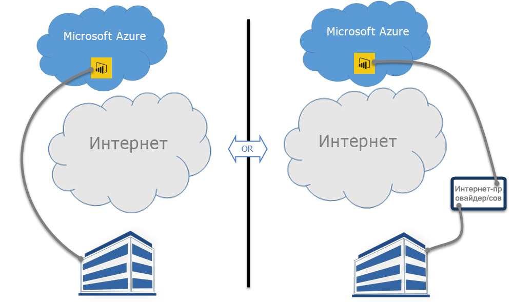

# Power BI и ExpressRoute
С помощью **Power BI** и **ExpressRoute** можно создать подключение между частной сетью организации и Power BI (или используя средство совместного размещения поставщика услуг Интернета), обходя Интернет для повышения безопасности конфиденциальных данных Power BI и подключений.

**ExpressRoute** — это служба Azure, которая позволяет создавать частные подключения между центрами обработки данных Azure (где находится Power BI) и локальной инфраструктурой или создавать частные подключения между центрами обработки данных Azure и средой совместного размещения.

Вы можете получить [дополнительные сведения об ExpressRoute](https://azure.microsoft.com/services/expressroute/) или о [регистрации](https://azure.microsoft.com/pricing/details/expressroute/).

> [!NOTE]
> Power BI поддерживается в режиме общедоступного пиринга, как описано в статье [Вопросы и ответы по ExpressRoute](https://docs.microsoft.com/azure/expressroute/expressroute-faqs).
> 
> 

## Исключения ExpressRoute для Power BI
Служба Power BI совместима с ExpressRoute, кроме нескольких исключений, где Power BI получает или отправляет данные через общедоступный Интернет. Эти конкретные исключения часто содержат статические данные, такие как файлы конфигурации браузера, загруженные с ближайшего узла **сети доставки содержимого (CDN)**. Некоторые широкие исключения применимы ко всем данным Power BI, а некоторые применимы к конкретным компонентам или службам. Каждое из этих исключений описано в следующих разделах.

### Общие исключения в Power BI и ExpressRoute
Исключение в **Power BI** и **ExpressRoute** означает, что передача данных в Power BI или обратно осуществляется через общедоступный Интернет, а не по частному каналу ExpressRoute.

Ниже приведены два общих исключения в Power BI с использованием ExpressRoute.

* Статические файлы, загружаемые из **сети доставки содержимого (CDN)** и веб-сайтов
* Данные **телеметрии**, передаваемые через общедоступный Интернет

Для эффективной передачи пользователям необходимого статического контента и файлов в соответствии с географическим расположением через общедоступный Интернет Power BI использует несколько**сетей доставки содержимого (CDN)** или веб-сайты. Статическими файлами могут быть скачиваемые продукты (например, **Power BI Desktop**, **локальный шлюз данных** или **пакеты содержимого Power BI** от различных независимых поставщиков услуг), файлы конфигурации браузера, которые используются для инициализации и установки последующих подключений к Power BI, а также начальная безопасная страница входа в Power BI (учетные данные отправляются только через ExpressRoute).   

Некоторые **данные телеметрии** также отправляются через общедоступный Интернет и через ExpressRoute. Данные телеметрии включают в себя статистику использования и схожие данные, передаваемые службам, которые используются для отслеживания использования и активности.

### Приложение Power BI SaaS и ExpressRoute
Когда пользователь инициирует подключение к службе Power BI (powerbi.com или через Cortana), целевая страница Power BI, страница входа и статические файлы, которые подготавливают браузер к подключению и взаимодействию с Power BI, извлекаются из сети CDN или веб-сайтов, которые подключаются через общедоступный Интернет.

После выполнения входа последующие взаимодействия с данными Power BI происходят через ExpressRoute, за исключением некоторых компонентов и служб, которые зависят от данных общедоступного Интернета:

* Для **визуальных элементов карт** требуется передача данных и подключение к службе Bing Virtual Earth или службе геокодирования Bing, которые выполняются через общедоступный Интернет.
* Для интеграции Power BI с **Cortana** требуется доступ к Bing через общедоступный Интернет.
* Когда пользователь добавляет **пользовательские ссылки**, такие как изображение или видео, Power BI запрашивает данные по такой ссылке, предоставленной пользователем, которая может использовать или не использовать ExpressRoute.
* Пользователи могут отправлять **отзывы в Power BI** в форме текста (или изображений) с помощью механизма обратной связи User Voice, который использует для передачи общедоступный Интернет.
* **Поставщик содержимого Новостей Bing** загружает содержимое из Bing, используя общедоступный Интернет.
* При подключении к **приложениям** (например, к пакетам содержимого) пользователям часто приходится вводить учетные данные и параметры, используя страницы, которые предоставляются поставщиком SaaS. Такие страницы могут использовать или не использовать ExpressRoute.

| Активность пользователей | Назначение |
| --- | --- |
| Целевая страница (до входа в систему) |`maxcdn.bootstrapcdn.com ; ajax.aspnetcdn.com ; netdna.bootstrapcdn.com ; cdn.optimizely.com; google-analytics.com ` |
| Имя входа |`*.mktoresp.com ; *.aadcdn.microsoftonline-p.com ; *.msecnd.com ; *.localytics.com ; ajax.aspnetcdn.com` |
| Информационная панель, отчет, управление наборами данных (включая карты и геокодирование) |`*.localytics.com ; *.virtualearth.net ; platform.bing.com; powerbi.microsoft.com; c.microsoft.com; app.powerbi.com; *.powerbi.com; dc.services.visualstudio.com ` |
| Поддержка |`support.powerbi.com ; powerbi.uservoice.com ; go.microsoft.com ` |

### Power BI Desktop и ExpressRoute
Служба Power BI Desktop также совместима с ExpressRoute, кроме нескольких исключений, которые описаны в следующем списке.

* **Уведомления об обновлениях**, которые используются для определения, имеют ли пользователи самую последнюю версию Power BI Desktop, передаются через общедоступный Интернет.
* Некоторые **данные телеметрии** передаются через общедоступный Интернет.
* Для **визуальных элементов карт** требуется передача данных и подключение к службе **Bing Virtual Earth** или службе **геокодирования Bing**, которые выполняются через общедоступный Интернет.
* **Получение данных** из некоторых источников данных, таких как **веб-сайты** или сторонние поставщики SaaS, происходит через общедоступный Интернет.

### Power BI PaaS и ExpressRoute
Power BI предоставляет интерфейсы API и другие компоненты на основе платформы, позволяющие разработчикам создавать настраиваемые решения Power BI и приложения. Помимо данных телеметрии и CDN, описанных ранее в этом разделе, для передачи данных Power BI PaaS через общедоступный Интернет используются следующие службы.

| Активность PaaS | Используемые дополнительные назначения |
| --- | --- |
| Общедоступное внедрение (телеметрия) |`c1.microsoft.com` |
| Пользовательские визуальные элементы (CDN) |`*.azureedge.net` |

Некоторые **пользовательские визуальные элементы** создаются сторонними поставщиками, а некоторые — корпорацией Майкрософт. Они могут использовать или не использовать ExpressRoute.

### Power BI Mobile и ExpressRoute
В этом документе не описывается использование мобильных приложений Power BI.  

### Локальный шлюз данных и ExpressRoute
Когда со службой Power BI используется **локальный шлюз данных**, передачи данных совместимы с ExpressRoute. Исключением являются действия пользователей, описанные в разделе о **SaaS- приложении Power BI и ExpressRoute** выше.  

