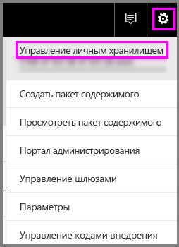
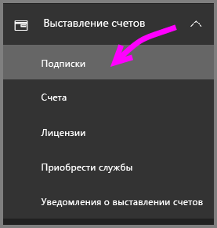

# Power BI Pro в вашей организации

Power BI Pro представляет собой платную лицензию, которая предоставляет дополнительные возможности. Лицензии Power BI Pro предназначены для группы, которой требуется взаимодействовать и совместной работать с другими пользователями, чтобы принимать решения на основе данных.  Каждому участнику группы, который создает или просматривает общее содержимое Power BI, нужна лицензия Pro, если только это содержимое не соотнесено с выделенными ресурсами с помощью Power BI Premium.

Лицензия Power BI Pro нужна для следующих функций:

* **Анализ данных в Excel или Power BI Desktop** — используйте Excel или Power BI Desktop для просмотра набора данных, опубликованного в Power BI, и взаимодействия с ним. Дополнительные сведения см. в разделе [Анализ в Excel](service-analyze-in-excel.md).

* **Общий доступ к панелям мониторинга и совместная работа с помощью рабочих областей** — рабочие области Power BI облегчают совместную работу с коллегами с использованием панелей мониторинга, отчетов и наборов данных. Дополнительные сведения см. в разделе [Совместная работа в рабочей области приложения Power BI](service-collaborate-power-bi-workspace.md).

* **Просмотр общего содержимого** — пользователи с подпиской Pro могут просматривать панели мониторинга и отчеты, предоставленные им для общего доступа, взаимодействовать с ними, а также повторно предоставлять их для общего доступа (если это разрешено). Однако пользователь с подпиской Pro не может изменять такие панели мониторинга и отчеты. Дополнительные сведения см. в разделе [Предоставление общего доступа коллегам и другим пользователям к панелям мониторинга и отчетам Power BI](service-share-dashboards.md).

* **Интеграция содержимого с Microsoft Teams** — вы можете добавить вкладку Power BI в канал Microsoft Teams. Microsoft Teams автоматически обнаруживает все отчеты в рабочей области. Дополнительные сведения см. в разделе [Взаимодействие групп Power BI с Microsoft Teams](https://powerbi.microsoft.com/en-us/blog/power-bi-teams-up-with-microsoft-teams/). 

## 60-дневная пробная версия Power BI Pro для пользователей

Зарегистрировав бесплатную учетную запись, вы можете использовать функции Power BI Pro бесплатно в течение 60 дней. Вы получите доступ ко всем функциональным возможностям учетных записей Pro на период действия пробной версии. В Power BI Pro доступны все функции бесплатной версии Power BI, а также дополнительные возможности общего доступа и совместной работы. Дополнительные сведения см. в разделе [Цены на Power BI](https://powerbi.microsoft.com/en-us/pricing/). Чтобы ознакомиться с 60-дневной бесплатной пробной версией Power BI Pro, выполните вход в службу Power BI и попробуйте одну из указанных ниже функций Power BI.

* [Создание рабочей области](consumer/end-user-create-apps.md)
* [предоставление общего доступа к панелям мониторинга](service-share-dashboards.md).

При выборе любой из этих функций вам будет предложено запустить бесплатную пробную версию. Вы также можете перейти в указанную пробную версию, щелкнув значок шестеренки и выбрав "Управление личным хранилищем". Затем выберите "Попробовать версию Pro бесплатно" справа.

   
    
   

После этого можно выбрать "Запустить пробную версию".

   

> [!NOTE]
> Пользователи, использующие преимущества пробной версии Power BI Pro, не отображаются на портале администрирования Office 365 как пользователи пробной версии Power BI Pro (они отображаются как пользователи бесплатной версии Power BI). Однако они отображаются как пользователи пробной версии Power BI Pro на странице управления хранилищем в Power BI.
>

> [!NOTE]
> Если ИТ-администратор хочет приобрести и развернуть лицензии на пробную версию Power BI для нескольких пользователей в организации без принятия условий пробной версии по отдельности каждым из них, он может зарегистрировать пробную версию подписки на Power BI Pro. Чтобы зарегистрироваться для пробной версии администратора, необходимо быть глобальным администратором Office 365 или администратором выставления счетов или создать новый клиент. Дополнительные сведения см. в статье [Приобретение Power BI Pro](service-admin-purchasing-power-bi-pro.md).
>

Чтобы при работе со службой проверить, имеется ли у вас пробная учетная запись Pro, щелкните значок шестеренки и выберите "Управление личным хранилищем".

   

## Пробная версия подписки в Office 365

Вы можете пробную версию Power BI Pro для своей организации. Оформив такую подписку, вы сможете назначить лицензии на Power BI Pro своим пользователям. Дополнительные сведения о назначении лицензий см. в статье [Назначение лицензий пользователям в Office 365](https://support.office.com/en-us/article/assign-licenses-to-users-in-office-365-for-business-997596b5-4173-4627-b915-36abac6786dc?ui=en-US&rs=en-US&ad=US).

> [!NOTE]
> В организации можно использовать только одну пробную версию для клиента. Это означает, что в клиенте уже используется пробная версия Power BI Pro, ее нельзя применить снова. Если вам нужна помощь, обратитесь в [службу поддержки Office 365 по вопросам выставления счетов](https://support.office.microsoft.com/en-us/article/contact-support-for-business-products-admin-help-32a17ca7-6fa0-4870-8a8d-e25ba4ccfd4b?CorrelationId=552bbf37-214f-4202-80cb-b94240dcd671&ui=en-US&rs=en-US&ad=US).
>

Выполните следующие действия, чтобы получить пробную версию подписки в Offiec 365:

1. Перейдите в [Центр администрирования Office 365](https://portal.office.com/adminportal/home#/homepage).
2. В левой области навигации выберите "Выставление счетов" и затем "Подписки".

   

3. Выберите "Добавить подписки" справа.

   

4. В разделе «Другие планы» наведите указатель мыши на многоточие (…) для Power BI Pro и выберите «Начать использовать бесплатную пробную версию».

    

5. На экране подтверждения заказа нажмите кнопку "Попробовать".
6. В квитанции заказа нажмите кнопку «Продолжить».

## Приобретение Power BI Pro

Вы можете приобрести Power BI Pro через Microsoft Office 365 или сертифицированного партнера корпорации Майкрософт. Дополнительные сведения о способах приобретения Power BI Pro см. в статье [Приобретение Power BI Pro](service-admin-purchasing-power-bi-pro.md).

## Дальнейшие действия
[Самостоятельная регистрация в Power BI](service-admin-signing-up-for-power-bi-with-a-new-office-365-trial.md)
 
[Бесплатная версия Power BI в вашей организации](service-admin-service-free-in-your-organization.md)
 
[Приобретение Power BI Pro](service-admin-purchasing-power-bi-pro.md)
 
[Активация расширенной пробной версии Power BI Pro](service-extended-pro-trial.md)
 
[Назначение лицензий Power BI Pro](service-admin-assigning-power-bi-pro-licenses.md)
 
[Что такое Power BI Premium?](service-admin-premium-manage.md)
 
[Как купить Power BI Premium](service-admin-premium-purchase.md)
 
[Техническая документация по Power BI Premium](https://aka.ms/pbipremiumwhitepaper)

Появились дополнительные вопросы? [Попробуйте задать вопрос в сообществе Power BI.](https://community.powerbi.com/)