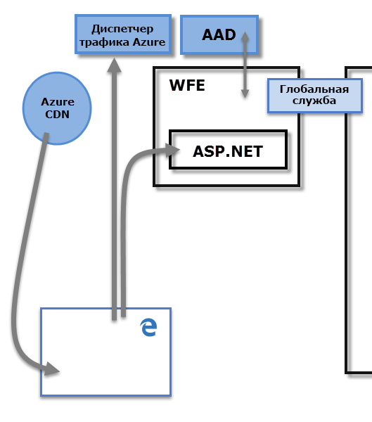
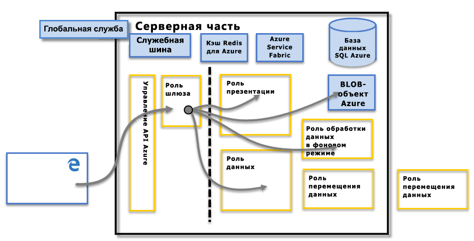

# Безопасность Power BI
Чтобы получить подробное описание системы безопасности в Power BI, [скачайте технический документ по безопасности Power BI](http://go.microsoft.com/fwlink/?LinkId=829185):

Служба Power BI работает на базе **Azure**— инфраструктуре и платформе корпорации Майкрософт для облачных вычислений. Архитектура службы Power BI основана на двух кластерах: кластере веб-интерфейса (**WFE**) и **внутреннем** кластере. Кластер WFE отвечает за первоначальное соединение и проверку подлинности в службе Power BI, после чего все остальные операции пользователя выполняются через внутренний кластер. Для хранения удостоверений пользователей и управления этими удостоверениями Power BI использует Azure Active Directory (AAD), а для управления хранение данных и метаданных — соответственно большие двоичные объекты Azure и Базу данных SQL Azure.

## Архитектура Power BI
Каждое развертывание Power BI состоит из двух кластеров — кластера веб-интерфейса (**WFE**) и **внутреннего** кластера.

Кластер **WFE** управляет первоначальным соединением и процессом проверки подлинности в службе Power BI, с помощью AAD, а также предоставляет маркеры для последующих клиентских подключений к службе Power BI. Для проверки подлинности и загрузки статического контента и файлов Power BI направляет пользовательский трафик в ближайший центр обработки данных, определяемый по записи DNS подключающегося к службе клиента, используя для этого **диспетчер трафика Azure** (ATM). Для эффективной передачи пользователям необходимого статического контента и файлов в соответствии с географическим расположением Power BI использует **сеть доставки содержимого Azure** (СВТ).

**Внутренний** кластер обеспечивает взаимодействие прошедших проверку подлинности клиентов со службой Power BI. **Внутренний** кластер управляет визуализациями, пользовательскими панелями мониторинга, наборами данных, отчетами, хранением данных, подключениями к данным, обновлением данных и другими видами взаимодействия со службой Power BI. **Роль шлюза** служит шлюзом между запросами пользователей и службой Power BI. Пользователи не взаимодействуют напрямую ни с одной ролью, кроме **роли шлюза**. Со временем обработку **роли шлюза** возьмет на себя **API управления Azure**.

> [!IMPORTANT]
> Крайне важно отметить, что через общедоступный Интернет доступны только роли **API управления Azure** (APIM) и **Шлюз** (GW). Они обеспечивают проверку подлинности, авторизацию, защиту от DDoS, регулирование, балансировку нагрузки, маршрутизацию и другие функции.
> 
> 

## Безопасность хранения данных
Для хранения данных и управления ими Power BI использует два основных репозитория: данные, передаваемые пользователями, обычно отправляются в хранилище **больших двоичных объектов Azure** , в то время как все метаданные, а также артефакты для самой системы хранятся в **Базе данных SQL Azure**.

Пунктирная линия на представленном выше изображении **внутреннего** кластера демонстрирует границу между единственными двумя компонентами, доступными пользователям (слева от пунктирной линии), и ролями, доступными только для системы. Когда прошедший проверку пользователь подключается к службе Power BI, **роль шлюза** принимает и обрабатывает соединение и все поступающие от клиента запросы (со временем эту задачу возьмет на себя **API управления Azure**), после чего взаимодействует от имени пользователя с остальной частью службы Power BI. Например, если клиент пытается открыть панель мониторинга, **роль шлюза** принимает этот запрос, а затем самостоятельно отправляет **роли презентации** запрос о получении данных, необходимых для отображения панели мониторинга в браузере.

## Проверка подлинности пользователей
Для проверки подлинности пользователей, выполняющих вход в службу Power BI, используется Azure Active Directory ([AAD](http://azure.microsoft.com/services/active-directory/)), а тот, в свою очередь, использует учетные данные входа Power BI всякий раз, когда пользователь пытается получить доступ к ресурсам, требующим проверки подлинности. Пользователи входят в службу Power BI по адресу электронной почты, указанному при создании учетной записи в Power BI; Power BI передает этот адрес в ресурсы как *действительное имя пользователя*каждый раз, когда пользователь пытается подключиться к данным. После этого *действительное имя пользователя* сопоставляется с *именем участника-пользователя* ([UPN](https://msdn.microsoft.com/library/windows/desktop/aa380525\(v=vs.85\).aspx) и разрешается в связанную учетную запись домена Windows, которая подвергается проверке подлинности.

Для организаций, где в качестве имени входа в Power BI используются рабочие адреса электронной почты (например, *david@contoso.com*), сопоставление *действительного имени пользователя* с UPN выполняется просто. Для организаций, не использующих рабочие адреса электронной почты в качестве имени входа в Power BI (например, *david@contoso.onmicrosoft.com*), надлежащее сопоставление между AAD и локальными учетными данными потребует [синхронизации каталогов](https://technet.microsoft.com/library/jj573653.aspx).

Система безопасности платформы для Power BI включает также защиту многопользовательской среды, сетевую защиту и возможность добавления мер безопасности на базе AAD.

## Безопасность данных и служб
Дополнительные сведения см. в [центре управления безопасностью Майкрософт](https://www.microsoft.com/trustcenter).

Как описано ранее в этой статье, серверы Active Directory используют имя пользователя для входа в Power BI для сопоставления учетных данных с UPN. При этом **важно** отметить, что пользователи несут ответственность за данные, к которым предоставляют доступ: если пользователь подключается к источникам данных, указав свои учетные данные, а затем на основе этих данных предоставляет общий доступ к отчету (информационной панели, набору данных и т. д.), соответствующие пользователи получают доступ к отчету без проверки подлинности со стороны оригинального источника данных.

Исключение составляют подключения к **SQL Server Analysis Services** через **локальный шлюз данных**. Панели мониторинга сохраняются в кэше Power BI, но для доступа к исходным отчетам или наборам данных требуется аутентификация соответствующего пользователя. При этом доступ предоставляется, только если у пользователя есть надлежащие учетные данные для доступа к этим сведениям. Дополнительную информацию см. в разделе [Локальный шлюз данных во всех подробностях](service-gateway-onprem-indepth.md).

