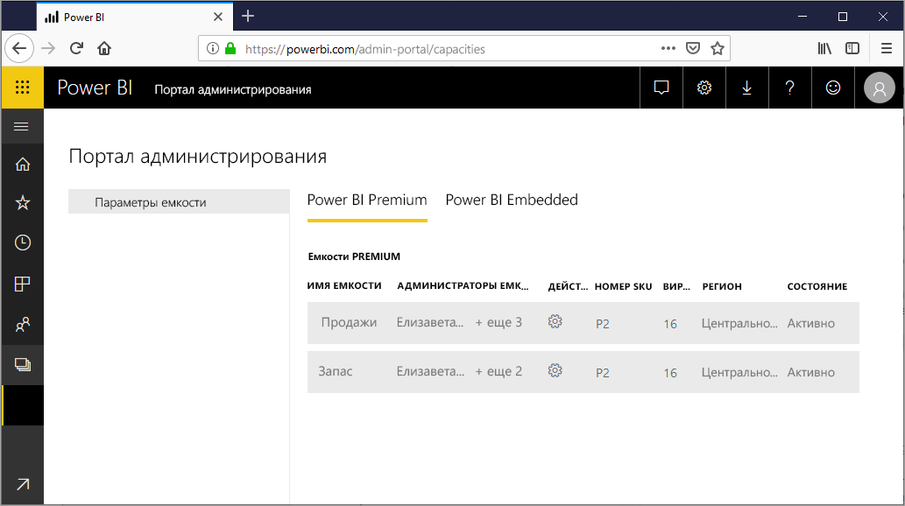
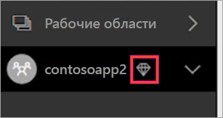
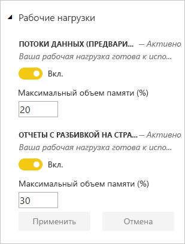
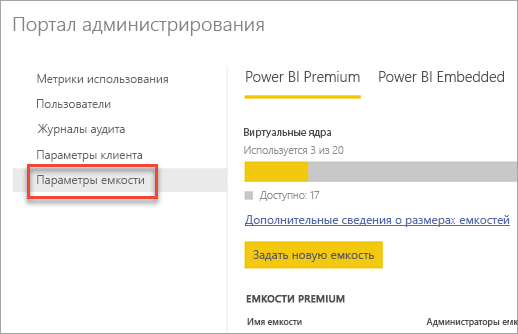
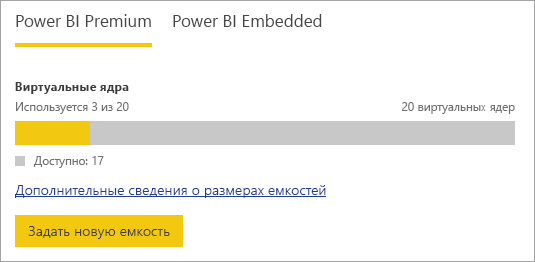
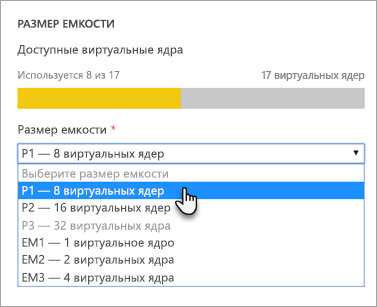
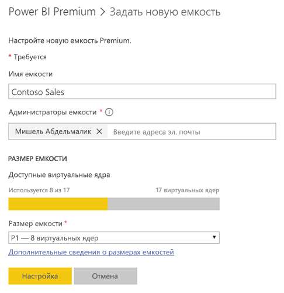
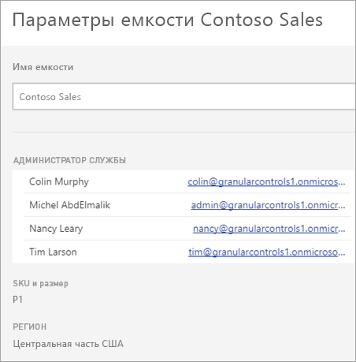
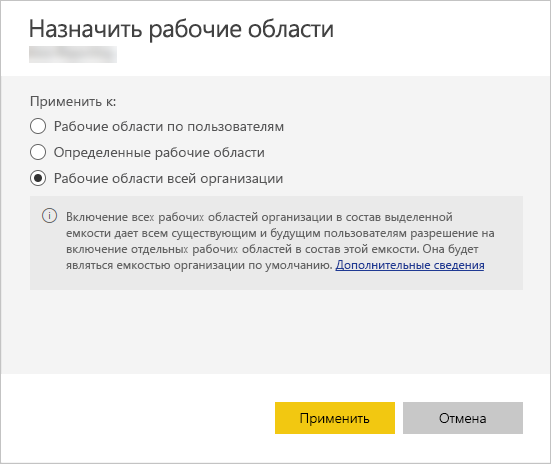
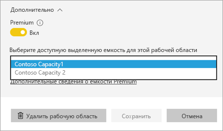

# Управление емкостью в Power BI Premium и Power BI Embedded

Узнайте, как управлять емкостью Power BI Premium и Power BI Embedded, которая предоставляет выделенные ресурсы для вашего содержимого.

## Что такое емкость?

*Емкость* — это ключевая характеристика предложений Power BI Premium и Power BI Embedded. Это набор ресурсов, зарезервированных для монопольного использования вашей организацией. Наличие выделенной емкости позволяет публиковать панели мониторинга, отчеты и наборы данных для пользователей в организации без необходимости приобретать лицензии для них. Она также обеспечивает предсказуемую и согласованную производительность содержимого, размещенного в емкости. Дополнительные сведения см. в статье [Что такое Power BI Premium?](service-premium.md)

### Администраторы емкости

Если вас добавили в емкость как *администратора емкости*, у вас есть полный контроль над этой емкостью и функциями ее администрирования. На портале администрирования Power BI можно добавить дополнительных администраторов емкости или предоставить пользователям разрешения на назначение емкости. Вы можете массово распределять рабочие пространства в емкости и просматривать метрики ее использования.

> [!NOTE]
> Администраторы емкости Power BI Embedded указываются на портале Microsoft Azure.

Каждая емкость имеет собственных администраторов. Назначение администратора емкости для одной емкости не дает ему доступ ко всем емкостям организации. По умолчанию у администраторов емкости нет доступа ко всем областям администрирования Power BI, таким как метрики использования, журналы аудита или параметры клиента. Кроме того, у администраторов емкости нет прав на настройку новых емкостей или изменение SKU существующих емкостей. Доступ к таким параметрам есть только у глобальных администраторов Office 365 и администраторов службы Power BI.

Все глобальные администраторы Office 365 и администраторы службы Power BI автоматически являются администраторами емкостей Power BI Premium и Power BI Embedded.

## Приобретение емкости

Чтобы воспользоваться преимуществами выделенной емкости, необходимо приобрести Power BI Premium в центре администрирования Office 365 или создать ресурс Power BI Embedded на портале Microsoft Azure. Дополнительные сведения см. в следующих статьях:

* **Power BI Premium.** [Как купить Power BI Premium](service-admin-premium-purchase.md)

* **Power BI Embedded.** [Создание емкости Power BI Embedded на портале Azure](https://docs.microsoft.com/azure/power-bi-embedded/create-capacity)

При покупке SKU определенного уровня Power BI Premium или Embedded ваш клиент получает соответствующее количество виртуальных ядер, которые будут использоваться в работающей емкости. Например, при покупке SKU Power BI Premium уровня P3, клиент получает 32 виртуальных ядра. Дополнительные сведения см. в разделе [Узлы емкости Premium](service-premium.md#premium-capacity-nodes).

## Как Premium выглядит для пользователей

В большинстве случаев пользователям не нужно знать, что они находятся в емкости Premium. Их панели мониторинга и отчеты будут работать как прежде. В качестве визуального указания рядом с рабочими областями, имеющими емкость Premium, отображается значок с бриллиантом.

## Настройка рабочих нагрузок

По умолчанию емкости Power BI Premium и Power BI Embedded поддерживают только рабочие нагрузки, связанные с выполнением запросов Power BI в облаке. Теперь мы предлагаем поддержку двух дополнительных рабочих нагрузок в режиме предварительной версии: **Отчеты с разбивкой на страницы** и **Потоки данных**. Дополнительные сведения: [Рабочие нагрузки в емкости Premium](service-premium.md#workloads-in-premium-capacity).

Чтобы включить рабочие нагрузки на портале администрирования Power BI, выполните следующие действия.

1. В разделе **Параметры емкости** выберите нужную емкость.

1. В разделе **Дополнительно** разверните **Рабочие нагрузки**.

1. Включите одну или несколько рабочих нагрузок и задайте значение для параметра **Максимальный объем памяти**.

    

1. Нажмите кнопку **Применить**.

## Мониторинг использования емкости

Power BI предоставляет приложение для мониторинга использования емкости. Дополнительные сведения см. в статье [Мониторинг емкостей Power BI Premium в вашей организации](service-admin-premium-monitor-capacity.md).

## Управление емкостью

После приобретения узлов емкости в Office 365 можно задать емкость на портале администрирования Power BI. Управление емкостями Power BI Premium ведется в разделе **Параметры емкости** на портале.

Чтобы управлять емкостью, выберите ее имя. После этого вы перейдете на экран управления емкостью.

Если емкости не назначена ни одна рабочая область, вы увидите сообщение, позволяющее [назначить рабочую область в емкость](#assign-a-workspace-to-a-capacity).

### Настройка новой емкости (Power BI Premium)

На портале администрирования показано количество использованных и оставшихся *виртуальных ядер*. Общее количество виртуальных ядер зависит от номера SKU Premium, который вы приобрели. Например, купив P3 и P2, вы получите 48 доступных ядер — 32 для P3 и 16 для P2.

При наличии доступных виртуальных ядер настройка новой емкости осуществляется так:

1. Выберите **Задать новую емкость**.

1. Дайте имя своей емкости.

1. Определите администратора для этой емкости.

1. Выберите размер емкости. Предлагаемые варианты зависят от количества доступных виртуальных ядер. Нельзя выбрать вариант, количество виртуальных ядер в котором превышает доступное вам количество.

    

1. Выберите **Настроить**.

    

Администраторы емкости, а также администраторы Power BI и глобальные администраторы Office 365 увидят емкость в списке на портале администрирования.

### Параметры емкости

1. На экране управления емкостью Premium в разделе **Действия** щелкните **значок шестеренки**, чтобы проверить и изменить параметры. 

    

1. В параметрах показаны администраторы службы, SKU и размер емкости и регион, в котором она расположена.

    

1. Можно также переименовать или удалить емкость.

    

> [!NOTE]
> Управление параметрами емкости Power BI Embedded осуществляется на портале Microsoft Azure.

### Изменить размер емкости

Администраторы Power BI и глобальные администраторы Office 365 могут изменить емкость Power BI Premium. Администраторам емкости, которые не являются администраторами Power BI или глобальными администраторами Office 365, этот параметр недоступен.

1. Выберите пункт **Изменить размер емкости**.

    

1. На экране **Изменение размера емкости** можно повысить или понизить уровень емкости нужным образом.

    

    Администраторы могут создавать и удалять узлы, а также изменять их размер при условии, что в них есть необходимое число виртуальных ядер.

    SKU уровня P невозможно понизить до SKU уровня EM. Если навести указатель мыши на отключенные параметры, появится объяснение.

### Проверка разрешений пользователя

Вы можете назначить дополнительных администраторов емкости, а также пользователей, которые будут иметь разрешения на *назначение емкости*. Пользователь, имеющий разрешения на назначение, может назначить рабочую область приложения емкости, если он является администратором этой рабочей области. Он также может назначить емкости свою *личную рабочую область*. У пользователей с разрешениями на назначение не будет доступа к порталу администрирования.

> [!NOTE]
> Администраторы емкости Power BI Embedded указываются на портале Microsoft Azure.

В разделе **Разрешения пользователя** разверните узел **Пользователи с разрешениями на назначение**, а затем добавьте пользователей или группы в зависимости от ситуации.

## Назначение рабочей области для емкости

Есть два способа назначить рабочую область в емкость: на портале администрирования и из рабочей области приложения.

### Назначение на портале администрирования

Администраторы емкости вместе с администраторами Power BI и глобальными администраторами Office 365 могут выполнять массовое назначение рабочих областей в разделе управления емкостью Premium на портале администрирования. При управлении емкостью вы увидите раздел **Рабочие области**, который позволяет вам назначать рабочие области.

1. Выберите **Назначить рабочие области**. Этот параметр доступен в нескольких местах.

1. Сделайте выбор в разделе **Применяются к**.

    

   | Выбор | Описание |
   | --- | --- |
   | **Рабочие области по пользователям** | При назначении рабочих областей пользователя или группы емкости Premium назначаются все рабочие области, принадлежащие этим пользователям, включая личные рабочие области. Эти пользователи автоматически получат разрешения на назначения рабочих областей. Сюда входят рабочие области, уже назначенные другой емкости. |
   | **Определенные рабочие области** | Введите имя определенной рабочей области, чтобы назначить ее выбранной емкости. |
   | **The entire organization's workspaces** (Рабочие области всей организации) | Этот параметр назначит все рабочие области приложений и личные рабочие области в вашей организации для емкости Premium. Кроме того, все текущие и будущие пользователи смогут переназначать отдельные рабочие области для этой емкости. |
   | | |

1. Нажмите кнопку **Применить**.

### Назначение из рабочей области приложения

Вы также можете назначить емкости Premium рабочую область приложения из параметров этой области. Чтобы переместить рабочую область в емкость, необходимо иметь разрешения администратора этой рабочей области, а также разрешения на назначение для этой емкости. Обратите внимание, что администраторы рабочей области всегда могут удалить рабочую область из емкости Premium.

1. Чтобы изменить рабочую область приложения, щелкните многоточие **(. . .)** и выберите команду **Изменить рабочую область**.

    

1. В окне **Изменение рабочей области** разверните раздел **Дополнительно**.

1. Выберите емкость, куда вы хотите назначить эту рабочую область приложения.

    

1. Нажмите кнопку **Сохранить**.

После сохранения рабочая область вместе со всем содержимым будет перенесена в емкость Premium без нарушения работы пользователей.

## Ключ продукта сервера отчетов Power BI

На портале администрирования Power BI на вкладке **Параметры емкости** будет отображаться ключ продукта для сервера отчетов Power BI. Он будет доступен только глобальным администраторам или пользователям, которым назначена роль администратора службы Power BI, и только в том случае, если вы приобрели SKU определенного уровня Power BI Premium.

Щелкните **Ключ сервера отчетов Power BI**, чтобы появилось диалоговое окно с ключом вашего продукта. Вы можете скопировать его и использовать при установке.

Дополнительные сведения см. в статье [Установка сервера отчетов Power BI](report-server/install-report-server.md).

## Дальнейшие действия

Предоставление пользователям общего доступа к опубликованным приложениям. Дополнительные сведения см. в статье [Создание и распространение приложения в Power BI](service-create-distribute-apps.md).

Появились дополнительные вопросы? [Попробуйте задать вопрос в сообществе Power BI.](http://community.powerbi.com/)
