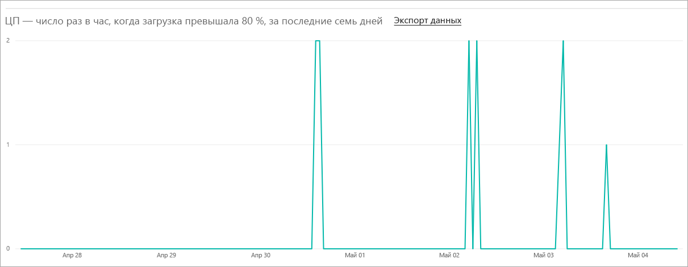
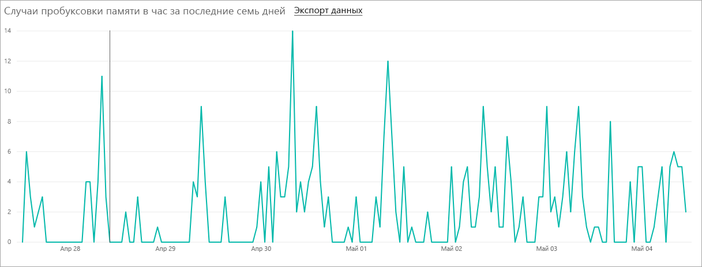
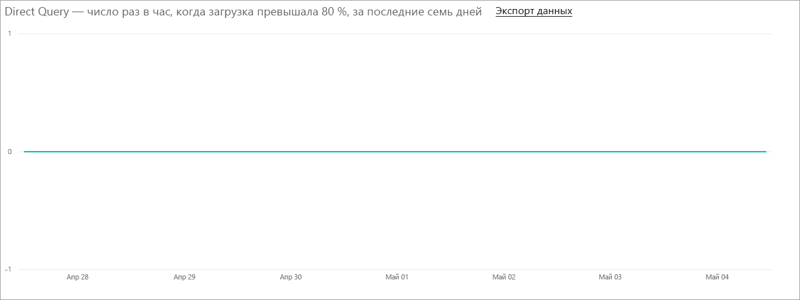

# Управление емкостью в Power BI Premium и Power BI Embedded
Узнайте, как управлять емкостью Power BI Premium и Power BI Embedded, а именно выделенными ресурсами для вашего содержимого.

Емкость — это ключевая характеристика предложений Power BI Premium и Power BI Embedded.

## Что такое емкость?
Емкость — это набор ресурсов, зарезервированных для монопольного использования вами. Наличие емкости позволяет публиковать панели мониторинга, отчеты и наборы данных для пользователей в организации без необходимости приобретать лицензии для них. Она также гарантирует предсказуемую и согласованную производительность содержимого, размещенного в емкости.

Использование емкости происходит незаметно для конечных пользователей. Они будут использовать Power BI или ваше приложение как обычно. Им даже не нужно знать, что некоторое (или все) содержимое размещается в выделенной емкости. Для ваших пользователей все будет работать точно так же, как и раньше.

[!INCLUDE [powerbi-premium-illustration](./includes/powerbi-premium-illustration.md)]

Дополнительные сведения см. в статье [Что такое Power BI Premium?](service-premium.md)

## Приобретение емкости
Чтобы воспользоваться преимуществами выделенной емкости, необходимо приобрести подписку на Power BI Premium в центре администрирования Office 365 или создать ресурс Power BI Embedded на портале Microsoft Azure. Дополнительные сведения см. в следующих статьях:

* **Power BI Premium**: [Как купить Power BI Premium](service-admin-premium-purchase.md).
* **Power BI Embedded:** [создание емкости Power BI Embedded на портале Azure](https://docs.microsoft.com/en-us/azure/power-bi-embedded/create-capacity)

При покупке SKU определенного уровня Power BI Premium ваш клиент получает соответствующее количество виртуальных ядер, которые будут использоваться в работающей емкости. Например, при покупке SKU Power BI Premium уровня P3, клиент получает 32 виртуальных ядра.

> [!NOTE]
> После окончания срока действия подписки у вас будет 30 дней полного доступа, но по окончании этого периода ваше содержимое будет размещено в общей емкости. Модели, размер которых превышает 1 ГБ, не поддерживаются в обычной общей лицензии.
>

## Администраторы емкости
> [!NOTE]
> Администраторы емкости Power BI Embedded определяются на портале Microsoft Azure.
>
>

Если вы назначены администратором определенной емкости, у вас есть полный контроль над этой емкостью и функциями ее администрирования. На портале администрирования Power BI можно добавить дополнительных администраторов емкости (только для Power BI Premium) или предоставить пользователям разрешения на назначение емкости. Вы можете массово распределять рабочие пространства в емкости и просматривать метрики ее использования.

Каждая емкость имеет собственных администраторов. Определение администратора емкости для одной емкости не дает ему доступ ко всем емкостям организации. По умолчанию у администраторов емкости нет доступа ко всем областям администрирования Power BI, таким как метрики использования, журналы аудита или параметры клиента. Кроме того, у администраторов емкости нет прав на настройку новых емкостей или изменение SKU существующих емкостей. Доступ к таким параметрам есть только у глобальных администраторов и администраторов службы Power BI.

Все глобальные администраторы Office 365 и администраторы Power BI автоматически являются администраторами емкостей Power BI Premium и Power BI Embedded.

## Управление емкостью
После приобретения узлов емкости в Office 365 вам нужно настроить новую емкость. Параметр задается на [портале администрирования Power BI](service-admin-portal.md). На портале администрирования вы увидите раздел **Параметры емкости**. Отсюда вы будете управлять емкостями Power BI Premium вашей организации.

При выборе элемента **Параметры емкости** вы перейдете на экран управления емкостью, по умолчанию относящийся к Power BI Premium.

### Настройка новой емкости (Power BI Premium)
Количество виртуальных ядер отражает используемый и доступный объем для создания емкости. Количество виртуальных ядер, доступных для вашей организации, зависит от приобретенного уровня SKU категории Premium. Например, купив P3 и P2, вы получите 48 доступных ядер — 32 для P3 и 16 для P2.

При наличии доступных виртуальных ядер настройка новой емкости осуществляется так:

1. Выберите **Задать новую емкость**.
2. Дайте **имя** своей емкости.
3. Определите администратора для этой емкости.

    Администратор емкости не должен быть администратором Power BI или глобальным администратором Office 365. Дополнительные сведения см. в разделе [Администраторы емкости](#capacity-admins).
4. Выберите размер емкости. Предлагаемые варианты зависят от количества доступных виртуальных ядер. Нельзя выбрать вариант, количество виртуальных ядер в котором превышает доступное вам количество.

    
5. Выберите **Настроить**.

    

Администраторы емкости, а также администраторы Power BI и глобальные администраторы Office 365 увидят емкость в списке на портале администрирования.

### Параметры емкости
На экране управления емкостью Premium щелкните **значок шестеренки (параметров)** в области действий. Так вы сможете переименовать или удалить емкость. В параметрах также показаны администраторы службы, SKU и размер емкости и регион, в котором она расположена.

> [!NOTE]
> Управление параметрами емкости Power BI Embedded осуществляется на портале Microsoft Azure.
>
>

### Изменение размера емкости (Power BI Premium)
Администраторы Power BI и глобальные администраторы Office 365 изменяют размер емкости Power BI Premium с помощью параметра **Изменить размер емкости**. Администраторам емкости, которые не являются администраторами Power BI или глобальными администраторами Office 365, этот параметр недоступен.

Экран **Изменить размер емкости** позволяет увеличить или уменьшить размер имеющейся емкости при наличии доступных ресурсов. Администраторы могут создавать и удалять узлы, а также изменять их размер при условии, что в них есть необходимое число виртуальных ядер.

SKU уровня P нельзя понизить до SKU уровня EM. Если навести указатель мыши на отключенные параметры, появится объяснение.

### Назначение емкости
Чтобы управлять емкостью, выберите ее имя. После этого вы перейдете на экран управления емкостью.

Если емкости не назначена ни одна рабочая область, вы увидите сообщение, позволяющее **назначить рабочие области**.

#### Разрешения пользователя
Для емкостей Power BI Premium можно назначить дополнительных **администраторов емкости**. Кроме того, можно назначить пользователей, у которых будут **разрешения на назначение емкости**. Пользователь, имеющий разрешения на назначение, может назначить рабочую область приложения емкости, если он является администратором этой рабочей области. Он также может назначить емкости свою *личную рабочую область*. У пользователей с разрешениями на назначение не будет доступа к порталу администрирования.

> [!NOTE]
> Администраторы емкости Power BI Embedded назначаются на портале Microsoft Azure.
>
>

## Измерения использования (Power BI Premium)
Для каждой емкости можно просматривать данные измерения использования ЦП и памяти, пробуксовки памяти и прямых запросов. Мы советуем отслеживать эти метрики, чтобы у пользователей не было проблем с производительностью при использовании емкости.

> [!NOTE]
> Использование емкости Power BI Embedded отслеживается на портале Azure.

| Метрика | Описание |
| --- | --- |
| ЦП |Число раз, когда загрузка ЦП превысила 80 %. |
| Пробуксовка памяти |Нехватка памяти в ядрах серверной части. В частности, это метрика показывает, сколько раз наборы данных вытесняются из памяти из-за нехватки памяти в результате использования нескольких наборов данных. |
| Использование памяти |Средний уровень использования памяти в гигабайтах (ГБ). |
| Прямых запросов в секунду | Число раз, когда количество прямых запросов и активных подключений превысило 80 % от максимального.     * Мы ограничиваем общее количество запросов DirectQuery и активных запросов на подключение в секунду.  * Ограничения составляют до 30 запросов в секунду для P1, 60 запросов в секунду для P2 и 120 запросов в секунду для P3.   * При учете указанного выше ограничения число прямых запросов и запросов активных подключений складывается. Например, при наличии 15 прямых запросов и 15 запросов на динамическое подключение в секунду будет достигнут лимит регулирования.  * Это в равной степени относится к локальным и облачным подключениям. |

Метрики отражают использование за последнюю неделю.  Чтобы изучить метрики более подробно, можно щелкнуть одну из плиток сводки.  В результате открываются подробные диаграммы для каждой из метрик, связанных с емкостью Premium.  На диаграммах представлены сводные данные за последнюю неделю, которые обновляются каждый час. Это позволяет определить, когда произошли те или иные события, связанные с производительностью емкости Premium.  

Базовые данные любой из метрик можно также экспортировать в CSV-файл.  Он будет содержать подробные сведения за каждый день последней недели с трехминутным интервалом.

## Назначение рабочей области для емкости
Существует несколько способов назначения рабочей области для емкости.

### Управление емкостью на портале администрирования
Администраторы емкости вместе с администраторами Power BI и глобальными администраторами Office 365 могут выполнять массовое назначение рабочих областей в разделе управления емкостью Premium на портале администрирования. При управлении емкостью вы увидите раздел **Рабочие области**, который позволяет вам назначать рабочие области.

1. Выберите **Назначить рабочие области**. Эту команду можно выбрать в нескольких местах. Она выполняет одну и ту же задачу.
2. Выберите **The entire organization's workspaces** (Рабочие области всей организации) или **Specific workspaces by user** (Определенные рабочие области пользователя).

   | Выбор | Описание |
   | --- | --- |
   | **The entire organization's workspaces** (Рабочие области всей организации) |Этот параметр назначит все рабочие области приложений и личные рабочие области в вашей организации для емкости Premium. Кроме того, все текущие и будущие пользователи смогут переназначать отдельные рабочие области для этой емкости. |
   | **Specific workspaces by user** (Определенные рабочие области пользователя) |При назначении рабочих областей пользователя или группы емкости Premium назначаются все рабочие области, принадлежащие этим пользователям, включая личные рабочие области. Эти пользователи автоматически получат разрешения на назначения рабочих областей. Сюда входят рабочие области, уже назначенные другой емкости. |
3. Нажмите кнопку **Применить**.

Этот параметр не позволяет назначать емкости определенные рабочие области.

### Параметры рабочей области приложения
Вы также можете назначить емкости Premium рабочую область приложения из параметров этой области. Чтобы назначить рабочую область приложения емкости Premium, выполните следующие действия.

Чтобы переместить рабочую область в емкость, необходимо иметь разрешения администратора этой рабочей области, а также разрешения на назначение для этой емкости. Обратите внимание, что администраторы рабочей области всегда могут удалить рабочую область из емкости Premium.

1. Чтобы изменить рабочую область приложения, щелкните многоточие **(...)** и выберите **Изменить рабочую область**.

    
2. В окне **Изменение рабочей области** разверните раздел **Advanced** (Дополнительно).
3. Если вам предоставлены разрешения на назначение емкости для любой емкости, у вас будет возможность включить **Premium** для этой рабочей области.
4. Выберите емкость, которую вы хотите назначить этой рабочей области приложения.

    
5. Нажмите кнопку **Сохранить**.

После сохранения рабочая область вместе со всем содержимым будет перенесена в емкость Premium без нарушения работы пользователей.

## Как Premium выглядит для пользователей
В большинстве случаев пользователям даже не нужно знать, что они находятся в емкости Premium. Их панели мониторинга и отчеты будут работать как прежде. В качестве визуального указания рядом с рабочими областями, имеющими емкость Premium, отображается значок с бриллиантом.

## Ключ продукта сервера отчетов Power BI
На портале администрирования Power BI на вкладке **Параметры емкости** будет отображаться ключ продукта для Сервера отчетов Power BI. Он будет доступен только глобальным администраторам или пользователям, которым назначена роль администратора службы Power BI, и только в том случае, если вы приобрели SKU определенного уровня Power BI Premium.

Щелкните **Ключ сервера отчетов Power BI**, чтобы появилось диалоговое окно с ключом вашего продукта. Вы можете скопировать его и использовать при установке.

Дополнительные сведения см. в статье [Установка сервера отчетов Power BI](report-server/install-report-server.md).

## Дальнейшие действия
Назначая рабочую область для емкости Premium, опубликованными приложениями можно делиться с пользователями бесплатной версии. Дополнительные сведения см. в статье [Создание и распространение приложения в Power BI](service-create-distribute-apps.md).

Появились дополнительные вопросы? [Попробуйте задать вопрос в сообществе Power BI.](http://community.powerbi.com/)
