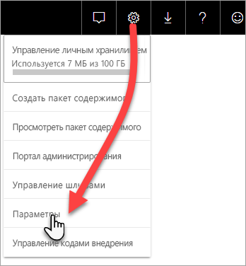
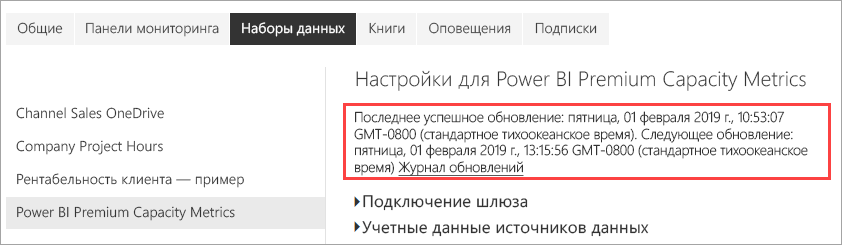
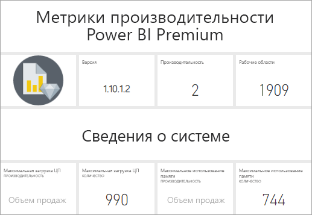
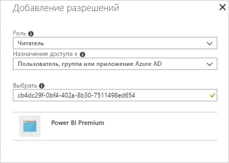

# Мониторинг емкостей Premium в приложении

Отслеживание емкостей очень важно для принятия обоснованных решений в отношении оптимального использования ресурсов емкости Premium. Вы можете контролировать емкость на портале администрирования или с помощью приложения **Power BI Premium Capacity Metrics**. В этой статье описывается приложение Premium Capacity Metrics. Оно предоставляет наиболее полные сведения об эффективности использования емкостей. Общее представление о средних значениях метрик использования за последние семь дней можно получить на портале администрирования. Дополнительные сведения о мониторинге на портале см. в статье [Мониторинг емкостей категории "Премиум" на портале администрирования](service-admin-premium-monitor-portal.md).

В приложение регулярно добавляются новые возможности и функции. Убедитесь в том, что вы используете последнюю версию. Если у вас установлена предыдущая версия приложения, лучше всего удалить ее, а затем нажать клавиши CTRL+F5, чтобы выполнить обновление.

## Установка приложения

Вы можете перейти к [приложению Premium Capacity Metrics](https://app.powerbi.com/groups/me/getapps/services/capacitymetrics) или установить его так же, как и другие приложения в Power BI.

1. В Power BI щелкните **Приложения**.

    

2. Справа щелкните **Получить приложения**.
3. В категории **Приложения** найдите приложение **Power BI Premium Capacity Metrics**.
4. Подпишитесь, чтобы установить приложение.

Немного подождите. Установка и обновление метрик занимает несколько минут. Если в приложении отображаются пустые метрики, нажмите клавишу F5, чтобы обновить страницу в браузере.

## Получение журнала обновления приложения

Чтобы узнать, когда в последний раз обновлялось приложение Premium Capacity Metrics, последовательно выберите **Параметры** > **Наборы данных** > **Power BI Premium Capacity Metrics** > **Журнал обновлений**. 

Вы увидите время последнего обновления. Можно также щелкнуть **Журнал обновлений**, чтобы просмотреть запланированные обновления и обновления по требованию.

## Мониторинг емкостей в приложении

Теперь, когда вы установили приложение, вы можете увидеть метрики емкости своей организации. В приложении реализована панель мониторинга со сводными метриками и подробными отчетами о них.

### Панель мониторинга

Чтобы просмотреть панель мониторинга с основными сводными метриками для емкостей, которые вы администрируете, перейдите в меню **Панели мониторинга** и щелкните **Метрики емкости Power BI Premium**. Откроется панель мониторинга.

На панели мониторинга отображаются указанные ниже метрики.

#### Максимум

| Метрика | Описание |
| --- | --- |
| Версия | Версия приложения. | 
| Производительность | Количество емкостей, для которых у вас есть права администратора. | 
| Рабочие области | Количество рабочих областей в ваших емкостях, которые отправляют метрики.|
|||

#### Сведения о системе

| Метрика | Описание |
| --- | --- |
| Емкость максимального использования ЦП | Емкость с максимальным количеством случаев, когда загрузка ЦП на 80 % превышала пороговое значение, за последние семь дней. |
| Количество случаев максимального использования ЦП | Количество случаев, когда максимальная загрузка ЦП указанной емкости на 80 % превышала пороговое значение, за последние семь дней. | 
| Емкость максимального использования памяти | Емкость с максимальным количеством случаев за последние семь дней, когда максимальный предел использования памяти превышал пороговое значение, с разделением на группы по три минуты.  |
| Количество случаев максимального использования памяти| Количество случаев, когда указанная емкость достигала максимального предела памяти, за последние семь дней с разделением на группы по три минуты. |
|||

#### Сведения о наборе данных

| Метрика | Описание |
| --- | --- |
| Наборы данных | Общее количество наборов данных во всех рабочих областях в емкостях.|
| Средний размер наборов данных (МБ) | Средний размер наборов данных во всех рабочих областях в емкостях.|  
| Среднее количество загруженных наборов данных | Среднее количество наборов данных, загруженных в память. |  
| Наборы данных — среднее количество активных наборов данных (%)| Средние количество активных наборов данных за последние семь дней. Набор данных считается активным, если пользователь взаимодействовал с визуальными элементами в течение последних трех минут. |
| ЦП — максимальное использование для наборов данных (%)| Максимальное использование ЦП рабочей нагрузкой набора данных за последние семь дней. |
| ЦП — среднее использование для наборов данных (%)| Среднее использование ЦП рабочей нагрузкой набора данных за последние семь дней. |
| Память — среднее использование для наборов данных (ГБ) | Среднее использование памяти рабочей нагрузкой набора данных за последние семь дней. |
| Память — максимальное использование для наборов данных (ГБ) | Максимальное использование памяти рабочей нагрузкой набора данных за последние семь дней.|
| Исключения наборов данных | Общее количество наборов данных, исключенных из-за нехватки памяти. |
| Количество случаев значительного использования ресурсов при активных подключениях или подключениях DirectQuery| Количество случаев, когда использование ресурсов при активных подключениях или подключениях DirectQuery превышало 80 % порогового значения, за последние семь дней с разделением на группы по три минуты. |
| Количество случаев максимального использования ресурсов при активных подключениях или подключениях DirectQuery| Наибольшее количество случаев, когда использование ресурсов при активных подключениях или подключениях DirectQuery превышало 80 %, за последние семь дней с разделением на группы по часу. |
| Максимальное использование ресурсов при активных подключениях или подключениях DirectQuery | Максимальное количество случаев, когда использование ресурсов при активных подключениях или подключениях DirectQuery превышало 80 % порогового значения, за последние семь дней с разделением на группы по три минуты.|
| Время максимального использования ресурсов для активных подключений или подключений DirectQuery | Время в формате UTC, когда максимальное использование ресурсов при активных подключениях или подключениях DirectQuery превышало 80 % чаще всего. |
| Общее количество обновлений | Общее количество обновлений за последние семь дней. |
| Надежность обновления (%) | Количество успешных обновлений, разделенное на общее количество обновлений, за последние семь дней. |
| Средняя продолжительность обновления (мин) | Среднее время, необходимое для обновления. |
| Среднее время ожидания обновления (мин)| Среднее время перед началом обновления. |
| Общее количество запросов |  Общее количество выполненных запросов за последние семь дней. |
| Общее количество запросов, ожидающих выполнения | Общее число запросов, которые ожидают выполнения. |
| Средняя продолжительность выполнения запросов (мс) | Среднее время выполнения запросов. |
| Среднее время ожидания запросов (мс) | Среднее время ожидания запросов к системным ресурсам перед их выполнением. |
|||

#### Сведения о потоке данных

| Метрика | Описание |
| --- | --- |
| Потоки данных |  Общее количество потоков данных во всех рабочих областях в емкостях.|
| Общее количество обновлений | Общее количество обновлений за последние семь дней.|  
| Средняя продолжительность обновления (мин) | Время выполнения обновления. |
| Среднее время ожидания обновления (минут) | Задержка между запланированным и фактическим временем начала обновления.|
| ЦП — максимальное использование для потоков данных (%) | Максимальное использование ЦП рабочей нагрузкой потоков данных за последние семь дней. |
| ЦП — среднее использование для потоков данных (%) | Среднее использование ЦП рабочей нагрузкой потоков данных за последние семь дней. |
| Память — максимальное использование для потоков данных (ГБ) | Максимальное использование памяти рабочей нагрузкой потоков данных за последние семь дней. |
| Память — среднее использование для потоков данных (ГБ) | Среднее использование памяти рабочей нагрузкой потоков данных за последние семь дней. |
|||

#### Сведения об отчете с разбивкой на страницы

| Метрика | Описание |
| --- | --- |
| Отчеты с разбивкой на страницы |  Общее количество отчетов с разбивкой на страницы во всех рабочих областях в емкостях. |
| Общее количество представлений | Общее количество случаев, когда все отчеты просматривались пользователями. | 
| Общее количество строк | Общее количество строк данных во всех отчетах.|
| Общее время | Общее время, необходимое для всех этапов (получение данных, обработка и визуализация) всех отчетов в миллисекундах. |
| ЦП — максимальное использование для отчетов с разбивкой на страницы (%) | Максимальное использование ЦП рабочей нагрузкой отчетов с разбивкой на страницы за последние семь дней. |
| ЦП — среднее использование ЦП для отчетов с разбивкой на страницы (%) | Среднее использование ЦП рабочей нагрузкой отчетов с разбивкой на страницы за последние семь дней. |
| Память — максимальное использование памяти для отчетов с разбивкой на страницы (ГБ) | Максимальное использование памяти рабочей нагрузкой отчетов с разбивкой на страницы за последние семь дней. |
| Память — среднее использование памяти для отчетов с разбивкой на страницы (ГБ) | Среднее использование памяти рабочей нагрузкой отчетов с разбивкой на страницы за последние семь дней. |
|||

#### Сведения об ИИ

| Метрика | Описание |
| --- | --- |
| Выполнение функций ИИ | Общее количество выполнений за последние семь дней. |
| Надежность выполнения функций ИИ (%) | Количество успешных выполнений, разделенное на общее количество выполнений, за последние семь дней. |
| Макс. ЦП (%)| Максимальное использование ЦП рабочей нагрузкой ИИ за последние семь дней. |
| Макс. память (ГБ) | Максимальное использование памяти рабочей нагрузкой ИИ за последние семь дней.|
| Максимальное время ожидания для выполнения функций ИИ (мс) | Максимальное время перед началом выполнения. |
| Среднее время ожидания для выполнения функций ИИ (мс)| Среднее время перед началом выполнения. |
| Максимальная длительность выполнения функций ИИ (мс) | Максимальное время, необходимое для выполнения. |
| Средняя длительность выполнения функций ИИ (мс)| Среднее время, необходимое для выполнения. |
| | |

### Отчеты

В отчетах приводятся более подробные метрики. Чтобы просмотреть отчеты о емкостей, для которых вы являетесь администратором, в меню **Отчеты**, щелкните **Метрики емкости Power BI Premium**. Или на панели мониторинга щелкните плитку метрик, чтобы перейти к нужному отчету. 

В нижней части отчета есть пять *вкладок*:

[**Наборы данных**](#datasets). Предоставляет подробные метрики о работоспособности наборов данных Power BI в емкостях.
[**Отчеты с разбивкой на страницы**](#paginated-reports). Предоставляет подробные метрики о работоспособности отчетов с разбивкой на страницы в емкостях.
[**Потоки данных**](#dataflows). Предоставляет подробные метрики обновления для потоков данных в доступных емкостях.
[**ИИ**](#ai). Обеспечивает подробные метрики по работоспособности функций ИИ, используемых в ваших емкостях.
[**Потребление ресурсов**](#resource-consumption). Предоставляет подробные метрики ресурсов, включая значительное использование памяти и ЦП.
[**Идентификаторы и сведения**](#ids-and-info). Имена, идентификаторы и сведения о владельцах емкостей, рабочих областей и рабочих нагрузок.

На каждой вкладке открывается страница для фильтрации метрик по емкости и диапазону дат. Если фильтры выбрано, по умолчанию для отчета будут отображаться метрики прошлой недели всех емкостей, которые отправляют отчеты метрики. 

### Наборы данных

На странице "Наборы данных" есть разные *области*: **Обновления**, **Длительность запросов**, **Задержки запросов** и **Наборы данных**. Для перехода к областям используйте кнопки в верхней части страницы.

#### область "Обновления"

| Раздел отчета | Метрики |
| --- | --- |
| Обновления |  Общее количество: общее количество обновлений для каждого набора данных.   Надежность: процентная доля обновлений, завершившихся успешно для каждого набора данных.   Среднее время ожидания: средняя задержка между запланированным временем и фактическим началом обновления набора данных в минутах.   Максимальное время ожидания: максимальное время ожидания для набора данных в минутах.   Средняя длительность: средняя длительность обновления для набора данных в минутах.   Максимальная длительность: максимальная длительность обновления для набора данных в минутах. |
| Пять наборов данных с наибольшей средней продолжительностью выполнения запросов в минутах |  Пять наборов данных с наибольшей средней продолжительностью обновления в минутах. |
| Пять наборов данных с наибольшим средним временем ожидания в минутах |  Пять наборов данных с наибольшим средним временем ожидания обновления в минутах. |
| Почасовое количество обновлений и потребление памяти (в ГБ) |  Успешные завершения, сбои и использование памяти с разделением на группы по часу по времени в формате UTC. |
| Почасовые показатели среднего времени ожидания обновления в минутах |  Среднее время ожидания обновления с разделением на группы по часу по времени в формате UTC. Большое число всплесков с высоким временем ожидания обновления могут означать, что емкость перегружена. |
|  |  |

#### Область длительности запросов

| Раздел отчета | Метрики |
| --- | --- |
| Длительность запросов |  Данные в этом разделе группируются по наборам данных, рабочим областям и часовым периодам за последние семь дней.   Всего: общее количество запросов, выполненных для набора данных.   Среднее: средняя продолжительность запросов для набора данных (в миллисекундах)   Максимальный: максимальная длительность запроса, выполненного для набора данных в миллисекундах.|
| Распределение продолжительности выполнения запросов |  Данные в гистограмме длительности запросов группируются по длительности запросов в миллисекундах по следующим категориям: ≤ 30 мс, от 30 до 100 мс, от 100 до 300 мс, от 300 мс до 1 сек, от 1 до 3 сек, от 3 до 10 сек, от 10 до 30 сек, больше 30 секунд. Длительные запросы и длительное время ожидания указывают на горячий уровень хранилища емкости. Это может также означать, что один набор данных вызывает проблемы и требует дальнейшего изучения. |
| 5 наборов данных с наибольшей средней длительностью запросов |  Пять наборов данных с наибольшей средней продолжительностью запросов в миллисекундах. |
| Почасовое распределение продолжительности выполнения запросов |  Количество запросов и средняя продолжительность их выполнения в миллисекундах в сравнении с использованием памяти в ГБ с разделением на группы по часу по времени в формате UTC. |
| Активные подключения или подключения DirectQuery (более 80 % использования) |  Количество случаев, когда использование ЦП при активных подключениях или подключениях DirectQuery превышало 80 %, с разделением на группы по часу по времени в формате UTC. |
|  |  |

#### Область Query Waits (Ожидания запросов)

| Раздел отчета | Метрики |
| --- | --- |
| Время ожидания запросов |  Данные в этом разделе группируются по наборам данных, рабочим областям и часовым периодам за последние семь дней.   Всего: общее количество запросов, выполненных для набора данных.   Количество ожиданий: количество запросов к набору данных, перед началом выполнения которых зафиксировано ожидание системных ресурсов.   Среднее: средняя продолжительность ожидания запросов для набора данных в миллисекундах.   Максимальный: длительность максимального ожидания запроса для набора данных в миллисекундах.|
| 5 наборов данных с наибольшим средним временем ожидания |  Пять наборов данных с наибольшим средним временем ожидания запросов в миллисекундах. |
| Распределение времени ожидания |  Данные гистограммы времени ожидания запросов группируются по времени ожидания в миллисекундах по следующим категориям: до 50 мс, от 50 до 100 мс, от 100 до 200 мс, от 200 до 400 мс, от 400 мс до 1 с, от 1 до 5 с более 5 с. |
| Почасовое распределение времени ожидания запросов |  Количество процессов ожидания запросов и среднее время ожидания в миллисекундах в сравнении с использованием памяти в ГБ с разделением по группам по часу по времени в формате UTC. |
|  |  |

#### область "Наборы данных"

| **Раздел отчета** | **Метрики** |
| --- | --- |
| Размеры набора данных  |  Максимальный размер: максимальный размер набора данных в МБ за указанный период. |
| Счетчики исключения наборов данных |  Всего: общее количество *вытеснений* наборов данных для каждой емкости. При нехватке памяти узел вытесняет один или несколько наборов данных из памяти. Наборы данных в неактивном состоянии (для которых не выполняются запросы или обновление) вытесняются в первую очередь. Для них применяется порядок "недавно использовавшиеся" (LRU).|
| Число наборов данных, загружаемых каждый час |  Число загруженных в память наборов данных и использование памяти в ГБ с разделением на группы по часу по времени в формате UTC. |
| Почасовые исключения наборов данных и использование памяти |  Исключения наборов данных и использование памяти с разделением на группы по часу по времени в формате UTC. |
| Использование памяти (%) |  Общее количество активных наборов данных в памяти в процентах от общего объема памяти. Разница между количество активных наборов данных и общим количеством определенных наборов данных, которые могут быть вытеснены. Отображается каждый час за последние семь дней. |
|  |  |

### Отчеты с разбивкой на страницы

| **Раздел отчета** | **Метрики** |
| --- | --- |
| Общие сведения об использовании |  Всего просмотров: количество просмотров отчета пользователями.   Число строк: количество строк данных в отчете.   Извлечение (сред.): средняя продолжительность получения данных для отчета (в миллисекундах). Высокая продолжительность может указывать на плохую оптимизацию запросов или другие проблемы с источником данных.    Обработка (сред.): средняя продолжительность обработки данных для отчета в миллисекундах.  Отрисовка (сред.): средняя продолжительность отображения отчета в окне браузера в миллисекундах.   Общее время: время для всех этапов обработки отчета в миллисекундах. |
| 5 отчетов с наибольшей средней длительностью получения данных |  Пять отчетов с наибольшим средним временем получения данных в миллисекундах. |
| 5 отчетов с наибольшей средней длительностью обработки отчета |  Пять отчетов с наибольшим средним временем обработки отчета в миллисекундах. |
| Почасовые результаты |  Успешные завершения, сбои и использование памяти с разделением на группы по часу по времени в формате UTC. |
| Почасовая длительность |  Время получения данных, обработки и визуализации отчета с разделением на группы по часу по времени в формате UTC. |
|  |  |

### Потоки данных

| **Раздел отчета** | **Метрики** |
| --- | --- |
| Обновления |  Всего: количество обновлений для каждого потока данных.   Надежность: процентная доля обновлений, завершившихся успешно для каждого потока данных.   Среднее время ожидания: средняя задержка между запланированным временем и фактическим началом обновления потока данных в минутах.   Максимальное время ожидания: максимальное время ожидания для потока данных в минутах.   Средняя длительность: среднее время обновления для потока данных в минутах.   Максимальная длительность: максимальное время обновления для потока данных в минутах. |
| Пять потоков данных с наибольшим средним временем обновления |  Пять потоков данных с наибольшим средним временем обновления в минутах. |
| Пять потоков данных с наибольшим средним временем ожидания |  Пять потоков данных с наибольшим средним временем ожидания обновления в минутах. |
| Почасовые показатели среднего времени ожидания обновления |  Среднее время ожидания обновления с разделением на группы по часу по времени в формате UTC. Большое число всплесков с высоким временем ожидания обновления могут означать, что емкость перегружена. |
| Почасовое количество обновлений и потребление памяти |  Успешные завершения, сбои и использование памяти с разделением на группы по часу по времени в формате UTC. |
|  |  |

### ИИ

| **Раздел отчета** | **Метрики** |
| --- | --- |
| Использование памяти ИИ | Использование памяти (в ГБ) с разделением на группы по часу с указанием времени в формате UTC. |
| Почасовое выполнение функций ИИ и среднее время ожидания | Выполнение функций ИИ и среднее время ожидания в миллисекундах с разделением на группы по часу с указанием времени в формате UTC. |
| Общие сведения об использовании | Общее число: число функций ИИ в рабочей области или потоке данных.   Надежность системы: процентная доля выполнений, завершившихся успешно.  Средн. время ожидания: средняя задержка между запланированным временем и началом выполнения в миллисекундах.  Максимальное время ожидания: максимальное время ожидания в миллисекундах.  Средн. длительность: средняя длительность выполнения в миллисекундах.  Максимальная длительность: длительность самого долгого выполнения в миллисекундах.  Средний общий размер: средний размер входных и выходных данных в байтах для функции ИИ. |
| | |

### Потребление ресурсов

| **Раздел отчета** | **Метрики** |
| --- | --- |
| Использование ЦП |  Максимальное потребление ЦП в течение часа по рабочим нагрузкам в процентах от общей производительности ЦП. Отображается каждый час за последние семь дней. |
| Использование памяти |  Максимальное потребление памяти в течение часа в гигабайтах по рабочим нагрузкам (сплошные линии), на которое наложены пределы рабочих нагрузок (пунктирная линия). Отображается каждый час за последние семь дней. |
|  |  |

### Идентификаторы и сведения

Вкладка **Идентификаторы и информация** содержит области **Емкости**, **Рабочая область**, **Наборы данных**, **Отчеты с разбивкой на страницы** и **Потоки данных**.

#### Область емкостей

| Раздел отчета | Метрики |
| --- | --- |
| Номер SKU и сведения о рабочих нагрузках | Параметры SKU и рабочей нагрузки для емкости. |
| Администраторы | Имена администраторов емкости. |
|||

#### Рабочие области

| Раздел отчета | Метрики |
| --- | --- |
| Рабочие области | Имена и идентификаторы всех рабочих областей. |
|||

#### область "Наборы данных"

| Раздел отчета | Метрики |
| --- | --- |
| Наборы данных | Имена рабочих областей и идентификаторы для всех наборов данных. |
|||

#### Область отчетов с разбивкой на страницы

| Раздел отчета | Метрики |
| --- | --- |
| Отчеты с разбивкой на страницы | Имена, имена рабочих областей и идентификаторы для всех отчетов с разбивкой на страницы. |
|||

#### Область потока данных

| Раздел отчета | Метрики |
| --- | --- |
| Потоки данных | Имена потоков данных, имена рабочих областей и идентификаторы для всех потоков данных. |
|||

## Мониторинг емкости Power BI Embedded

Вы можете использовать приложение Power BI Premium Capacity Metrics для мониторинга емкостей *SKU A* в Power BI Embedded. Эти емкости появятся в отчете, если вы являетесь администратором емкости. Однако обновление отчета не выполняется, если вы не предоставите определенные разрешения для Power BI в своих номерах SKU A:

1. Откройте емкость на портале Azure.

1. Щелкните **Управление доступом (IAM)** и добавьте приложение **Power BI Premium** к роли читателя. Если вы не можете найти приложение по имени, его можно добавить по идентификатору клиента: `cb4dc29f-0bf4-402a-8b30-7511498ed654`.

    

> [!NOTE]
> Вы можете контролировать потребление емкости Power BI Embedded в приложении или на портале Azure, но не на портале администрирования Power BI.

## Дальнейшие действия

> [!div class="nextstepaction"]
> [Оптимизация емкостей Power BI Premium](service-premium-capacity-optimize.md)
