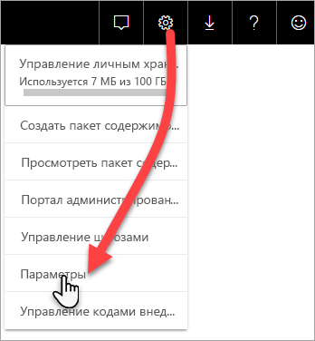

# Мониторинг емкостей Premium в приложении

Отслеживание емкостей очень важно для принятия обоснованных решений в отношении оптимального использования ресурсов емкости Premium. Вы можете контролировать емкость на портале администрирования или с помощью приложения **Power BI Premium Capacity Metrics**. В этой статье описывается приложение Premium Capacity Metrics. Оно предоставляет наиболее полные сведения об эффективности использования емкостей. Общее представление о средних значениях метрик использования за последние семь дней можно получить на портале администрирования. Дополнительные сведения о мониторинге на портале см. в статье [Мониторинг емкостей категории "Премиум" на портале администрирования](service-admin-premium-monitor-portal.md).

В приложение регулярно добавляются новые возможности и функции. Убедитесь в том, что вы используете последнюю версию.
**Последняя версия приложения — 1.10.1.1 (выпущена 5 февраля 2019 г.)**.   
Если у вас установлена предыдущая версия приложения, лучше всего удалить ее, а затем нажать клавиши CTRL+F5, чтобы выполнить обновление. 

## Установка приложения

Вы можете перейти к [приложению Premium Capacity Metrics](https://app.powerbi.com/groups/me/getapps/services/capacitymetrics) или установить его так же, как и другие приложения в Power BI.

1. В Power BI щелкните **Приложения**.   
    

2. Справа щелкните **Получить приложения**.
3. В категории **Приложения** найдите приложение **Power BI Premium Capacity Metrics**.
4. Подпишитесь, чтобы установить приложение.

Немного подождите. Установка и обновление метрик занимает несколько минут. Если в приложении отображаются пустые метрики, нажмите клавишу F5, чтобы обновить страницу в браузере.

## Получение журнала обновления приложения

Чтобы узнать, когда в последний раз обновлялось приложение Premium Capacity Metrics, последовательно выберите **Параметры** > **Наборы данных** > **Power BI Premium Capacity Metrics** > **Журнал обновлений**. 

Вы увидите время последнего обновления. Можно также щелкнуть **Журнал обновлений**, чтобы просмотреть запланированные обновления и обновления по требованию.

## Мониторинг емкости в приложении

Теперь, когда вы установили приложение, вы можете увидеть метрики емкости своей организации. Давайте посмотрим на некоторые из доступных ключевых метрик.

### Панель мониторинга метрики

Когда вы открываете приложение, в нем сначала отображается информационная панель с кратким описанием всех возможностей, для которых у вас есть права администратора.

На панели мониторинга отображаются указанные ниже метрики.

| **Раздел отчета** | **Метрики** |
| --- | --- |
| **Сведения о системе** |  Версия приложения   Количество емкостей, для которых у вас есть права администратора   Количество рабочих областей в ваших емкостях, которые отправляют отчеты метрики   Среднее использование памяти в ГБ за последние семь дней   Максимальное использование памяти в ГБ за последние семь дней   Местное время, когда был использован максимальный объем памяти   Количество случаев, когда загрузка ЦП на 80 % превышала пороговое значение, за последние семь дней, разделенное на группы по три минуты   Наибольшее количество случаев, когда загрузка ЦП была выше 80 %, за последние семь дней, разделенное на группы по часу   Местное время, когда за час загрузка ЦП превышала 80 % чаще всего |
| **Сведения о наборе данных** |  Общее количество наборов данных во всех рабочих областях в доступных емкостях   Количество случаев, когда прямой запрос или запросы на активное подключение превысили 80 % порогового значения, за последние семь дней, разделенное на группы по три минуты   Наибольшее количество случаев, когда прямой запрос или запросы на активное подключение превысили 80 %, за последние семь дней, разделенное на группы по часу   Местное время, когда за час прямой запрос или запросы на активное подключение превышали 80 % чаще всего   Общее количество обновлений за последние семь дней   Среднее время ожидания обновления — средняя задержка между запланированным временем и началом обновления (в минутах)   Средняя продолжительность обновления — время, необходимое для завершения обновления (в минутах)   Общее количество запросов за последние семь дней   Среднее время ожидания запроса — время ожидания на системных ресурсах перед началом выполнения (в миллисекундах)   Средняя продолжительность запросов — время выполнения запроса (в миллисекундах)   Общее количество моделей, исключенных из-за нехватки памяти   Средний размер наборов данных    Среднее число наборов данных, загруженных в память |
| **Сведения о потоке данных** |  Общее количество потоков данных во всех рабочих областях в емкостях   Общее количество обновлений за последние семь дней   Среднее время ожидания обновления — средняя задержка между запланированным временем и началом обновления (в минутах)   Средняя продолжительность обновления — время, необходимое для завершения обновления (в минутах) |
| **Сведения об отчете с разбивкой на страницы** |  Общее количество отчетов с разбивкой на страницы во всех рабочих областях в емкостях   Общее количество случаев, когда все отчеты были доступны для просмотра пользователями   Общее количество строк данных во всех отчетах   Общее время, необходимое для всех этапов (получение данных, обработка и отрисовка) всех отчетов (в миллисекундах) |
|  |  |

### Отчет по метрикам

Щелкните панель мониторинга, чтобы перейти к соответствующему отчету. В нижней части отчета есть пять вкладок.

* [**Наборы данных**](#datasets). Подробные метрики о работоспособности наборов данных Power BI в доступных емкостях.

* [**Отчеты с разбивкой на страницы**](#paginated-reports). Подробные метрики о работоспособности отчетов с разбивкой на страницы в емкостях.

* [**Потоки данных**](#dataflows). Подробные метрики обновления для потоков данных в доступных емкостях.

* [**Потребление ресурсов**](#resource-consumption). Общие метрики емкости, включая память и высокую загрузку ЦП.

* [**Идентификаторы и сведения**](#ids-and-info). Имена, идентификаторы и сведения о владельцах емкостей, рабочих областей и рабочих нагрузок.

На каждой вкладке можно выполнить фильтрацию метрики по диапазону емкости и дате. Если фильтры выбрано, по умолчанию для отчета будут отображаться метрики прошлой недели всех емкостей, которые отправляют отчеты метрики. 

#### Наборы данных

Используйте кнопки в верхней части вкладки **Наборы данных**, чтобы перейти к другим областям: **Обновления**, **Длительность запросов**, **Время ожидания запроса** и **Наборы данных**.

##### область "Обновления"

Область **Обновления** содержит указанные ниже метрики.

| **Раздел отчета** | **Метрики** |
| --- | --- |
| **Надежность обновления** |  Общее количество: общее количество обновлений для каждого набора данных   Надежность: процентная доля обновлений, завершившихся успешно для каждого набора данных   Среднее время ожидания: средняя задержка между запланированным временем и фактическим началом обновления набора данных (в минутах)   Максимальное время ожидания: максимальное время ожидания для набора данных (в минутах)    Средняя длительность: средняя длительность обновления для набора данных (в минутах)   Максимальная длительность: максимальная длительность обновления для набора данных (в минутах) |
| **5 наборов данных с наибольшей средней длительностью обновления** |  Пять наборов данных с наибольшей средней продолжительностью обновления (в минутах) |
| **5 наборов данных с наибольшим средним временем ожидания** |  Пять наборов данных с наибольшим средним периодом ожидания обновления (в минутах) |
| **Почасовые показатели среднего времени ожидания обновления** |  Среднее время ожидания обновления с разбивкой по сегментам длительностью в один час, которые отображаются по местному времени. Большое число всплесков с высоким временем ожидания обновления могут означать, что емкость перегружена. |
| **Почасовое количество обновлений и потребление памяти** |  Успешные завершения, сбои и потребление памяти с разбивкой по сегментам длительностью в один час, которые отображаются по местному времени. |
|  |  |

##### Область длительности запросов

Область **длительности запросов** содержит указанные ниже метрики.

| **Раздел отчета** | **Метрики** |
| --- | --- |
| **Длительность запросов** |  Данные в этом разделе группируются по наборам данных, рабочим областям и периодам длительностью в один час за последние семь дней   Всего: общее количество запросов, выполненных для набора данных   Средний: средняя продолжительность запросов для набора данных (в миллисекундах)   Максимальный: максимальная длительность запроса, выполненного для набора данных (в миллисекундах)|
| **Распределение длительности запросов** |  Данные в гистограмме длительности запросов группируются по длительности запросов в миллисекундах по следующим категориям: ≤ 30 мс, от 30 до 100 мс, от 100 до 300 мс, от 300 мс до 1 сек, от 1 до 3 сек, от 3 до 10 сек, от 10 до 30 сек, больше 30 секунд. Длительные запросы и длительное время ожидания указывают на горячий уровень хранилища емкости. Это может также означать, что один набор данных вызывает проблемы и требует дальнейшего изучения. |
| **5 наборов данных с наибольшей средней длительностью запросов** |  Пять наборов данных с наибольшей средней продолжительностью запросов (в миллисекундах) |
| **Прямой запрос или активные подключения (более 80 % использования)** |  Количество периодов, в которые прямые запросы или активные подключения потребляли более 80 % ЦП, с разбивкой по сегментам длительностью в один час, которые отображаются по местному времени |
| **Почасовое распределение длительности запросов** |  Количество запросов и средняя длительность их выполнения (в миллисекундах) в сравнении с потреблением памяти (в ГБ) с разбивкой на периоды в один час, которые определяются по местному времени |
|  |  |

##### Область Query Waits (Ожидания запросов)

Область **длительности ожиданий** содержит указанные ниже метрики.

| **Раздел отчета** | **Метрики** |
| --- | --- |
| **Время ожидания запросов** |  Данные в этом разделе группируются по наборам данных, рабочим областям и периодам длительностью в один час за последние семь дней   Всего: общее количество запросов, выполненных для набора данных   Количество ожиданий: количество запросов к набору данных, перед началом выполнения которых выполнялось ожидание системных ресурсов    Средний: средняя продолжительность ожидания запросов для набора данных (в миллисекундах)   Максимальный: длительность самого долгого ожидания запроса для набора данных (в миллисекундах)|
| **Распределение времени ожидания** |  Данные гистограммы времени ожидания запросов группируются в зависимости от длительности периодов ожидания в миллисекундах по следующим категориям: ≤ 50 мс, от 50 до 100 мс, от 100 до 200 мс, от 200 до 400 мс, от 400 мс до 1 сек, от 1 до 5 сек, больше 5 секунд. |
| **5 наборов данных с наибольшим средним временем ожидания** |  Пять наборов данных с наибольшим средним периодом ожидания запросов (в миллисекундах) |
| **Почасовое количество и время процессов ожидания запросов** |  Количество процессов ожидания запросов и средняя длительность ожидания (в миллисекундах) в сравнении с потреблением памяти (в ГБ) с разбивкой на периоды в один час, которые определяются по местному времени |
|  |  |

##### область "Наборы данных"

Область **наборов данных** содержит указанные ниже метрики.

| **Раздел отчета** | **Метрики** |
| --- | --- |
| **Счетчики вытеснения наборов данных** |  Всего: общее количество *вытеснений* наборов данных для каждой емкости. При нехватке памяти узел вытесняет один или несколько наборов данных из памяти. Наборы данных в неактивном состоянии (для которых не выполняются запросы или обновление) вытесняются в первую очередь. Для них применяется порядок "недавно использовавшиеся" (LRU).|
| **Почасовые вытеснения наборов данных и потребление памяти** |  Вытеснения наборов данных и потребление памяти с разбивкой по сегментам длительностью в один час, которые отображаются по местному времени |
| **Число наборов данных, загружаемых каждый час** |  Число загруженных в память наборов данных и потребление памяти (ГБ) с разбивкой по часам по местному времени |
| **Процентные значения потребления памяти** |  Общее количество активных наборов данных в памяти в процентах от общего объема памяти. Разница между количество активных наборов данных и общим количеством определенных наборов данных, которые могут быть вытеснены. Отображается каждый час за последние семь дней. |
| **Размер данных**  |  Максимальный размер: максимальный размер набора данных в МБ за указанный период |
|  |  |

#### Отчеты с разбивкой на страницы

На вкладке **Отчеты с разбивкой на страницы** отображаются подробные метрики о работоспособности отчетов с разбивкой на страницы в доступных емкостях.

| **Раздел отчета** | **Метрики** |
| --- | --- |
| **Общие сведения об использовании** |  Всего просмотров: количество просмотров отчета пользователями   Число строк: количество строк данных в отчете   Извлечение (сред.): средняя продолжительность получения данных для отчета (в миллисекундах). Высокая продолжительность может указывать на плохую оптимизацию запросов или другие проблемы с источником данных.    Обработка (сред.): средняя продолжительность обработки данных для отчета (в миллисекундах)  Отрисовка (сред.): средняя продолжительность отрисовки отчета в окне браузера (в миллисекундах)   Общее время: продолжительность всех этапов отображения отчета (в миллисекундах)|
| **5 отчетов с наибольшей средней длительностью получения данных** |  Пять отчетов с наибольшей средней продолжительностью получения данных (в миллисекундах) |
| **5 отчетов с наибольшей средней длительностью обработки отчета** |  Пять отчетов с наибольшей средней продолжительностью обработки отчета (в миллисекундах) |
| **Почасовая длительность** |  Продолжительность получения данных, обработки и отрисовки отчета с разбивкой по сегментам длительностью в один час, которые отображаются по местному времени |
| **Почасовые результаты** |  Успешные завершения, сбои и потребление памяти с разбивкой по сегментам длительностью в один час, которые отображаются по местному времени. |
|  |  |

#### Потоки данных

Вкладка **Потоки данных** содержит подробные метрики обновления для потоков данных в доступных емкостях.

| **Раздел отчета** | **Метрики** |
| --- | --- |
| **Обновление** |  Всего: количество обновлений для каждого потока данных   Надежность: процентная доля обновлений, завершившихся успешно для каждого потока данных   Среднее время ожидания: средняя задержка между запланированным временем и фактическим началом обновления потока данных (в минутах)   Максимальное время ожидания: максимальное время ожидания для потока данных (в минутах)    Средняя длительность: средняя длительность обновления для потока данных (в минутах)   Максимальная длительность: максимальная длительность обновления для потока данных (в минутах) |
| **5 потоков данных с наибольшей средней длительностью обновления** |  Пять потоков данных с наибольшей средней продолжительностью обновления (в минутах) |
| **5 потоков данных наибольшим средним временем ожидания** |  Пять потоков данных с наибольшим средним периодом ожидания обновления (в минутах) |
| **Почасовые показатели среднего времени ожидания обновления** |  Среднее время ожидания обновления с разбивкой по сегментам длительностью в один час, которые отображаются по местному времени. Большое число всплесков с высоким временем ожидания обновления могут означать, что емкость перегружена. |
| **Почасовое количество обновлений и потребление памяти** |  Успешные завершения, сбои и потребление памяти с разбивкой по сегментам длительностью в один час, которые отображаются по местному времени. |
|  |  |

#### Потребление ресурсов

На вкладке **Потребление ресурса** отображаются сведения о потреблении ЦП и памяти для всех емкостей и рабочих нагрузок.

| **Раздел отчета** | **Метрики** |
| --- | --- |
| **Потребление ЦП** |  Потребление по рабочим нагрузкам в процентах от общей производительности ЦП. Отображается каждый час за последние семь дней. |
| **Потребление памяти** |  Потребление памяти в гигабайтах по рабочим нагрузкам (сплошные линии), на которое наложены пределы рабочих нагрузок (пунктирная линия). Отображается каждый час за последние семь дней. |
|  |  |

#### Идентификаторы и сведения

На вкладке **Идентификаторы и сведения** содержатся имена, идентификаторы и сведения о владельцах емкостей, рабочих областей и рабочих нагрузок.

## Мониторинг емкости Power BI Embedded

Вы можете использовать приложение Power BI Premium Capacity Metrics для мониторинга емкостей *SKU A* в Power BI Embedded. Эти емкости появятся в отчете, если вы являетесь администратором емкости. Однако обновление отчета не выполняется, если вы не предоставите определенные разрешения для Power BI в своих номерах SKU A:

1. Откройте емкость на портале Azure.

1. Щелкните **Управление доступом (IAM)** и добавьте приложение Power BI Premium к роли читателя. Если вы не можете найти приложение по имени, вы также можете добавить его по его идентификатору: cb4dc29f-0bf4-402a-8b30-7511498ed654.

    

> [!NOTE]
> Вы можете контролировать потребление емкости Power BI Embedded в приложении или на портале Azure, но не на портале администрирования Power BI.

## Дальнейшие действия

> [!div class="nextstepaction"]
> [Использование и оптимизация ресурсов емкости Power BI Premium](service-premium-understand-how-it-works.md)
