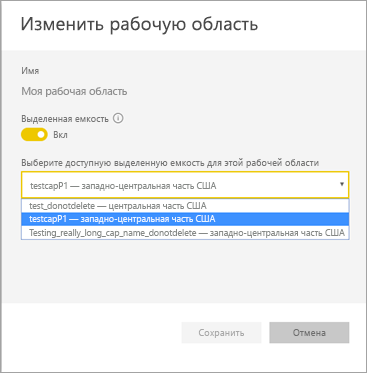
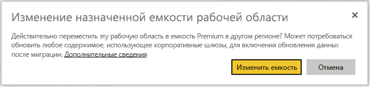

# Поддержка нескольких регионов в Power BI Premium (предварительная версия)
Поддержка нескольких регионов — это функция Power BI Premium, которая помогает многонациональным клиентам соблюдать региональные, отраслевые или организационные требования к размещению данных. Будучи клиентом Power BI Premium, вы можете развертывать содержимое в центрах обработки данных, которые находятся в регионах, отличающихся от домашнего региона клиента Power BI. Вы можете развернуть содержимое в любом из следующих географических регионов:

- Соединенные Штаты 
- Канада 
- Соединенное Королевство 
- Бразилия 
- Европа 
- Япония 
- Индия 
- Азиатско-Тихоокеанский регион; 
- Австралия 

Географический регион может охватывать более одного региона Azure. Например, США — это географический регион, а центрально-западная часть США и центрально-южная часть США — регионы Azure в США. 

Поддержка нескольких регионов недоступна в Power BI для Германии, Power BI для Китая через оператора 21Vianet и в Power BI для государственных организаций США.

## Использование поддержки нескольких регионов

Для новых емкостей включите поддержку нескольких регионов, выбрав регион, отличающийся от региона по умолчанию из раскрывающегося списка.  С каждой доступной емкостью отображается регион, где она в данный момент расположена, например **Центрально-западная часть США**.

  
Когда вы создадите емкость, она останется в соответствующем регионе. Содержимое любых созданных рабочих областей будет храниться в этом же регионе. Рабочие области можно перенести из одного региона в другой с помощью раскрывающегося списка на экране настроек рабочей области.

Отобразится следующее сообщение для подтверждения изменения: 

При миграции на этом этапе не нужно сбрасывать учетные данные шлюза.  После их сохранения в регионе емкости Premium, потребуется сбросить эти данные по завершении миграции.
   
Во время миграции при некоторых операциях может произойти сбой, например при публикации новых наборов данных или обновлении данных по расписанию.  

Следующие элементы сохраняются в регионе Premium, если включена поддержка нескольких регионов:
 
- модели (ABF-файлы) для импорта и наборы данных Direct Query;
- кэш запросов;
- образы R.

Следующие элементы остаются в домашнем регионе клиента:

- наборы данных рush-уведомлений;
- Книги Excel
- метаданные панели мониторинга или отчетов, например названия плиток и запросы к плиткам;
- служебные шины для запросов шлюза или запланированных заданий обновления;
- Разрешения
- учетные данные наборов данных.
 
## Просмотр регионов емкости

На портале администрирования можно просмотреть все емкости клиента Power BI и регионы, в которых они сейчас расположены.

 

## Изменение региона для существующего содержимого

Если необходимо изменить регион для существующего содержимого, это можно сделать двумя способами:

- Создать вторую емкость и переместить рабочие области. Пользователи с бесплатной лицензией не столкнутся с простоем, пока у клиента есть запасные виртуальные ядра.
- Если создать вторую емкость невозможно, можно временно переместить содержимое обратно в общую емкость из емкости Premium. Дополнительные виртуальные ядра не требуются, но у пользователей с бесплатной лицензией будет некоторый простой.

## Перемещение содержимого за пределы емкости с поддержкой нескольких регионов  

Можно переместить рабочие области за пределы емкости с поддержкой нескольких регионов одним из двух способов:

- Удалить текущую емкость, в которой расположена рабочая область.  При этом рабочая область переместится обратно в общую емкость в домашнем регионе.
- Перенести отдельные рабочие области обратно в емкость Premium, расположенную в домашнем клиенте.

## Рекомендации и ограничения

Убедитесь, что любое инициируемое вами перемещение данных между регионами соответствует всем корпоративным и государственным требованиям, прежде чем осуществлять его.

Кэшированный запрос, хранящийся в удаленном регионе, остается в этом регионе в неактивном состоянии. Но другие данные в процессе передачи могут перемещаться в обе стороны между разными географическими регионами. 

При перемещении данных из одного региона в другой в среде с поддержкой нескольких регионов источник данных может до 30 дней оставаться в регионе, из которого были перемещены данные. В течение этого времени конечные пользователи не будут иметь доступа к нему. Он будет удален из этого региона и уничтожен в течение 30-дневного периода.

Поддержка нескольких регионов в целом не улучшает производительность. Загрузка отчетов и панелей мониторинга по-прежнему сопряжена с запросами метаданных из домашнего региона.

## Дальнейшие действия

[Что такое Power BI Premium?](service-premium.md)

Появились дополнительные вопросы? [Попробуйте задать вопрос в сообществе Power BI.](http://community.powerbi.com/)
