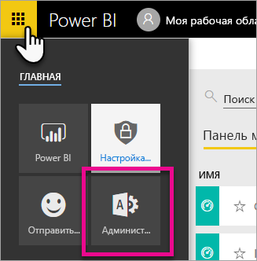
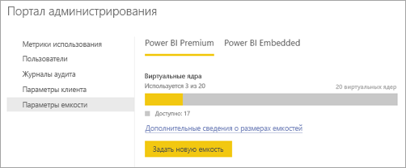

# Как купить Power BI Premium

> [!NOTE]
> Сейчас эта статья перерабатывается для описания новых функций, предоставления более подробных сведений и повышения удобочитаемости. 

В этой статье приводятся сведения о том, как приобрести емкость Power BI Premium (P1–P3) для организации. Емкость Power BI Premium можно приобрести в Центре администрирования Microsoft 365, а управление емкостями осуществляется на портале администрирования Power BI. Актуальные цены и сведения о планировании см. на [странице цен на Power BI](https://powerbi.microsoft.com/pricing/) и воспользуйтесь [калькулятором Power BI Premium](https://powerbi.microsoft.com/calculator/).

Авторам содержимого по-прежнему требуется лицензия Power BI Pro, даже если в организации используется Power BI Premium. Для организации необходимо приобрести по меньшей мере одну лицензию Power BI Pro.

Если срок действия подписки Premium истекает, у вас есть 30 дней полного доступа к емкости. После этого ваше содержимое будет размещено в общей емкости. В общей емкости не поддерживаются модели, размер которых превышает 1 ГБ.

## Создание клиента с Power BI Premium P1

Если у вас нет клиента и вы хотите создать его, вместе с ним можно приобрести Power BI Premium. По ссылке ниже представлены инструкции по созданию клиента и предоставляется возможность приобрести Power BI Premium: [предложение Power BI Premium P1](https://signup.microsoft.com/Signup?OfferId=b3ec5615-cc11-48de-967d-8d79f7cb0af1). При создании клиента вам будет автоматически назначена роль глобального администратора Office 365 для этого клиента.

## Приобретение емкости Power BI Premium для существующей организации

Чтобы приобрести подписки и лицензии для существующей организации (клиента), нужно иметь роль глобального администратора Office  365 или администратора выставления счетов. Дополнительные сведения см. в разделе [Роли администраторов в Office 365](https://support.office.com/article/About-Office-365-admin-roles-da585eea-f576-4f55-a1e0-87090b6aaa9d).

Чтобы приобрести емкость Premium, выполните указанные ниже действия.

1. В службе Power BI выберите средство выбора приложений Office 365, а затем **Администратор**.

    

    Кроме того, можно перейти в Центр администрирования Microsoft 365. Для этого перейдите в https://portal.office.com и выберите **Администратор**.

1. Выберите **Выставление счетов** > **Приобрести службы**.

1. В разделе **Другие планы** найдите предложения Power BI Premium. В списке отобразятся предложения P1–P3, EM3 и P1 (ежемесячная подписка).

1. Наведите указатель мыши на многоточие (**…**), а затем выберите **Приобрести**.

    

1. Следуйте инструкциям по приобретению.

После завершения покупки на странице **Приобретение служб** будет показано, что элемент приобретен и активен.

## Приобретение дополнительных емкостей

Теперь, когда у вас есть емкость, по мере роста потребностей вы можете приобретать дополнительные емкости. Вы можете использовать любое сочетание номеров SKU емкости Premium (P1–P3) в организации. Разные номера SKU предоставляют различные мощности ресурсов.

1. В Центре администрирования Microsoft 365 выберите **Выставление счетов** > **Приобретение служб**.

1. Найдите элемент Power BI Premium, для которого требуется приобрести дополнительную емкость, в разделе **Другие планы**.

1. Наведите указатель мыши на **многоточие (…)**, а затем выберите **Change license quantity** (Изменить количество лицензий).

    

1. Измените количество экземпляров для этого элемента. По завершении нажмите кнопку **Отправить**.

   > [!IMPORTANT]
   > После нажатия кнопки **Отправить** будет выполнена оплата с кредитной карты, указанной в профиле.

После этого на странице **Приобретение служб** отобразится текущее число экземпляров, находящихся в вашем распоряжении. На портале администрирования Power BI в разделе **Параметры емкости** доступные виртуальные ядра отражают новую приобретенную емкость.

## Отмена подписки

Вы можете отменить подписку в Центре администрирования Microsoft 365. Чтобы отменить подписку Premium, выполните инструкции ниже.

1. Перейдите в Центр администрирования Microsoft 365.

1. Выберите **Billing** (Выставление счетов)  >  **Subscriptions** (Подписки).

1. Выберите в списке подписку Power BI Premium.

1. Выберите **More actions** > **Cancel subscription** (Дополнительные действия > Отменить подписку).

1. На странице **Cancel subscription** (Отменить подписку) указано, будет ли взиматься [плата за досрочное завершение использования](https://support.office.com/article/early-termination-fees-6487d4de-401a-466f-8bc3-c0beb5cc40d3). Кроме того, на этой странице можно узнать, когда будут удалены сведения подписки.

1. Ознакомьтесь с представленной информацией и, если решите продолжить, выберите команду **Cancel subscription** (Отменить подписку).

### Отмена или истечение срока действия лицензии

Когда вы отменяете подписку уровня "Премиум" или истекает срока действия лицензии на емкость, вы можете получить доступ к емкости "Премиум" в течение 30 дней с момента отмены или истечения срока действия. После этого вы больше не сможете получить доступ к емкостям "Премиум" или рабочим областям в них.

## Дальнейшие действия

[Настройка и администрирование емкостей Power BI Premium](service-admin-premium-manage.md)\
[Страница цен на Power BI](https://powerbi.microsoft.com/pricing/)\
[Калькулятор Power BI Premium](https://powerbi.microsoft.com/calculator/)\
[Вопросы и ответы по Power BI Premium](service-premium-faq.md)\
[Технический документ по планированию развертывания Power BI Enterprise](https://aka.ms/pbienterprisedeploy)

Появились дополнительные вопросы? [Попробуйте задать вопрос в сообществе Power BI.](http://community.powerbi.com/)
