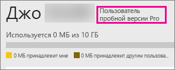

# Приобретение Power BI Pro
Служба Power BI Pro предназначена для пользователей, которые публикуют отчеты, вместе используют панели мониторинга, совместно работают с коллегами в рабочих областях и принимают участие в других похожих действиях, например имеют возможность:

* анализировать данные в Excel или Power BI Desktop;
* предоставлять общий доступ с поддержкой Excel Web App;
* совместно использовать панели мониторинга и совместно работать с рабочими областями приложений;
* Просмотр общего содержимого
* интегрировать содержимое с рабочими областями Microsoft Teams.

ИТ-администраторы имеют несколько вариантов использования Power BI Pro в организации. Вы можете приобрести Power BI Pro в Центре администрирования Office 365 либо через представителя или партнера корпорации Майкрософт. В этой статье рассматриваются два варианта работы со службой Power BI Pro в пробном режиме, а также порядок ее приобретения для организации.

См. дополнительные сведения о [Power BI Premium](service-premium.md) и Power BI Pro как части предложения Premium.

## Цены
Последнюю информацию о ценах на Power BI Pro и таблицу с входящими функциями см. в разделе [Цены на Power BI](https://powerbi.microsoft.com/pricing/).

## 60-дневная пробная версия Power BI Pro для пользователей
Зарегистрировав бесплатную учетную запись, вы можете использовать функции Power BI Pro бесплатно в течение 60 дней. Вы получите доступ ко всем функциональным возможностям учетных записей Pro на период действия пробной версии. В Power BI Pro доступны все функции бесплатной версии Power BI, а также дополнительные возможности общего доступа и совместной работы. Дополнительные сведения см. в разделе [Цены на Power BI](https://powerbi.microsoft.com/pricing). Чтобы ознакомится с 60-дневной бесплатной пробной версией Power BI Pro, выполните вход в службу Power BI и попробуйте одну из следующих функций Power BI.

* [создание рабочей области приложения](service-create-distribute-apps.md);
* [предоставление общего доступа к панелям мониторинга](service-share-dashboards.md).

При выборе любой из этих функций вам будет предложено запустить бесплатную пробную версию. Вы также можете перейти в пробный режим Pro, щелкнув значок шестеренки и выбрав **Управление личным хранилищем**. Затем выберите **Попробовать версию Pro бесплатно** справа.

После этого можно нажать **Запустить пробную версию**.

> [!NOTE]
> Пользователи, использующие преимущества пробной версии Power BI Pro, не отображаются на портале администрирования Office 365 как пользователи пробной версии Power BI Pro (они отображаются как пользователи бесплатной версии Power BI). Однако они отображаются как пользователи пробной версии Power BI Pro на странице **управления хранилищем** в Power BI.

> [!NOTE]
> Если ИТ-администратор хочет приобрести и развернуть лицензии на пробную версию Power BI для нескольких пользователей в организации без принятия условий пробной версии по отдельности каждым из них, он может зарегистрировать [пробную версию подписки на Power BI Pro](https://portal.office.com/Signup/MainSignup15.aspx?OfferId=d59682f3-3e3b-4686-9c00-7c7c1c736085&dl=POWER_BI_PRO). Чтобы зарегистрироваться для пробной версии администратора, необходимо быть глобальным администратором Office 365 или администратором выставления счетов или создать новый клиент. Дополнительные сведения см. в статье [Приобретение Power BI Pro](service-admin-purchasing-power-bi-pro.md).

> [!NOTE]
> В связи с выпуском Power BI Premium и изменениями бесплатной версии Power BI от 1 июня 2017 года вы сможете приобрести расширенную пробную версию Power BI Pro. Дополнительные сведения см. в статье [Активация расширенной пробной версии Power BI Pro](service-extended-pro-trial.md).

### Внешний вид и интерфейс службы
Чтобы при работе со службой убедиться в том, что у вас пробная учетная запись Pro, нажмите на значок **шестеренки* и выберите **Управление личным хранилищем**.

## Пробная версия подписки в Office 365
Вы можете пробную версию Power BI Pro для своей организации. Оформив такую подписку, вы сможете назначить лицензии на Power BI Pro своим пользователям. Дополнительные сведения о назначении лицензий см. в статье [Назначение лицензий пользователям в Office 365 для бизнеса](https://support.office.com/article/Assign-or-unassign-licenses-for-Office-365-for-business-997596b5-4173-4627-b915-36abac6786dc).

> [!NOTE]
> В организации можно использовать только одну пробную версию для клиента. Это означает, что в клиенте уже используется пробная версия Power BI Pro, ее нельзя применить снова. Если вам нужна помощь, обратитесь в [службу поддержки Office 365 по вопросам выставления счетов](https://support.office.microsoft.com/article/Contact-Office-365-for-business-support-Admin-Help-32a17ca7-6fa0-4870-8a8d-e25ba4ccfd4b?CorrelationId=552bbf37-214f-4202-80cb-b94240dcd671&ui=en-US&rs=en-US&ad=US#BKMK_call_support).
> 

1. Перейдите в [Центр администрирования Office 365](https://portal.office.com/admin/default.aspx).
2. В левой области навигации выберите «Выставление счетов > Подписки».
3. Выберите «Добавить подписки +» справа.
4. В разделе «Другие планы» наведите указатель мыши на многоточие (…) для Power BI Pro и выберите «Начать использовать бесплатную пробную версию».
   
    
5. На экране подтверждения заказа нажмите кнопку «Попробовать».
6. В квитанции заказа нажмите кнопку «Продолжить».

В разделе **Выставление счетов** > **Подписки** появится **Пробная версия Power BI Pro** на 25 лицензий. Пробный период составляет один месяц.

### Внешний вид и интерфейс службы
Чтобы при работе со службой убедиться в том, что у вас учетная запись Pro, нажмите на значок **шестеренки** и выберите **Управление личным хранилищем**. Указаний на то, что у вас пробная версия, не будет.

## Приобретение подписки в Office 365
Вы можете приобрести Power BI Pro для своей организации в Центре администрирования Office 365. Оформив такую подписку, вы сможете назначить лицензии на Power BI Pro своим пользователям. Дополнительные сведения о назначении лицензий см. в статье [Назначение лицензий пользователям в Office 365 для бизнеса](https://support.office.com/article/Assign-or-unassign-licenses-for-Office-365-for-business-997596b5-4173-4627-b915-36abac6786dc).

1. Перейдите в [Центр администрирования Office 365](https://portal.office.com/admin/default.aspx).
2. В левой области навигации выберите «Выставление счетов > Подписки».
3. Выберите «Добавить подписки +» справа.
4. В разделе «Другие планы» наведите указатель мыши на многоточие (…) для Power BI Pro и выберите «Приобрести».
   
    
5. Укажите интересующее вас количество лицензий и выберите «Быстрый заказ» или «Добавить в корзину».
   
   > [!NOTE]
   > Позже при необходимости вы сможете увеличить количество лицензий.
   > 
   > 
6. Введите информацию, необходимую для оформления заказа.

> [!NOTE]
> Если у вас уже есть пробная версия Power BI Pro, вы перейдете непосредственно на экран оформления заказа, где нужно будет указать нужное вам число лицензий.
> 
> 

В разделе **Выставление счетов** > **Подписки** появится **Power BI Pro**. Если затем вы захотите добавить лицензии, вернитесь на страницу **добавления подписок** и выберите **Изменить количество лицензий**.

### Внешний вид и интерфейс службы
Чтобы при работе со службой убедиться в том, что у вас учетная запись Pro, нажмите на значок **шестеренки** и выберите **Управление личным хранилищем**.

## Льготный период
Когда срок действия лицензии Power BI Pro истечет, вы сможете воспользоваться 30-дневным льготным периодом. 

У подписки Power BI Pro такой же жизненный цикл, как и у подписки Office 365. См. дополнительные сведения о [работе с данными и доступе после истечения срока действия подписки Office 365 для бизнеса](https://support.office.com/en-us/article/What-happens-to-my-data-and-access-when-my-Office-365-for-business-subscription-ends-4436582f-211a-45ec-b72e-33647f97d8a3).

## Дальнейшие действия
[Самостоятельная регистрация в Power BI](service-self-service-signup-for-power-bi.md)  
[Бесплатная версия Power BI в вашей организации](service-admin-service-free-in-your-organization.md)  
[Активация расширенной пробной версии Power BI Pro](service-extended-pro-trial.md)  
[Что такое Power BI Premium?](service-premium.md)  
[Как купить Power BI Premium](service-admin-premium-purchase.md)  
[Техническая документация по Power BI Premium](https://aka.ms/pbipremiumwhitepaper)  

Появились дополнительные вопросы? [Попробуйте задать вопрос в сообществе Power BI.](http://community.powerbi.com/)

