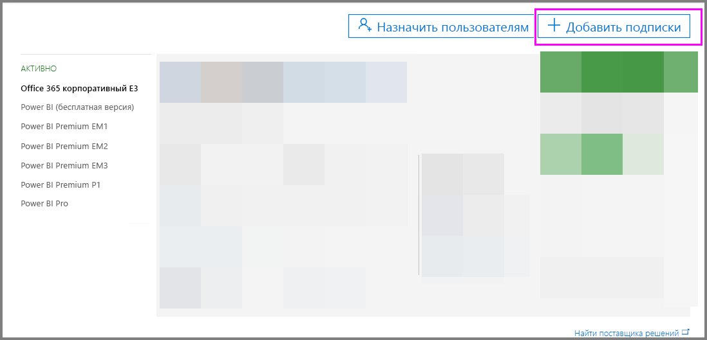
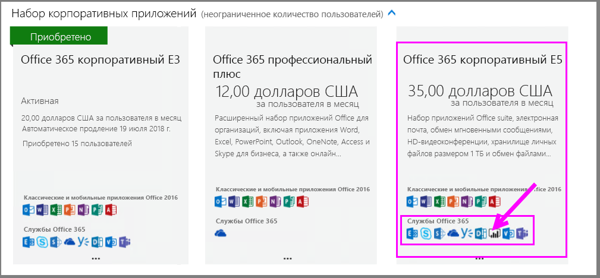
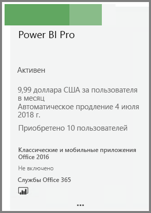
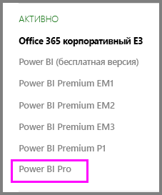

# Краткое руководство. Приобретение лицензий Power BI Pro

Индивидуальные лицензии Power BI Pro предоставляют доступ ко всему содержимому и всем возможностям службы Power BI, включая совместный доступ к содержимому и совместную работу с другими пользователями Pro. Публиковать и использовать содержимое в рабочих областях приложения, совместно использовать панели мониторинга, а также подписываться на панели мониторинга и отчеты могут только пользователи с лицензией Pro. В этой статье объясняется, как приобретать лицензии Power BI Pro в Office 365.

## Предварительные требования

Необходимо быть членом роли [**Глобальный администратор** или **Администратор выставления счетов**](https://support.office.com/article/about-office-365-admin-roles-da585eea-f576-4f55-a1e0-87090b6aaa9d?ui=en-US&rs=en-US&ad=US) в Office 365. 

## Приобретение лицензий Power BI Pro через Office 365

Выполните следующие действия, чтобы приобрести лицензии Power BI Pro:

1. Откройте [Центр администрирования Office 365](https://portal.office.com/adminportal/home#/homepage).

2. В левой области навигации выберите **Выставление счетов** > **Подписки**.

    

3. В правом верхнем углу страницы **Подписки** щелкните элемент **Добавить подписки**.

    

4. Найдите требуемое предложение подписки:

    В разделе **Набор корпоративных приложений** выберите **Office 365 корпоративный E5**.

    

    В области **Другие планы** выберите **Power BI Pro**.

    

5. Наведите указатель мыши на многоточие (...) рядом с нужной подпиской и выберите пункт **Приобрести**.

    

6. Выберите предпочитаемый вариант выставления счетов: **Платить ежемесячно** или **Заплатить за весь год**.

7. В области **Сколько пользователей в вашей организации?** введите нужное число лицензий, а затем выберите **Быстрый заказ** и завершите транзакцию.

8. Убедитесь, что приобретенные подписки появились на странице **Подписки**.

   

9. Чтобы добавить дополнительные лицензии после первоначальной покупки, выберите **Power BI Pro** на странице **Подписки**, а затем выберите **Добавить/удалить лицензии**.

## Дальнейшие действия

Теперь вы можете назначить приобретенные лицензии пользователям в клиенте.

[Назначение лицензий пользователям в Office 365](service-admin-assigning-power-bi-pro-licenses.md)

[Назначение лицензий пользователям в Azure](service-admin-assigning-power-bi-pro-licenses-azure.md)

[Цены на Power BI](https://powerbi.microsoft.com/en-us/pricing/)
