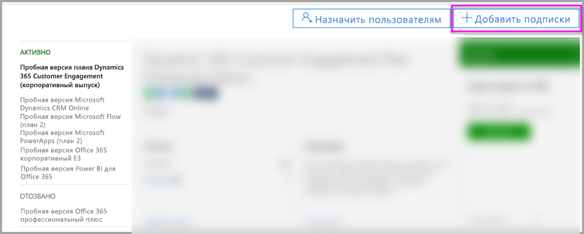
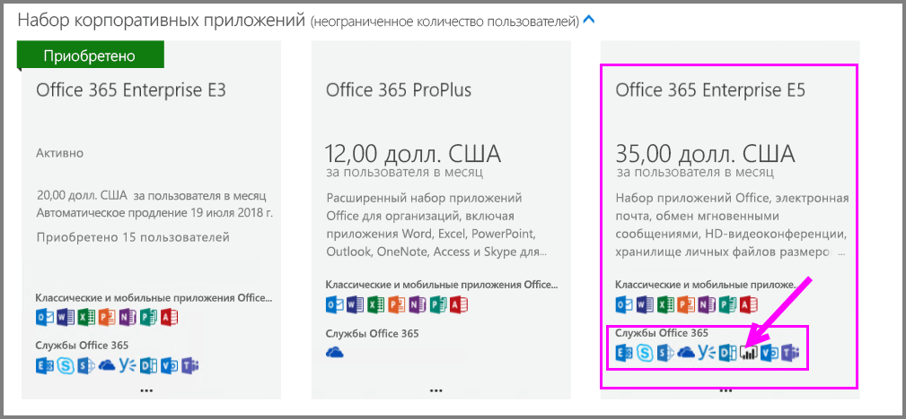
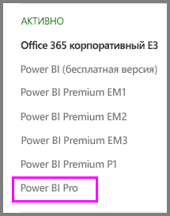
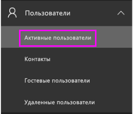
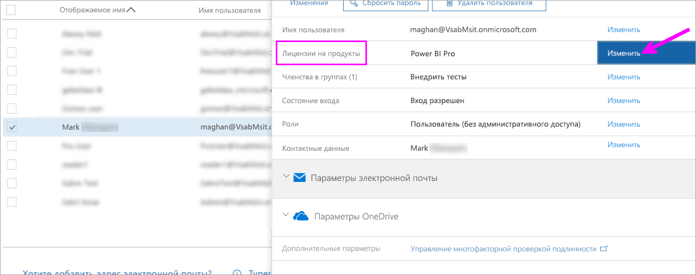
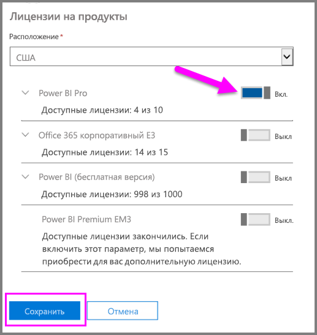
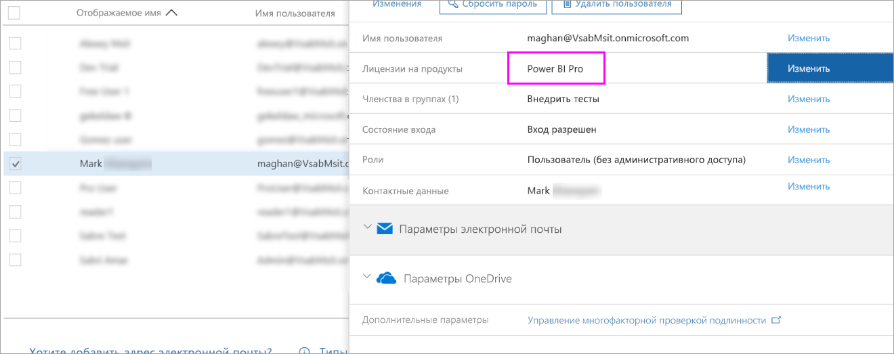
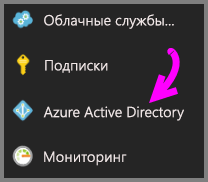
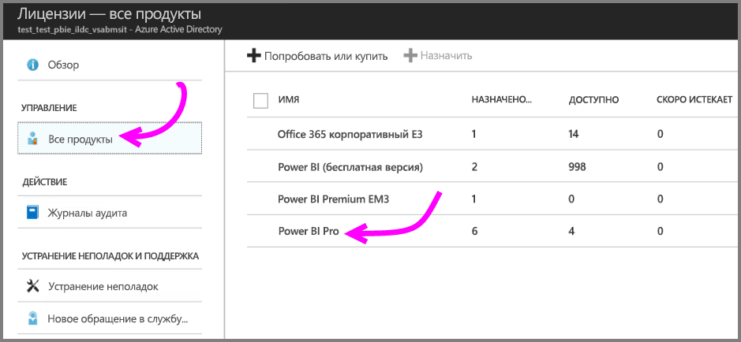
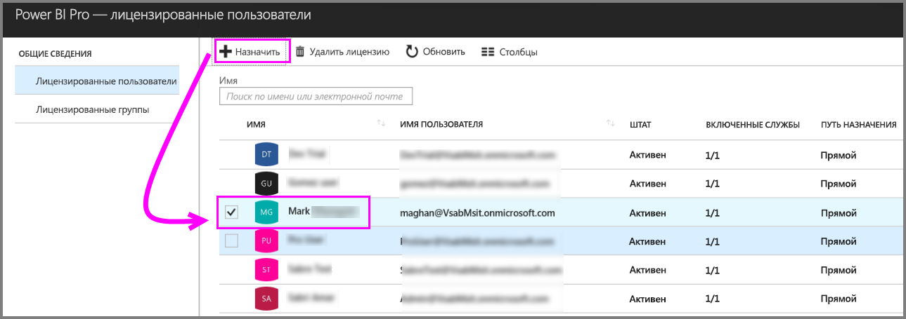

# Приобретение и назначение лицензий Power BI Pro

Индивидуальные лицензии Power BI Pro предоставляют доступ ко всему содержимому и всем возможностям службы Power BI, включая совместный доступ к содержимому и совместную работу с другими пользователями Pro. Публиковать и использовать содержимое в рабочих областях приложения, совместно использовать панели мониторинга, а также подписываться на панели мониторинга и отчеты могут только пользователи с лицензией Pro. Дополнительные сведения см. в разделе [Функции Power BI по типам лицензий](service-features-license-type.md).

В этой статье сначала объясняется, как приобретать лицензии Power BI Pro в Office 365. Затем приводятся два варианта назначения этих лицензий отдельным пользователям: Office 365 и Azure (выберите один из вариантов).

## Предварительные требования

Необходимо быть членом роли [**Глобальный администратор** или **Администратор выставления счетов**](https://support.office.com/article/about-office-365-admin-roles-da585eea-f576-4f55-a1e0-87090b6aaa9d) в Office 365.

Для назначения лицензий в Azure вы должны быть владельцем подписки Azure, которая используется в Power BI для запросов к Active Directory.

## Приобретение лицензий в Office 365

Выполните следующие действия, чтобы приобрести лицензии Power BI Pro:

1. Откройте [Центр администрирования Microsoft 365](https://portal.office.com/adminportal/home#/homepage).

2. В левой области навигации выберите **Выставление счетов** > **Подписки**.

    

3. В правом верхнем углу страницы **Подписки** щелкните элемент **Добавить подписки**.

    

4. Найдите требуемое предложение подписки:

    В разделе **Набор корпоративных приложений** выберите **Office 365 корпоративный E5**.

    

    В области **Другие планы** выберите **Power BI Pro**.

    

5. Наведите указатель мыши на многоточие (**. . .**) рядом с нужной подпиской и выберите **Приобрести**.

    

6. Выберите предпочитаемый вариант выставления счетов: **Платить ежемесячно** или **Заплатить за весь год**.

7. В области **Сколько пользователей в вашей организации?** введите нужное число лицензий, а затем выберите **Быстрый заказ** и завершите транзакцию.

8. Убедитесь, что приобретенные подписки появились на странице **Подписки**.

   

9. Чтобы добавить дополнительные лицензии после первоначальной покупки, выберите **Power BI Pro** на странице **Подписки**, а затем выберите **Добавить/удалить лицензии**.

## Назначение лицензий в Office 365

Выполните следующие действия, чтобы назначить лицензии Power BI Pro отдельным учетным записям пользователей:

1. Откройте [Центр администрирования Microsoft 365](https://portal.office.com/adminportal/home#/homepage).

2. На панели навигации слева разверните пункт **Пользователи** и выберите элемент **Активные пользователи**.

    

3. Выберите пользователя, а затем в разделе **Лицензии на продукты** — **Изменить**.

    

4. В области **Power BI Pro** выберите значение **Включено**, а затем нажмите кнопку **Сохранить**.

    

5. В области **Состояние** для выбранных учетных записей убедитесь в назначении лицензии Power BI Pro.

    

## Назначение лицензий в Azure

Выполните следующие действия, чтобы назначить лицензии Power BI Pro отдельным учетным записям пользователей:

1. Перейдите на [портал Azure](https://ms.portal.azure.com/#@microsoft.onmicrosoft.com/dashboard/private/39bc3cf7-31a4-43f6-954c-f2d69ca2f0).

2. На панели навигации слева выберите **Azure Active Directory**.

    

3. В разделе **Azure Active Directory** выберите **Лицензии**.

    

4. В разделе **Лицензии** щелкните **Все продукты**, а затем **Power BI Pro**, чтобы отобразить список лицензированных пользователей.

    

5. Щелкните **Назначить**, чтобы добавить лицензию Power BI Pro еще одной учетной записи пользователя.

    

## Дальнейшие действия

Итак, вы назначили лицензии, и теперь можно подробнее изучить Power BI Pro.

[Лицензирование Power BI в организации](service-admin-licensing-organization.md)

[Поиск пользователей Power BI, выполнивших вход](service-admin-access-usage.md)

Появились дополнительные вопросы? [Попробуйте задать вопрос в сообществе Power BI.](https://community.powerbi.com/)
