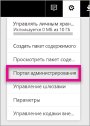
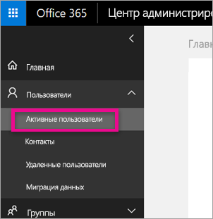
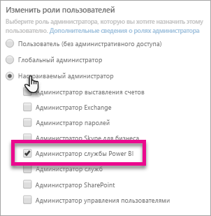

# <a name="understanding-the-power-bi-admin-role"></a>Основные сведения о роли администратора Power BI
Узнайте, как использовать роль администратора Power BI внутри организации.

<iframe width="640" height="360" src="https://www.youtube.com/embed/PQRbdJgEm3k?showinfo=0" frameborder="0" allowfullscreen></iframe>

Роль администратора службы Power BI можно назначать пользователям, которым нужен доступ к порталу администрирования Power BI, не предоставляя им какой-либо иной административный доступ к службам Office 365. Например, роль глобального администратора. Она предназначена для специалистов, занимающихся администрированием Power BI в организации.

Администраторы пользователей Office 365 могут назначить пользователям роль администраторов Power BI в Центре администрирования Office 365 или с помощью скрипта PowerShell. После назначения роли пользователь сможет получить доступ к [порталу администрирования Power BI](service-admin-portal.md). Он будет иметь доступ к метрикам использования, а также сможет управлять функциями Power BI на уровне клиента.



## <a name="using-the-office-365-admin-center-to-assign-a-role"></a>Назначение роли с помощью Центра администрирования Office 365
Чтобы назначить пользователям роль администратора Power BI в Центре администрирования Office 365, сделайте следующее.

1. Перейдите в Центр администрирования Office 365 и выберите **Пользователи** > **Активные пользователи**.
   
    
2. Выберите пользователя, которому нужно назначить роль.
3. Выберите **Изменить** для ролей.
   
    
4. Выберите **Customized administrator** (Настраиваемый администратор) > **Power BI service administrator** (Администратор службы Power BI).
   
    
5. Нажмите кнопку **Сохранить**.

В списке ролей пользователя должна появиться роль **Power BI service administrator** (Администратор службы Power BI). Члены этой группы не имеют доступа к [порталу администрирования Power BI](service-admin-portal.md).


## <a name="using-powershell-to-assign-a-role"></a>Назначение роли с помощью PowerShell
Чтобы выполнить команду PowerShell, необходимо установить модуль PowerShell для Azure Active Directory.

### <a name="download-azure-ad-powershell-module"></a>Скачивание модуля PowerShell для Azure AD
[Скачать PowerShell версии 2 для Azure Active Directory](https://github.com/Azure/azure-docs-powershell-azuread/blob/master/Azure%20AD%20Cmdlets/AzureAD/index.md)

[Скачать PowerShell версии 1.1.166.0 GA для Azure Active Directory](http://connect.microsoft.com/site1164/Downloads/DownloadDetails.aspx?DownloadID=59185)

### <a name="command-to-add-role-to-member"></a>Команда для добавления роли участнику
**Команда Azure AD PowerShell версии 2**

Вам потребуется получить **идентификатор объекта** для роли **Администратор службы Power BI**. Чтобы получить **идентификатор объекта**, можно выполнить команду [Get-AzureADDirectoryRole](https://docs.microsoft.com/powershell/azuread/v2/get-azureaddirectoryrole).

```
PS C:\Windows\system32> Get-AzureADDirectoryRole

ObjectId                             DisplayName                        Description
--------                             -----------                        -----------
00f79122-c45d-436d-8d4a-2c0c6ca246bf Power BI Service Administrator     Full access in the Power BI Service.
250d1222-4bc0-4b4b-8466-5d5765d14af9 Helpdesk Administrator             Helpdesk Administrator has access to perform..
3ddec257-efdc-423d-9d24-b7cf29e0c86b Directory Synchronization Accounts Directory Synchronization Accounts
50daa576-896c-4bf3-a84e-1d9d1875c7a7 Company Administrator              Company Administrator role has full access t..
6a452384-6eb9-4793-8782-f4e7313b4dfd Device Administrators              Device Administrators
9900b7db-35d9-4e56-a8e3-c5026cac3a11 AdHoc License Administrator        Allows access manage AdHoc license.
a3631cce-16ce-47a3-bbe1-79b9774a0570 Directory Readers                  Allows access to various read only tasks in ..
f727e2f3-0829-41a7-8c5c-5af83c37f57b Email Verified User Creator        Allows creation of new email verified users.
```

В этом случае идентификатор объекта роли будет 00f79122-c45d-436d-8d4a-2c0c6ca246bf.

Кроме того, необходимо знать **идентификатор объекта** пользователей. Его можно найти, выполнив команду [Get-AzureADUser](https://docs.microsoft.com/powershell/azuread/v2/get-azureaduser).

```
PS C:\Windows\system32> Get-AzureADUser -SearchString 'tim@contoso.com'

ObjectId                             DisplayName UserPrincipalName      UserType
--------                             ----------- -----------------      --------
6a2bfca2-98ba-413a-be61-6e4bbb8b8a4c Tim         tim@contoso.com        Member
```

Чтобы добавить участника в роль, выполните команду [Add-AzureADDirectoryRoleMember](https://docs.microsoft.com/powershell/azuread/v2/add-azureaddirectoryrolemember).

| Параметр | Описание |
| --- | --- |
| ObjectId |Идентификатор объекта роли. |
| RefObjectId |Идентификатор объекта участников. |

```
Add-AzureADDirectoryRoleMember -ObjectId 00f79122-c45d-436d-8d4a-2c0c6ca246bf -RefObjectId 6a2bfca2-98ba-413a-be61-6e4bbb8b8a4c
```

**Команда Azure AD PowerShell версии 1**

Чтобы добавить участника в роль с использованием командлетов Azure AD версии 1, нужно выполнить команду [Add-MsolRoleMember](https://docs.microsoft.com/powershell/msonline/v1/add-msolrolemember).

```
Add-MsolRoleMember -RoleMemberEmailAddress "tim@contoso.com" -RoleName "Power BI Service Administrator"
```

## <a name="limitations-and-considerations"></a>Рекомендации и ограничения
Роль администратора службы Power BI не позволяет получить доступ к следующим возможностям.

* Изменение пользователей и лицензий в центре администрирования Office 365.
* Доступ к журналам аудита. Дополнительные сведения см. в статье [Применение функции аудита в своей организации](service-admin-auditing.md).

## <a name="next-steps"></a>Дальнейшие действия
[Портал администрирования Power BI](service-admin-portal.md)  
[Add-AzureADDirectoryRoleMember](https://docs.microsoft.com/powershell/azuread/v2/add-azureaddirectoryrolemember)  
[Add-MsolRoleMember](https://docs.microsoft.com/powershell/msonline/v1/add-msolrolemember)  
[Аудит Power BI в организации](service-admin-auditing.md)  
[Администрирование Power BI в организации](service-admin-administering-power-bi-in-your-organization.md)  

Появились дополнительные вопросы? [Попробуйте задать вопрос в сообществе Power BI.](http://community.powerbi.com/)

