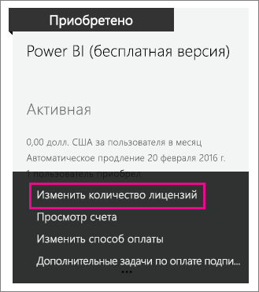

# Бесплатная версия Power BI в вашей организации
В этой статье рассматриваются возможности использования бесплатной версии Power BI в организации. Когда речь идет об организации, имеется в виду клиент, с которым связан набор пользователей и служб. Администратор может назначать пользователям лицензии, а также разрешать им регистрироваться в индивидуальном режиме. Мы рассмотрим лицензию на бесплатную версию Power BI, а также управление индивидуальной регистрацией.

## Индивидуальная регистрация и назначение лицензий
Пользователь организации может получить доступ к службе Power BI двумя разными способами. Он может зарегистрироваться в Power BI в индивидуальном порядке, либо ему может быть назначена лицензия Powre BI через портал администрирования Office 365.

Разрешив индивидуальную регистрацию, администраторы организации могут освободить себя от части обязанностей: благодаря этому пользователи, которых интересует служба Power BI, смогут оформлять на нее бесплатную подписку.

Администратор, которому нужны расширенные возможности контроля, может запретить индивидуальную регистрацию и самостоятельно назначать лицензии Power BI через Центр администрирования Office 365. Это позволяет администратору самостоятельно управлять доступом пользователей организации к тем или иным службам. Кроме того, этот вариант хорошо подходит в ситуации, когда в организации проводятся проверки и необходимо точно знать, к каким данным и функциям есть доступ у тех или иных пользователей.

## Получение неограниченного количества лицензий
В Центре администрирования Office 365 в разделе **Выставление счетов** > **Лицензии** может быть доступна бесплатная версия Power BI с неограниченным количеством лицензий.

Такая возможность появляется после того, как кто-то из пользователей в первый раз регистрируется в службе Power BI в индивидуальном порядке. При этом для вашей организации выделяется соответствующий блок лицензий и одна из них назначается зарегистрировавшемуся пользователю.

Если индивидуальная регистрация запрещена и никто из пользователей не зарегистрировался, соответствующий блок лицензий не отображается. Вы можете разрешить индивидуальную регистрацию и зарегистрировать одного из пользователей либо получить бесплатные лицензии путем добавления подписки через Office 365 (мы рассмотрим этот вопрос чуть позже).

Получив доступ к блоку лицензий на бесплатную версию Power BI, вы можете назначить их своим пользователям. Дополнительные сведения о назначении лицензий см. в статье [Назначение лицензий пользователям в Office 365 для бизнеса](https://support.office.com/article/Assign-or-unassign-licenses-for-Office-365-for-business-997596b5-4173-4627-b915-36abac6786dc).

## Получение бесплатных лицензий путем добавления подписки в Office 365
1. Перейдите в [Центр администрирования Office 365](https://portal.office.com/admin/default.aspx).
2. В левой области навигации выберите **Выставление счетов** > **Подписки**.
3. Выберите **Добавить подписки +** справа.
4. В разделе "Другие планы" наведите указатель мыши на многоточие **(…)** для версии "Power BI (бесплатно)" и выберите **Купить**.
   
    
5. Укажите интересующее вас количество лицензий и выберите **Быстрый заказ** или **Добавить в корзину**.
   
   > [!NOTE]
   > Позже при необходимости вы сможете увеличить количество лицензий.
   > 
   > 
6. Введите информацию, необходимую для оформления заказа.

Вам не придется оплачивать покупку, хотя потребуется указать данные кредитной карты либо выбрать оплату по счету.

Если затем вы захотите добавить лицензии, вернитесь на страницу **Добавления подписок** и выберите **Изменить количество лицензий** для бесплатной версии Power BI.

Теперь вы можете назначить полученные лицензии своим пользователям. Дополнительные сведения о назначении лицензий см. в статье [Назначение лицензий пользователям в Office 365 для бизнеса](https://support.office.com/article/Assign-or-unassign-licenses-for-Office-365-for-business-997596b5-4173-4627-b915-36abac6786dc).

## Включение и отключение индивидуальной регистрации пользователей в каталоге Azure Active Directory
Администратор может разрешать и запрещать индивидуальную регистрацию пользователей в каталоге Azure Active Directory (AAD). Если вы знаете, как использовать команды PowerShell AAD, вы можете разрешать и запрещать индивидуальные подписки самостоятельно. [Дополнительные сведения](https://technet.microsoft.com/library/jj151815.aspx)

В каталоге AAD для управления этой функцией используется параметр **AllowAdHocSubscriptions**. В большинстве клиентов для него задано значение true, то есть соответствующая функция включена. Если вы приобрели Power BI через партнера, по умолчанию для этого параметра может быть установлено значение false и данная возможность отключена.

1. Сначала необходимо войти в Azure Active Directory с использованием учетных данных Office 365. В первой строке потребуется ввести учетные данные. Вторая строка используется для подключения к Azure Active Directory.
   
     $msolcred = get-credential   connect-msolservice -credential $msolcred
   
   
2. После входа выполните следующую команду, чтобы определить состояние соответствующего параметра в своем клиенте.
   
     Get-MsolCompanyInformation | fl AllowAdHocSubscriptions
3. С помощью этой команды можно включить ($true) или отключить ($false) параметр AllowAdHocSubscriptions.
   
     Set-MsolCompanySettings -AllowAdHocSubscriptions $true

> [!NOTE]
> В результате этой блокировки новые пользователи в вашей организации не смогут зарегистрироваться в Power BI. Пользователи, которые зарегистрировались в Power BI до отключения новых регистраций, сохранят свои лицензии.
> 
> 

## Дальнейшие действия
[Самостоятельная регистрация в Power BI](service-self-service-signup-for-power-bi.md)  
[Приобретение Power BI Pro](service-admin-purchasing-power-bi-pro.md)  
[Регистрация бесплатной учетной записи Power BI с пользовательским клиентом каталога Azure Active Directory](developer/create-an-azure-active-directory-tenant.md)  
[Что такое Power BI Premium?](service-premium.md)  
[Техническая документация по Power BI Premium](https://aka.ms/pbipremiumwhitepaper)  

Появились дополнительные вопросы? [Попробуйте задать вопрос в сообществе Power BI.](http://community.powerbi.com/)

