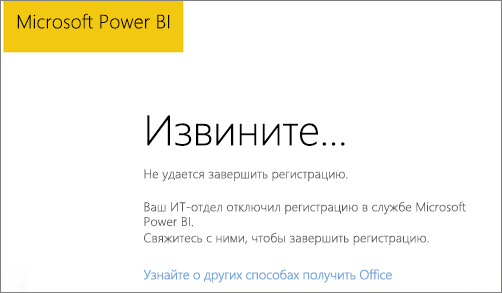

# <a name="unable-to-add-power-bi-to-office-365-partner-subscription"></a>Невозможно добавить Power BI к партнерской подписке на Office 365

Office 365 позволяет компаниям перепродавать пакеты Office 365, интегрированные в их собственные решения. В этом случае такие компании и решения являются единой точкой контакта по вопросам приобретения, выставления счетов и поддержки.

Если вы заинтересованы в приобретении Power BI вместе с подпиской Office 365, мы рекомендуем обратиться к своему партнеру. Если ваш партнер сейчас не предлагает Power BI, вы можете найти другие варианты.

## <a name="work-with-your-partner-to-purchase-power-bi"></a>Приобретение Power BI через партнера

Чтобы приобрести подписку на Power BI Pro и Power BI Premium, обратитесь к партнеру для выяснения доступных вам вариантов.

* Ваш партнер соглашается добавить Power BI в свой портфель, после чего вы сможете купить подписку у него.

* Ваш партнер может перевести вас на использование модели, в соответствии с которой вы можете приобрести Power BI непосредственно в корпорации Майкрософт или у другого партнера, предлагающего Power BI.

## <a name="purchase-from-microsoft-or-another-channel"></a>Приобретение у Майкрософт или через другой канал

В зависимости от отношений с партнером вы можете приобрести Power BI непосредственно у корпорации Майкрософт или у другого партнера. Вы можете проверить, возможно ли добавить подписки Power BI на портале администрирования Microsoft 365 (требуется членство в роли глобального администратора или администратора выставления счетов).

1. Перейдите в [Центр администрирования Microsoft 365](https://admin.microsoft.com/AdminPortal/Home#/homepage).

1. В меню слева откройте вкладку **Выставление счетов**.

    * Если вы видите раздел **Подписки**, то можете приобрести службу непосредственно у корпорации Майкрософт или обратиться к другому партнеру, который предлагает Power BI.

        

    * Если пункт **Подписки** не отображается, вы не можете приобрести решение непосредственно у корпорации Майкрософт или другого партнера.

Если ваш партнер не предлагает Power BI, и вы не можете приобрести это решение непосредственно у корпорации Майкрософт или другого партнера, попробуйте зарегистрироваться для получения бесплатной пробной версии.

## <a name="sign-up-for-a-free-trial"></a>Регистрация для получения бесплатной пробной версии

Вы можете зарегистрироваться для получения бесплатной пробной версии Power BI. Если вы не приобретете Power BI Pro в конце пробного периода, у вас по-прежнему будет бесплатная лицензия с множеством функций Power BI. Дополнительные сведения см. в разделе [Регистрация отдельного пользователя в Power BI](service-self-service-signup-for-power-bi.md).

### <a name="enable-ad-hoc-subscriptions"></a>Включение специализированных подписок

По умолчанию индивидуальная регистрация (специализированная подписка) не поддерживается. В этом случае при попытке зарегистрироваться вы увидите следующее сообщение: *Ваш ИТ-отдел отключил регистрацию на Microsoft Power BI*.



Чтобы включить специализированные подписки, свяжитесь со своим партнером и попросите его включить эту возможность. Если вы являетесь администратором клиента и знаете, как использовать команды PowerShell Azure Active Directory, вы можете включить специализированные подписки самостоятельно. [Azure Active Directory PowerShell для Graph](/powershell/azure/active-directory/install-adv2/)

1. Войдите в Azure Active Directory с использованием учетных данных Office 365. В первой строке скрипта, приведенного ниже, запрашиваются учетные данные. Вторая строка используется для подключения к Azure Active Directory.

    ```powershell
    $msolcred = get-credential
    connect-msolservice -credential $msolcred
    ```

    

1. После входа, выполните следующую команду, чтобы проверить текущие параметры для `AllowAdHocSubscriptions`.

    ```powershell
    Get-MsolCompanyInformation
    ```

1. Выполните следующую команду, чтобы разрешить регистрацию на бесплатную версию.

    ```powershell
    Set-MsolCompanySettings -AllowAdHocSubscriptions $true
    ```

## <a name="next-steps"></a>Дальнейшие действия

[Лицензирование Power BI в организации](service-admin-licensing-organization.md)

У вас имеются и другие вопросы? [Попробуйте задать вопрос в сообществе Power BI.](https://community.powerbi.com/)