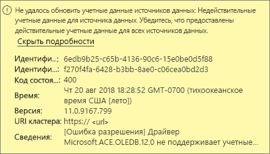
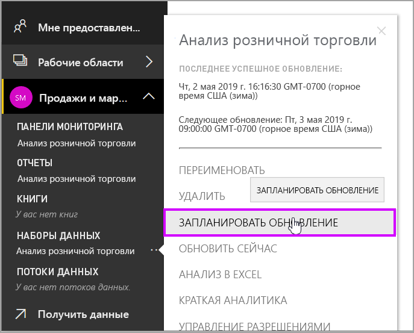
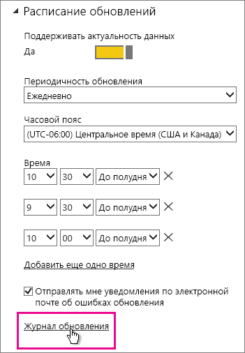
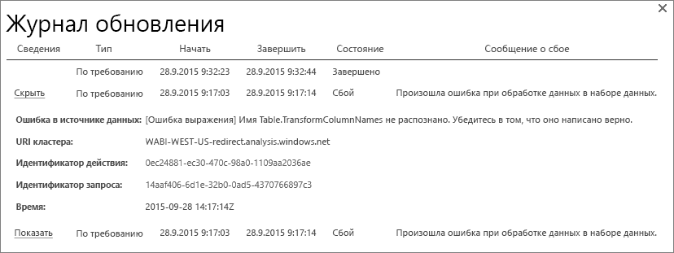
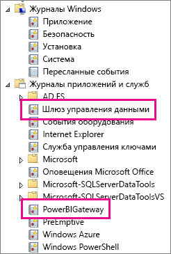
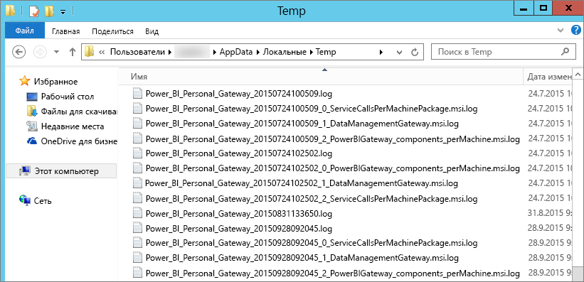

# Устранение неполадок с Power BI Gateway - Personal
Ниже рассмотрено несколько распространенных проблем, которые могут возникнуть при использовании шлюза Power BI Gateway - Personal.

> [!NOTE]
> Текущая версия шлюза для личного использования — **локальный шлюз данных (персональный режим)**. Обновите установку, чтобы использовать эту версию.
> 
> 

## Обновление до самой последней версии
Использование устаревшей версии шлюза может вызывать множество проблем.  Рекомендуется всегда следить за тем, чтобы использовалась самая новая версия.  Если шлюз не обновлялся в течение месяца или более, попробуйте установить последнюю версию шлюза и проверьте, получится ли воспроизвести проблему.

## Установка
**Личный шлюз является 64-разрядным**, поэтому, если ваш компьютер 32-разрядный, вы не сможете установить личный шлюз. Ваша операционная система должна быть 64-разрядной. Необходимо установить 64-разрядную версию ОС Windows или установить личный шлюз на 64-разрядном компьютере.

**Не удается установить личный шлюз в качестве службы, хотя вы являетесь администратором компьютера**. Сбой установки может происходить, если пользователь принадлежит к локальной группе администраторов компьютера, однако групповая политика не позволяет конкретному пользователю выполнять вход в качестве службы.  Перед установкой убедитесь, что групповая политика позволяет пользователю выполнять вход в качестве службы. Мы работаем над исправлением этой проблемы. [Дополнительные сведения](https://technet.microsoft.com/library/cc739424.aspx)

**Истекло время ожидания операции**. Это часто происходит, если на компьютере (физическом компьютере или виртуальной машине), на котором устанавливается личный шлюз, установлен одноядерный процессор. Закройте все приложения, отключите все необязательные процессы и попытайтесь повторить установку.

**Шлюз управления данными или Analysis Services Connector нельзя установить на одном компьютере с личным шлюзом**. Если на компьютере уже установлен соединитель Analysis Services  Connector или шлюз управления данными, необходимо сначала удалить такой соединитель или шлюз, а затем попытаться установить личный шлюз.

> [!NOTE]
> При возникновении проблем во время установки журналы установки могут предоставить сведения, которые помогут устранить проблему. Дополнительные сведения см. в разделе [Журналы установки](#SetupLogs).
> 
> 

 **Конфигурация прокси-сервера.** При настройке личного шлюза могут возникнуть проблемы, если в среде требуется использование прокси-сервера. Дополнительные сведения о настройке прокси-сервера см. в разделе [Настройка параметров прокси-сервера для шлюзов Power BI](service-gateway-proxy.md).

## Расписание обновления
**Ошибка. Отсутствуют учетные данные, хранящиеся в облаке.**

Подобное сообщение об ошибке может отобразиться в разделе "Параметры" для \<набора данных\>, если вы запланировали обновление, а затем удалили и повторно установили личный шлюз. При удалении личного шлюза учетные данные источника данных для набора данных, который был настроен для обновления, удаляются из службы Power BI.

**Решение.** В Power BI перейдите к параметрам обновления для набора данных. В разделе "Управление источниками данных" для любого источника данных с ошибкой щелкните "Изменить учетные данные" и снова войдите в источник данных.

**Ошибка. Недопустимые учетные данные для набора данных. Чтобы продолжить работу, обновите учетные данные, используя функцию обновления или диалоговое окно "Параметры источника данных".**

**Решение**. Если вы получите сообщение об учетных данных, это может означать следующее.

* Убедитесь в актуальности имен пользователей и паролей, используемых для входа в источники данных. В Power BI перейдите к параметрам обновления для набора данных. В разделе "Управление источниками данных" щелкните "Изменить учетные данные", чтобы обновить учетные данные для источника данных.
* Гибридное веб-приложение с использованием облачных и локальных источников в одном запросе не обновляется в личном шлюзе, если в одном из источников для проверки подлинности используется OAuth. В качестве примера можно привести гибрид между CRM Online и локальным сервером SQL Server. Он не будет работать, поскольку CRM Online требует OAuth.
  
  Это известная проблема, над решением которой ведется работа. Чтобы обойти проблему, создайте отдельные запросы для облачного и локального источника, а затем объедините или соедините эти запросы.

**Ошибка. Неподдерживаемый источник данных.**

**Решение.** Получение сообщения о неподдерживаемом источнике данных в параметрах расписания обновления может означать следующее: 

* обновление источника данных в Power BI в настоящее время не поддерживается; 
* книга Excel не содержит модель данных, а только данные листа. Power BI в настоящее время поддерживает обновление, только если переданная книга Excel содержит модель данных. При импорте данных с помощью Power Query в Excel обязательно выберите вариант загрузки данных в модель данных. Это гарантирует, что данные будут импортированы в модель данных. 

**Ошибка. [Не удается объединить данные] &lt;часть запроса&gt;/&lt;…&gt;/&lt;…&gt; обращается к источникам данных с уровнями конфиденциальности, которые не предусматривают совместное использование. Повторите сборку этого объединения данных.**

**Решение**. Эта ошибка связана с ограничениями уровня конфиденциальности и используемыми типами источников данных.

**Ошибка. Ошибка источника данных: не удается преобразовать значение \[таблица\] в тип таблицы.**

**Решение**. Эта ошибка связана с ограничениями уровня конфиденциальности и используемыми типами источников данных.

**Ошибка. Недостаточно места для этой строки.**

Это происходит, если размер одной строки превышает 4 МБ. Необходимо будет найти эту строку в источнике данных и попытаться отфильтровать ее или уменьшить ее размер.

## Источники данных
**Отсутствует поставщик данных**. Личный шлюз — это 64-разрядная система. Для работы шлюза на компьютере, где установлен личный шлюз, должны быть установлены 64-разрядные версии поставщиков данных. Например, если в качестве источника данных в наборе данных используется Microsoft Access, необходимо установить 64-разрядный поставщик ACE на том же компьютере, на котором установлен личный шлюз.  

>[!NOTE]
>При использовании 32-разрядной версии Excel нельзя установить 64-разрядный поставщик ACE на том же компьютере.

**Проверка подлинности Windows не поддерживается для базы данных Access**. В настоящее время Power BI поддерживает только анонимный доступ для базы данных Access. Мы работаем над включением проверки подлинности Windows для баз данных Access.

**Ошибка входа при вводе учетных данных для источника данных**. Если при вводе учетных данных Windows для источника данных выводится примерно следующее сообщение об ошибке, возможно, вы все еще используете более раннюю версию личного шлюза. [Установите последнюю версию шлюза Power BI Gateway - Personal](https://powerbi.microsoft.com/gateway/).

  

**Ошибка. Ошибка входа при выборе проверки подлинности Windows для источника данных с помощью OLEDB ACE**. При вводе учетных данных источника данных с помощью поставщика OLEDB ACE, возникает следующая ошибка:

Power BI в настоящее время не поддерживает проверку подлинности Windows для источника данных с помощью поставщика OLEDB ACE.

**Решение.** Чтобы обойти эту ошибку, можно выбрать анонимную проверку подлинности. Для устаревших поставщиков OLEDB ACE анонимные учетные данные эквивалентны учетным данным Windows.

## Обновление плитки
Если при обновлении плитки возникает ошибка, см. следующую статью:

[Устранение неполадок с плитками](refresh-troubleshooting-tile-errors.md)

## Инструменты для устранения неполадок
### Журнал обновления
**Журнал обновления** может помочь выявить возникшие ошибки, а также предоставляет полезные данные, в случае если требуется создать запрос на техническую поддержку. Можно просматривать как запланированные обновления, так и обновления по запросу. Ниже описано, как можно открыть **журнал обновления**.

1. В области навигации Power BI в разделе **Наборы данных** выберите набор данных, затем &gt; меню "Открыть" &gt; **Запланировать обновление**.
   
2. В **Параметры для...** &gt; **Запланировать обновление** выберите **Журнал обновления**.  
   
   
   

### Журналы событий
Существует несколько журналов событий, которые могут предоставить нужные сведения. Первые два — **шлюза управления данными** и **PowerBIGateway**— доступны, если вы обладаете правами администратора на данном компьютере.  Если вы не являетесь администратором и используете личный шлюз, вы увидите записи из журнала **приложения** .

Журналы **шлюза управления данными** и **PowerBIGateway** расположены в разделе **Журналы приложения и служб**.

### Трассировка Fiddler
[Fiddler](http://www.telerik.com/fiddler) — это бесплатный инструмент от Telerik, отслеживающий трафик HTTP.  Вы можете просматривать всю работу службы Power BI с клиентского компьютера. Это позволяет найти ошибки и другие связанные сведения.

### Журналы установки
Если **личный шлюз** не удается установить, вы увидите ссылку для отображения журнала установки. Это позволяет получить сведения о сбое. Это — журналы установки Windows, также известные как журналы MSI. Они могут быть довольно сложными и неудобными для чтения. Как правило, само описание ошибки будет приведено внизу, но определение причины ошибки является непростой задачей. Это может быть результатом ошибок в другом журнале, или быть результатом ошибки выше в журнале.

Кроме того, можно перейти к **временной папке** (%temp%) и найти файлы, которые начинаются с **Power\_BI\_**.

> [!NOTE]
> При переходе в %temp% вы можете попасть во вложенную папку временной папки.  Файлы **Power\_BI\_** будут находиться в корне временной папки.  Вам может потребоваться перейти вверх на один или два уровня.
> 
> 

## Дальнейшие действия
[Настройка параметров прокси-сервера для локального шлюза данных](service-gateway-proxy.md)  
[Обновление данных](refresh-data.md)  
[Шлюз Power BI Gateway — Personal](personal-gateway.md)  
[Устранение неполадок с плитками](refresh-troubleshooting-tile-errors.md)  
[Устранение неполадок локального шлюза данных](service-gateway-onprem-tshoot.md)  
Появились дополнительные вопросы? [Ответы на них см. в сообществе Power BI.](http://community.powerbi.com/)

