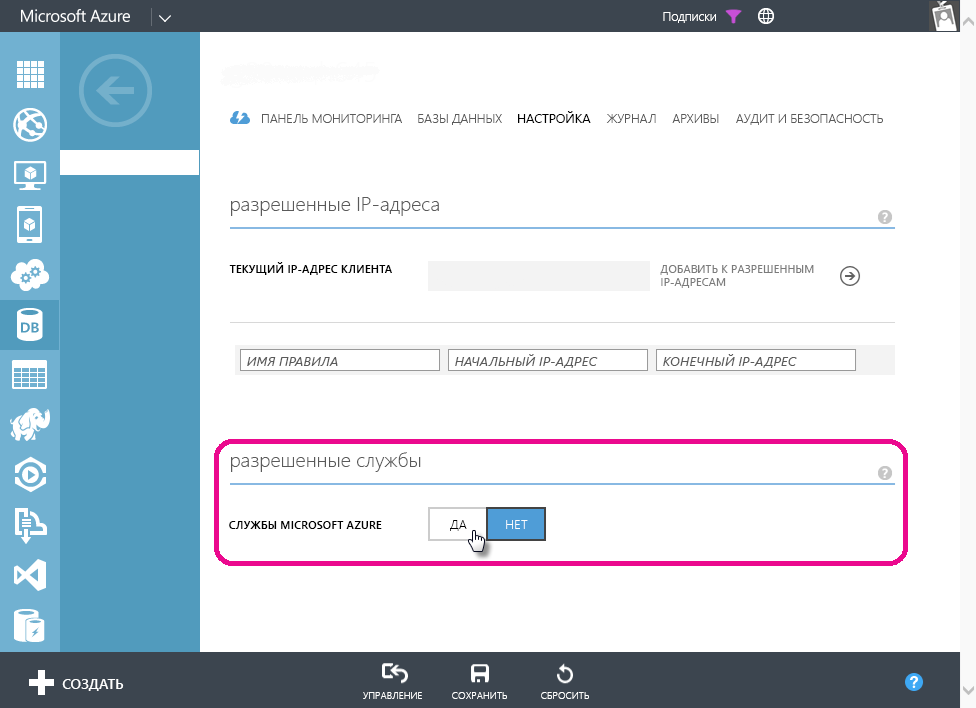

# Устранение неполадок с запланированным обновлением для баз данных SQL Azure в Power BI
Подробные инструкции по настройке запланированного обновления см. в разделе [Обновление данных в Power BI](refresh-data.md).

Если при настройке запланированного обновления базы данных SQL Azure во время редактирования учетных данных возникает ошибка с кодом 400, попробуйте выполнить следующие действия, чтобы настроить соответствующее правило брандмауэра.

1. Войдите на портал управления Azure.
2. Перейдите на сервер SQL Azure, для которого вы настраиваете обновление.
3. Включите "Службы Microsoft Azure" в разделе разрешенных служб.

  

Появились дополнительные вопросы? [Ответы на них см. в сообществе Power BI.](http://community.powerbi.com/)

