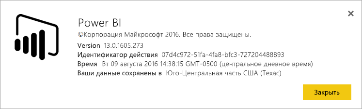
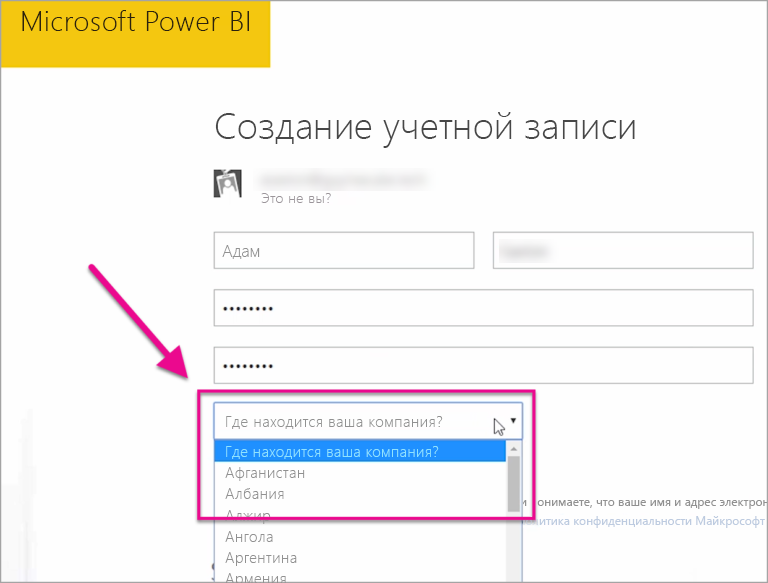

# Где расположен мой клиент Power BI?
<iframe width="560" height="315" src="https://www.youtube.com/embed/0fOxaHJPvdM?showinfo=0" frameborder="0" allowfullscreen></iframe>

Узнайте, где расположен ваш клиент Power BI и как происходит выбор места расположения. Это важно знать, так как место расположения клиента может влиять на качество обмена данными со службой.

## Как определить, где расположен ваш клиент Power BI
Чтобы найти регион, в котором расположен ваш клиент, выполните следующие действия.

1. Нажмите кнопку **?** на странице службы Power BI.
2. Выберите **О Power BI**.
3. Посмотрите, какой регион указан после текста **Ваши данные сохранены в**. Это регион, в котором расположен ваш клиент.

## Как происходит выбор региона
Выбор региона для хранения данных зависит от страны, которая была выбрана при создании клиента. Это относится к регистрации в Office 365 в дополнение к Power BI, так как эта информация является общей для указанных служб. Если вы создаете новый клиент, при заполнении регистрационной формы вы увидите раскрывающийся список стран.

Выбор страны из этого списка влияет на выбор места хранения ваших данных. Служба Power BI выберет для хранения данных ближайший к выбранной стране регион.

> [!WARNING]
> Этот выбор нельзя изменить.
> 
> 

Появились дополнительные вопросы? [Ответы на них см. в сообществе Power BI.](http://community.powerbi.com/)

