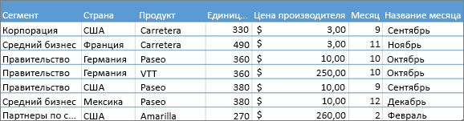
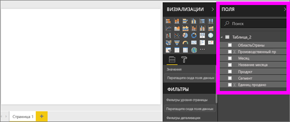
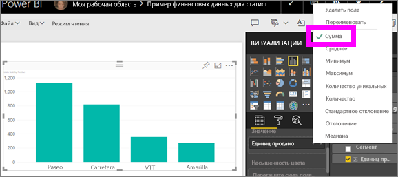
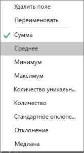
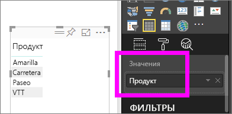
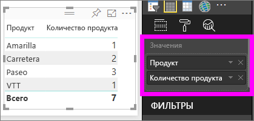

# Работа со статистическими выражениями (сумма, среднее и т. д.) в службе Power BI

## Что такое статистическое выражение?

Иногда над данными нужно выполнить математическую операцию с объединением значений. К таким операциям относятся сложение, вычисление среднего или максимального значения, подсчет и т. д. Объединение значений данных называется *статистическим вычислением*. В результате таких операций появляются *статистические выражения*.

При создании визуализаций в службе Power BI и приложении Power BI Desktop для данных может выполняться статистическое вычисление. Часто этот вариант подходит, но в некоторых случаях, возможно, потребуется обработать значения по-другому.  Например, для суммирования и получения среднего значения применяются разные подходы. Есть несколько способов управления статистическим вычислением, используемым службой Power BI в визуализации, и его изменения.

Сначала давайте рассмотрим *типы* данных, так как тип данных определяет, как служба Power BI выполняет статистическое вычисление, и требуется ли это.

## Типы данных

В большинстве наборов данных содержится более одного типа данных. На самом базовом уровне данные могут быть числовыми или нечисловыми. Для числовых данных служба Power BI может выполнить статистическое вычисление с помощью выражений "Сумма", "Среднее", "Количество", "Минимум", "Дисперсия" и многих других. Даже для текстовых данных, часто называемых *категориальными*, эта служба может выполнять статистическое вычисление. Если вы пытаетесь выполнить статистическое вычисление для поля с категориальными данными (поместив их в контейнер только числовых значений, такой как **Значения** или **Подсказки**), Power BI может подсчитать количество экземпляров каждой категории или количество уникальных экземпляров каждой категории. Специальные типы данных, такие как даты, могут иметь несколько собственных статистических параметров, например: самая ранняя, самая поздняя, первая и последняя.

В следующем примере:

- Столбцы **Units Sold** (Продано единиц) и **Manufacturing Price** (Цена производителя) содержат числовые данные.

- Столбцы **Segment** (Сегмент), **Country** (Страна), **Product** (Продукт), **Month** (Месяц), и **Month Name** (Название месяца) содержат категориальные данные.

   

При создании визуализации в Power BI служба будет выполнять статистическое вычисление для числовых полей (по умолчанию *Сумма*) по определенному полю с категориальными данными.  Например, "Units Sold ***by Product***" (Продано единиц по продуктам), "Units Sold ***by Month***" (Продано единиц по месяцам) и "Manufacturing Price ***by Segment***" (Цена производителя по сегментам). Power BI ссылается на некоторые числовые поля как на **меры**. Меры в редакторе отчетов Power BI определить очень просто — они отображаются с символом ∑ в списке **Поля**. Дополнительные сведения см. в статье [Знакомство с редактором отчетов](service-the-report-editor-take-a-tour.md).

## Почему статистические выражения не работают так, как мне нужно?

Работа со статистическими выражениями в службе Power BI может быть сопряжена с определенными сложностями. Возможна ситуация, когда служба Power BI не позволяет изменить статистическое выражение для числового поля. Или, например, вы не хотите применять статистическое выражение к полю "год" — вам просто нужно подсчитать количество экземпляров.

Как правило, проблема в таких случаях связана с определением поля в наборе данных. Возможно, владелец набора данных определил поле как текстовое, в связи с чем служба Power BI не может вычислить для него сумму или среднее значение. К сожалению, [категорию поля может изменить только владелец набора данных](desktop-measures.md). При наличии разрешений владельца для набора данных как в приложении Desktop, так и в программе, которая использовалась для создания набора данных (например, Excel), вы можете решить эту проблему. В противном случае потребуется обратиться к владельцу набора данных за помощью.  

См. раздел [**Рекомендации и устранение неполадок**](#considerations-and-troubleshooting) в конце этой статьи. В нем приводятся некоторые полезные советы и рекомендации. Если вы не нашли ответ на свой вопрос, опубликуйте его на [форуме сообщества Power BI](https://community.powerbi.com). Это позволит получить оперативный ответ непосредственно от команды Power BI.

## Изменение вычисления числового поля

Предположим, есть диаграмма, в которой суммируются проданные единицы различных продуктов, но вместо суммы требуется получить среднее значение.

1. Создайте **гистограмму с группировкой**, в которой используются мера и категория. В этом примере мы используем Units Sold by Product (Продано единиц по продукту).  По умолчанию в Power BI создается диаграмма, в которой суммируется число проданных единиц (мера в списке **значений**) для каждого продукта (категория в списке **осей**).

   

1. На панели **Визуализации** щелкните правой кнопкой мыши меру и выберите нужный тип вычисления. В этом случае мы выбираем **Среднее**. Если нужного статистического выражения нет, см. раздел [**Рекомендации и устранение неполадок**](#considerations-and-troubleshooting).

   

   > [!NOTE]
   > Параметры, доступные в раскрывающемся списке, будут зависеть от выбранного поля и способа его категоризации владельцем набора данных.

1. Теперь для вашей визуализации выполнено статистическое вычисление среднего значения.

   

## Способы статистического вычисления для данных

Некоторые параметры, которые могут быть доступны для статистической обработки поля:

- **Не суммировать**. Если этот параметр выбран, служба Power BI обрабатывает отдельно каждое значение в этом поле и не суммирует их. Используйте этот параметр при наличии числового столбца идентификатора, который не должен суммироваться службой.

- **Сумма**. Все значения в этом поле суммируются.

- **Среднее**. Вычисляется среднее арифметическое значений.

- **Минимум**. Отображается самое низкое значение.

- **Максимум**. Отображается самое высокое значение.

- **Количество (не пустых).** Подсчитывается количество значений в этом поле, которые не являются пустыми.

- **Количество (уникальных).** Подсчитывается количество уникальных значений в этом поле.

- **Стандартное отклонение.**

- **Отклонение**.

- **Медиана**.  Показывает значение медианы (среднее). Это значение, число элементов выше и ниже которого одинаково.  Если медиан две, Power BI вычисляет их среднее значение.

Например, эти данные:

| Страна | Объем |
|:--- |:--- |
| США |100 |
| Соединенное Королевство |150 |
| Канада |100 |
| Германия |125 |
| Франция | |
| Япония |125 |
| Австралия |150 |

выдадут следующие результаты:

- **Не суммировать**: каждое значение отображается отдельно

- **Сумма**: 750

- **Среднее**: 125

- **Максимум**:  150

- **Минимум**: 100

- **Количество (не пустых):** 6

- **Количество (различных):** 4

- **Стандартное отклонение:** 20,4124145...

- **Отклонение:** 416,666...

- **Медиана:** 125

## Создание статистического вычисления с использованием категориального (текстового) поля

Можно выполнять статистическое вычисление и для нечисловых полей. Например, существующее поле с названия продукта можно добавить в качестве значения и задать для него выражение **Количество**, **Количество уникальных**, **Первый** или **Последний**.

1. Перетащите поле **Продукт** в список **Значения**. Список **значений** обычно используется для числовых полей. Power BI распознает это поле как текстовое, задает для статистического вычисления параметр **Не суммировать** и выводит таблицу с одним столбцом.

   

1. Если изменить статистическую функцию по умолчанию **Не суммировать** на **Количество уникальных**, Power BI подсчитает количество разных продуктов. В нашем случае их будет четыре.
  
   

1. Если изменить функцию агрегирования на **Количество**, Power BI подсчитает общее количество. В этом случае для элемента **Продукт** отображается семь записей.

   

1. Перетащив то же поле (в этом случае **Продукт**) в список **Значения** и оставив статистическое выражение по умолчанию **Не суммировать**, мы распределим в Power BI количество по продуктам.

   

## Рекомендации и устранение неполадок

Вопрос.  Почему не отображается параметр **Не суммировать**?

Ответ.  Выбранное поле, скорее всего, является вычисляемой или дополнительной мерой, созданной в Excel или [Power BI Desktop](desktop-measures.md). Каждая вычисляемая мера имеет собственную жестко заданную формулу. Используемое службой Power BI статистическое выражение изменить нельзя. Например если это выражение "Сумма", выполнять можно только суммирование. В списке **Поля***вычисляемые меры* отображаются с символом калькулятора.

Вопрос.  Мое поле **является** числовым. Почему доступны только варианты **Количество** и **Количество различных объектов**?

Ответ 1.  Вероятно, владелец набора данных *не* классифицировал поле как числовое. Например, если в наборе данных присутствует поле **года**, владелец вполне мог классифицировать его как текстовое. В Power BI поле **года** скорее всего будет рассматриваться как числовое (например, количество людей, родившихся в 1974 году). При этом менее вероятно, что служба Power BI будет суммировать или вычислять средние значения для этих полей. Если вы являетесь владельцем, откройте набор данных в Power BI Desktop и измените тип данных на вкладке **Моделирование**.

Ответ 2. Поле со значком калькулятора является *вычисляемой мерой*. Каждой вычисляемой мере соответствует жестко заданная формула, изменить которую может только владелец набора данных. Используемое службой Power BI вычисление может быть простым статистическим выражением, например средним значением или суммой. Однако это может быть и более сложная операция, например "процент вклада в родительскую категорию" или "нарастающий итог с начала года". Power BI не будет вычислять сумму или среднее значение. Вместо этого для каждой точки данных будет выполняться пересчет с использованием жестко заданной формулы.

Ответ 3.  Еще один вариант: вы случайно поместили поле в *контейнер*, который допускает только категориальные значения.  В этом случае единственным доступными параметрами будут "Количество" и "Число разных элементов".

Ответ 4.  Еще одно возможное объяснение: вы используете поле для оси. Например, на оси линейчатой диаграммы Power BI отображает одну панель для каждого уникального значения. Значения полей в этом случае вообще не вычисляются.

>[!NOTE]
>Исключением из этого правила являются точечные диаграммы, для которых *требуются* вычисленные значения для осей X и Y.

Вопрос.  Почему я не могу агрегировать текстовые поля для источников данных SQL Server Analysis Services?

Ответ.  С активными подключениями к многомерным моделям SQL Server Analysis Services невозможно выполнять агрегирование на стороне клиента, включая определение первого, последнего, среднего, минимального, максимального и суммарного значений.

Вопрос.  Я использую точечную диаграмму и хочу, чтобы поле *не* вычислялось.  Как это сделать?

Ответ.  Добавьте поле в контейнер **Сведения**, но не в контейнеры осей X и Y.

Вопрос.  Когда я добавляю числовые поля в визуализацию, большинство полей по умолчанию суммируются, но для некоторых по умолчанию вычисляется среднее значение или количество либо выполняется другая операция.  Почему статистическое выражение по умолчанию не всегда одинаковое?

Ответ.  Владельцы наборов данных могут назначать суммирование по умолчанию для каждого поля. Если вы владелец набора данных, измените суммирование по умолчанию на вкладке **Моделирование** в Power BI Desktop.

Вопрос.  Я владелец набора данных и хочу, чтобы для поля никогда не выполнялось агрегирование.

Ответ.  В Power BI Desktop на вкладке **Моделирование** установите для параметра **Тип данных** значение **Текст**.

Вопрос.  В раскрывающемся списке не отображается параметр **Не суммировать**.

Ответ.  Попробуйте удалить поле, а затем добавить его снова.

Появились дополнительные вопросы? [Ответы на них см. в сообществе Power BI.](https://community.powerbi.com/)