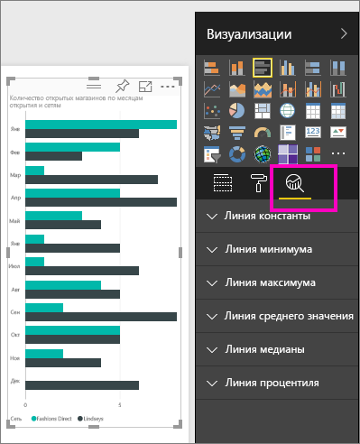
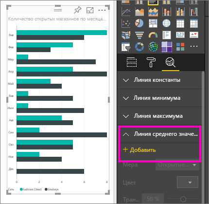
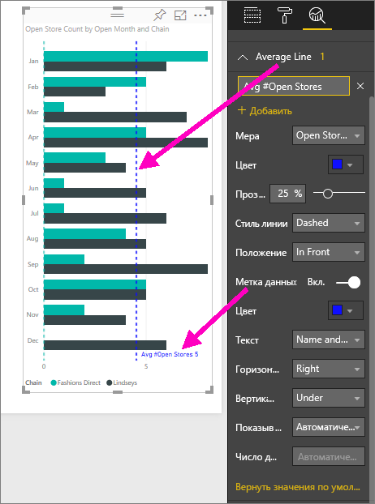
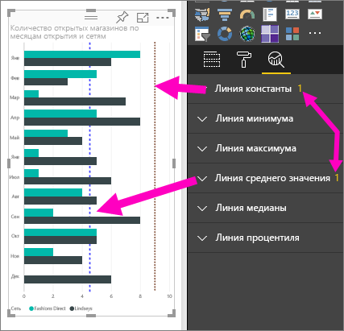
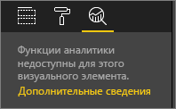

# Создание динамических строк ссылок для визуальных элементов в службе Power BI

Панель **Аналитика** в **службе Power BI** позволяет добавлять динамические *строки ссылок* в визуализации, чтобы обратить внимание на важные тенденции и подробные сведения.

> [!NOTE]
> Панель **Аналитика** отобразится, только если выбрать визуализацию на холсте отчетов.
> 
> 

## Использование панели "Аналитика"
Используя панель **Аналитика**, можно создать такие динамические строки ссылок (не все строки доступны для всех типов визуальных элементов):

* линия константы оси X;
* линия константы оси Y;
* линия минимума;
* линия максимума;
* линия среднего значения;
* линия медианы;
* линия процентиля.

Чтобы посмотреть доступные динамические строки ссылок для визуального элемента, сделайте следующее:

1. Выберите или создайте визуализацию, а затем на **панели визуализации** щелкните значок **Аналитика**.

2. Используя стрелку вниз, выберите тип строки, которую необходимо создать, чтобы развернуть ее параметры. В данном случае выбираем **линию среднего значения**.
   
   

3. Чтобы создать строку, щелкните **+Добавить** и выберите меру, которая будет использоваться для создания строки.  Раскрывающийся список **Меры** автоматически заполняется доступными данными из выбранной визуализации. Мы будем использовать **Количество открытых магазинов**.

5. Для строки можно выбрать разные свойства, например цвет, степень прозрачности, стиль и позицию (относительно элементов данных визуального элемента). Если нужно задать метку строки, укажите ее название, а затем переместите переключатель **Метка данных** в положение **Вкл.**  Так мы выберем заголовок для строки *Средний показатель количества открытых магазинов* и настроим несколько других параметров, как показано ниже.
   
   

1. Обратите внимание на число, которое отображается рядом с элементом **Линия среднего значения** на панели **Аналитика**. Оно указывает на количество динамических строк, созданных для визуального элемента, и их тип. Если добавить **строку константы** как целевой показатель 9 открытых магазинов, на панели **Аналитика** будет показано, что теперь к этой визуализации также применена строка ссылки типа **Линия константы**.
   
   
   

С помощью динамических строк ссылок, создаваемых на панели **Аналитика**, можно визуализировать множество интересных показателей.

## Рекомендации и устранение неполадок

Если к выбранному визуальному элементу не применяются динамические строки ссылок (в данном случае визуальный элемент **Карта**), при выборе панели **Аналитика** вы увидите следующее:
   

Возможность использовать динамические строки ссылок зависит от типа используемого визуального элемента. Далее мы рассмотрим, какие динамические строки сейчас доступны для тех или иных визуальных элементов.

Следующие визуальные элементы поддерживают динамические строки без каких-либо ограничений:

* диаграмма с областями;
* график;
* точечная диаграмма;
* гистограмма с группировкой;
* линейчатая диаграмма с группировкой.

Следующие визуальные элементы работают только с *линиями константы* из панели **Аналитика**:

* диаграмма с областями с накоплением;
* линейчатая диаграмма с накоплением;
* гистограмма с накоплением;
* нормированная линейчатая диаграмма;
* нормированная гистограмма.

Со следующими визуальными элементами можно использовать только *линии тренда*:

* график без накопления;
* гистограмма с группировкой.

Наконец, недекартовы визуальные элементы сейчас не поддерживают следующие динамические строки из панели **Аналитика**:

* матрица;
* круговая диаграмма;
* кольцевой график;
* Таблица

## Дальнейшие действия
[Панель "Аналитика" в Power BI Desktop](desktop-analytics-pane.md)

Появились дополнительные вопросы? [Ответы на них см. в сообществе Power BI.](http://community.powerbi.com/)

