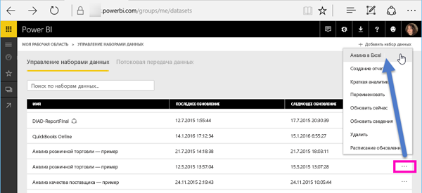
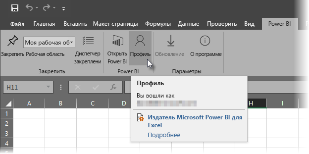

# Анализ в Excel
Бывают ситуации, когда для просмотра набора данных в Power BI и работы с ним требуется использовать Excel. Это можно сделать с помощью компонента **Анализ в Excel**, позволяющей получить доступ к функциям сводных таблиц, диаграмм и срезов в Excel для набора данных, имеющегося в Power BI.

## Требования
К использованию **анализа в Excel** предъявляется ряд требований:

* Компонент **Анализ в Excel** поддерживается в Microsoft Excel 2010 с пакетом обновления 1 и более поздних версиях.
* Сводные таблицы Excel не поддерживают агрегирование числовых полей перетаскиванием. В наборе данных Power BI *должны быть заранее определенные меры*.
* В некоторых организациях могут действовать правила групповой политики, которые запрещают устанавливать необходимые обновления **Анализ в Excel**. Если вам не удается их установить, обратитесь к своему администратору.
* Для **анализа в Excel** требуется лицензия Pro. Дополнительные сведения о различиях в функциональных возможностях см. в [сравнении бесплатной версии Power BI и Power BI Pro](service-free-vs-pro.md). 

## Принципы работы
При выборе элемента **Анализ в Excel** в меню многоточия (...), связанного с набором данных или отчетом в **Power BI**, Power BI создает ODC-файл и скачивает его из браузера на ваш компьютер.

При открытии этого файла в Excel отображается пустая **сводная таблица** и список **Поля** со всеми таблицами, полями и мерами из набора данных Power BI. Вы можете создавать сводные таблицы, диаграммы и анализировать набор данных точно так же, как и при использовании любого локального набора данных в Excel.

ODC-файл использует строку подключения MSOLAP для соединения с набором данных в Power BI. При анализе данных или работе с ними Excel отправляет запросы к набору данных Power BI, и результаты возвращаются обратно в Excel. Если набор данных подключен к динамическому источнику с помощью DirectQuery, Power BI отправляет запросы к этому источнику и возвращает результаты в Excel.

Компонент **Анализ в Excel** очень удобно использовать для работы с наборами данных и отчетами, которые подключаются к *табличным* или *многомерным базам данных в службах Analysis Services* либо находятся в файлах Power BI Desktop и книгах Excel с моделями данных, содержащими меры модели, которые были созданы с помощью языка выражений анализа данных (DAX).

## Приступая к анализу в Excel
В Power BI щелкните меню многоточия рядом с отчетом или набором данных (... рядом с именем отчета или набора данных) и в появившемся меню выберите **Анализ в Excel**.

### Установка обновлений для Excel
При первом использовании компонента **Анализ в Excel** потребуется установить обновления для библиотек Excel. Вам будет предложено скачать и запустить обновления Excel (при этом запускается установка пакета установщика Windows *SQL_AS_OLEDDB.msi*). Этот пакет устанавливает **поставщик OLE DB Microsoft AS для сервера SQL Server 2016 RC0 (предварительная версия)**.

> [!NOTE]
> Не забудьте установить флажок **Больше не показывать** в диалоговом окне **Установка обновлений Excel**. Это обновление необходимо установить только один раз.
> 
> 

Если вам снова требуется установить обновления Excel для компонента **Анализ в Excel**, можно скачать такое обновление с помощью значка **скачивания** в Power BI, как показано на следующем рисунке.

### Вход в Power BI
Даже если вы уже вошли в Power BI в браузере, в первый раз при открытии нового ODC-файла в Excel вам, возможно, потребуется снова войти в эту службу со своей учетной записью Power BI. При это выполняется проверка подлинности соединения из Excel в Power BI.

### Пользователи с несколькими учетными записями Power BI
Некоторые пользователи имеют несколько учетных записей Power BI и могут столкнуться с ситуацией, когда они вошли в Power BI с помощью одной учетной записи, но доступ к набору данных, используемому при анализе в Excel, имеет другая учетная запись. В этом случае при попытке доступа к набору данных, используемому в книге анализа в Excel, может возникать ошибка **Запрещено** или ошибка входа в систему.

При этом вы сможете повторно войти в систему с помощью учетной записи Power BI, имеющей доступ к набору данных, используемому при анализе в Excel. Можно также выбрать элемент **Профиль** на вкладке ленты **Power BI** в Excel, который определяет учетную запись, с помощью которой вы вошли в систему, и позволяет выйти из нее (после чего можно воспользоваться нужной учетной записью).

### Включение подключений к данным
Чтобы приступить к анализу данных Power BI в Excel, проверьте имя и путь ODC-файла и нажмите кнопку **Разрешить**.

> [!NOTE]
> Администраторы клиентов Power BI могут использовать *портал администрирования Power BI*, чтобы отключить функцию **Анализировать в Excel** для работы с локальными наборами данных, размещенными в базах данных Analysis Services (AS). Если этот параметр отключен, функция **Анализировать в Excel** будет отключена для баз данных AS, но по-прежнему будет доступна для работы с другими наборами данных.
> 
> 

## Анализ
Теперь, когда Excel открыт и отображается пустая сводная таблица, вы можете выполнять для набора данных Power BI любые виды анализа. Как и другие локальные книги, анализа в Excel позволяет создавать сводные таблицы, диаграммы, добавлять данные из других источников и т. п. И конечно же, вы может создавать различные листы для работы с ними в любых представлениях.

> [!NOTE]
> Необходимо знать, что использование функции **анализа в Excel** предоставляет все данные на уровне детализации для всех пользователей с разрешением на набор данных.
> 
> 

## Сохранить
Эту книгу, подключенную к набору данных Power BI, можно сохранить так же, как и любую другую. При этом ее нельзя опубликовать или импортировать обратно в Power BI,так как для публикации или импорта данные в книге должны содержаться в таблицах или использовать модель данных. Так как в новой книге есть только подключение к набору данных в Power BI, ее публикация или импорт в Power BI привели бы к возникновению замкнутого цикла.

## Совместный доступ
Сохранив книгу, вы можете предоставить доступ к ней другим пользователям Power BI в своей организации.

Когда такой пользователь откроет вашу книгу в первый раз, он увидит в ней сводные таблицы и данные в том состоянии, в каком они были на момент последнего сохранения (то есть они могут быть неактуальны). Чтобы обновить данные до текущей версии, потребуется нажать кнопку **Обновить** на ленте **Данные**. А так как книга подключается к набору данных в Power BI, пользователи, пытающиеся обновить книгу, должны будут войти в эту службу и установить обновления для Excel (только в первый раз).

Так как пользователям потребуется обновить набор данных, а обновление внешних подключений в Excel Online не поддерживается, рекомендуется открывать такие книги в классическом приложении Excel на компьютере.

## Устранение неполадок
В некоторых случаях функция анализа в Excel дает неожиданный результат или работает не так, как нужно. [На этой странице представлены решения наиболее распространенных проблем, возникающих при работе с функцией анализа в Excel.](desktop-troubleshooting-analyze-in-excel.md)