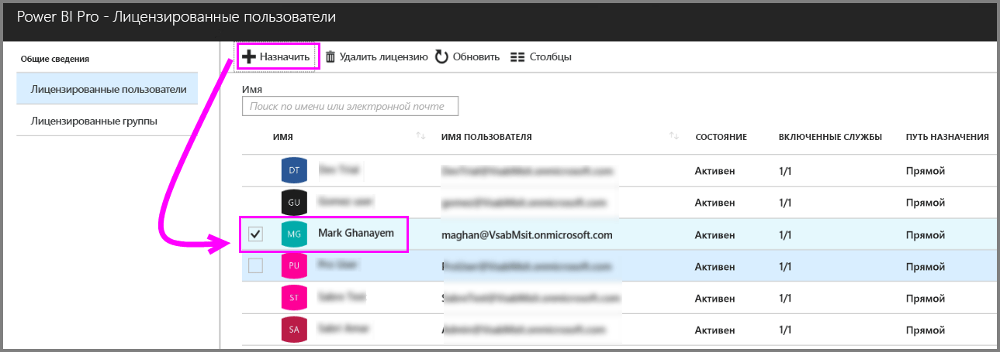
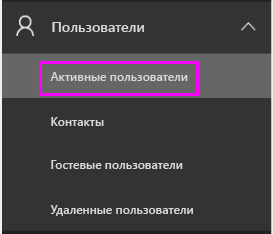
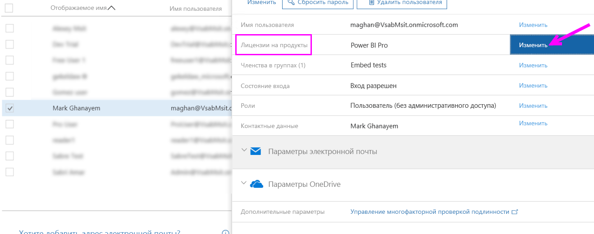
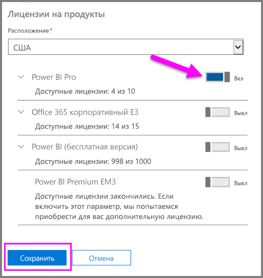
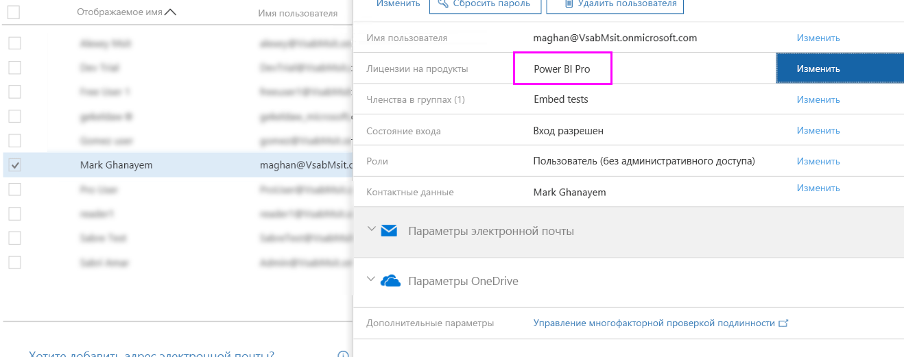

# Назначение лицензий Power BI Pro

Чтобы назначить лицензии Power BI Pro пользователям, администраторы могут использовать множество порталов управления и командлетов PowerShell. Управление лицензиями Power BI осуществляется на базе Azure Active Directory (Azure AD).

* Владельцы подписок Azure могут использовать колонку Azure Active Directory на [портале Azure](https://ms.portal.azure.com/#@microsoft.onmicrosoft.com/dashboard/private/39bc3cf7-31a4-43f6-954c-f2d69ca2f0). 

* Глобальные администраторы и администраторы учетных записей пользователей могут использовать [Центр администрирования Office 365](https://portal.office.com/AdminPortal/Home#/homepage).

## Управление лицензиями Power BI Pro на портале Azure

Power BI использует Azure AD в качестве базовой службы. Azure AD хранит учетные записи пользователей и группы, а также другие параметры, например сведения о приобретенных продуктах.

### Назначение лицензий отдельным учетным записям пользователей

Выполните следующие действия, чтобы назначить лицензии Pro отдельным учетным записям пользователей, если вы являетесь владельцем подписки Azure:

1. Перейдите на [портал Azure](https://ms.portal.azure.com/#@microsoft.onmicrosoft.com/dashboard/private/39bc3cf7-31a4-43f6-954c-f2d69ca2f0). 

2. На панели навигации слева щелкните "Azure Active Directory".

    

3. В колонке "Azure Active Directory" щелкните "Лицензии".

    

4. В колонке "Лицензии" щелкните "Все продукты", а затем "Power BI Pro", чтобы отобразить список лицензированных пользователей.

    

5. Щелкните "Назначить", чтобы добавить лицензию Power BI Pro в дополнительную учетную запись пользователя.

    

> [!NOTE]
> Хотя можно управлять большинством аспектов лицензирования, приобрести лицензии Power BI Pro на портале Azure невозможно. Для приобретения подписки Power BI Pro используйте Центр администрирования Office 365. Дополнительные сведения см. в статье [Приобретение Power BI Pro](https://docs.microsoft.com/en-us/power-bi/service-admin-purchasing-power-bi-pro).
>

## Управление лицензиями Power BI Pro в Центре администрирования Office 365

Если вы являетесь глобальным администратором, то можете использовать Центр администрирования Office 365 для приобретения подписки Power BI Pro и управления соответствующими лицензиями для организации.

Выполните следующие действия, чтобы назначить лицензии Pro отдельным учетным записям пользователей, если вы являетесь администратором Office 365:

1. Перейдите в центр администрирования Office 365.

2. В левой области навигации разверните пункт "Пользователи" и выберите элемент "Активные пользователи".

    

3. Выберите одного или нескольких пользователей и выберите элемент "Изменить лицензии продуктов".

    

4. В области Power BI Pro переключите параметр на значение "Включено", а затем нажмите кнопку "Сохранить".

    

5. В области "Состояние" для выбранных учетных записей убедитесь, что лицензия Power BI Pro назначена успешно.

    

> [!NOTE]
> Если в вашей подписке закончились лицензии, добавьте их, развернув пункт "Выставление счетов" в левой области навигации и выбрав элемент "Подписки". На странице "Подписки" выберите подписку Power BI Pro и щелкните элемент "Добавить/удалить лицензии".
>

## Дальнейшие действия
[Условия использования расширенной пробной версии Power Bi Pro](https://aka.ms/power-bi-trial)
 
[Условия использования Microsoft Power BI Preview](https://powerbi.microsoft.com/terms-of-service/)
 
[Объявление о выпуске Power BI Premium](https://aka.ms/pbipremium-announcement)
 
[Поиск пользователей Power BI, выполнивших вход](service-admin-access-usage.md)

Появились дополнительные вопросы? [Попробуйте задать вопрос в сообществе Power BI.](https://community.powerbi.com/)