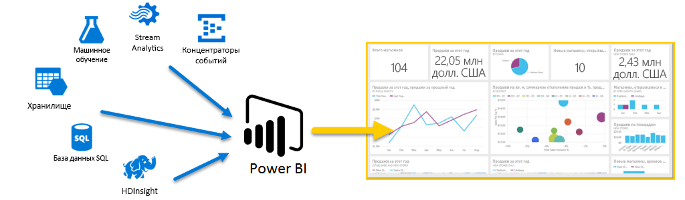
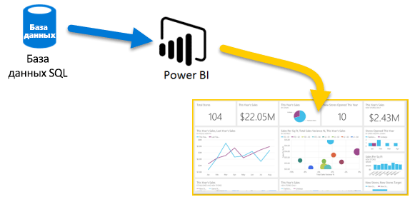
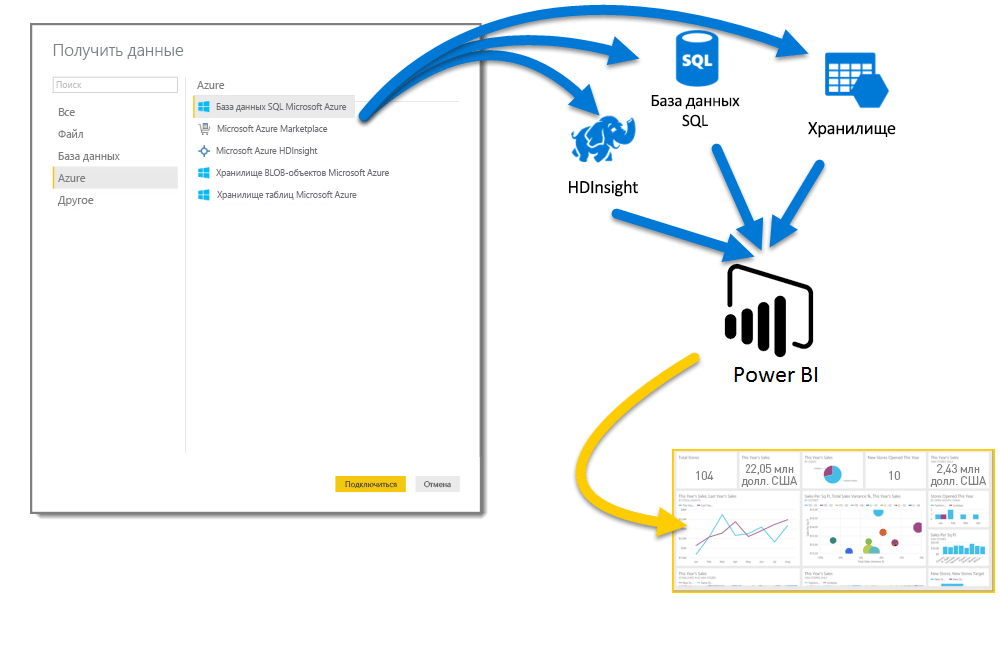

# Azure и Power BI
Благодаря службам **Azure** и **Power BI**усилия по обработке данных могут дать результаты в виде аналитических материалов и отчетов, которые обеспечат ценные сведения о бизнесе в режиме реального времени. Независимо от того, выполняется ли обработка данных в облачной или локальной среде, является ли она простой или сложной, с одним источником или высокой степенью масштабируемости, в хранилищах или в режиме реального времени, Azure и Power BI обеспечивают встроенные возможности подключения и интеграции, которые позволяют эффективно реализовать задачи, связанные с бизнес-аналитикой.

В Power BI доступен целый ряд подключений к службам Azure, а решения бизнес-аналитики, которые вы можете создавать, используя эти службы, так же уникальны, как и ваша компания. Вы можете подключиться всего к одному источнику данных Azure (или небольшой группе), а затем сформировать и уточнить набор данных для построения настраиваемых отчетов.

### База данных SQL Azure и Power BI
Вы можете начать с простого подключения к базе данных SQL Azure и создавать отчеты для отслеживания развития вашего бизнеса. С помощью [Power BI Desktop](desktop-getting-started.md) можно создавать отчеты, определяющие тенденции и ключевые показатели эффективности, которые помогают вашей компании двигаться вперед.

Здесь вы можете узнать еще больше о [Базе данных SQL Azure](http://azure.microsoft.com/services/sql-database/).

### Преобразование, формирование и объединение данных в облаке
У вас более сложные данные и разнородные источники? Это не проблема. При использовании **Power BI Desktop** и служб Azure любые подключения легко доступны из диалогового окна **Получить данные** . В одном запросе можно подключиться к **базе данных SQL Azure**, источнику данных **Azure HDInsight** и **хранилищу BLOB-объектов Azure** (либо **табличному хранилищу Azure**), а затем выбрать в каждом источнике только необходимые наборы данных и уточнить их в том же запросе.

Кроме того, можно создавать разные отчеты для разных целевых аудиторий, используя то же подключение к данным и даже тот же запрос. Просто создайте новую страницу отчета и уточните визуализации для каждой аудитории: таким образом вы сможете донести актуальную информацию до всех заинтересованных лиц.

Дополнительные сведения можно найти в следующих ресурсах:

* [База данных SQL Azure](http://azure.microsoft.com/services/sql-database/)
* [Azure HDInsight](http://azure.microsoft.com/services/hdinsight/)
* [Служба хранилища Azure](http://azure.microsoft.com/services/storage/) (хранилище BLOB-объектов и табличное хранилище)

### Формирование более сложной среды и (достижение целей) с помощью служб Azure и Power BI
Благодаря Azure и Power BI среду можно расширять по мере необходимости. Используйте широкие возможности обработки нескольких источников данных, систем обработки больших объемов данных в режиме реального времени, [Stream Analytics](http://azure.microsoft.com/services/stream-analytics/) и [концентраторов событий](http://azure.microsoft.com/services/event-hubs/) и объединяйте данные различных служб SaaS в отчеты бизнес-аналитики, обеспечивающие преимущество вашего бизнеса.

### Подключение данных приложений с помощью API-интерфейсов Power BI
Power BI можно также использовать для получения аналитических данных о существующих приложениях. Используя API-интерфейсы Power BI, разработчики приложений могут отправлять целые наборы данных в Power BI программными средствами. Требуются постоянные обновления? Благодаря API-интерфейсам Power BI разработчики могут отправлять обновления данных в режиме реального времени, чтобы быстрее приступить к работе, а затем перейти к использованию Azure Stream Analytics, когда этого потребуют возросшие требования к масштабируемости.

На [портале разработчиков Power BI](http://dev.powerbi.com) можно найти множество полезных сведений об API-интерфейсах Power BI. Почитав [блог разработчиков Power BI](http://blogs.msdn.com/powerbidev), вы можете узнать, какие задачи решают другие разработчики, используя программные средства Power BI. Имеется также страница, посвященная [начальным сведениям о разработке в Power BI](https://msdn.microsoft.com/library/dn889824.aspx).

### Какие задачи можно решать с помощью Azure и Power BI?
Существуют разнообразные сценарии, в которых возможно объединение функций **Azure** и **Power BI** , — доступные возможности так же уникальны, как и ваш бизнес. Дополнительные сведения о **службах Azure** можно найти на этой [обзорной странице](http://go.microsoft.com/fwlink/?LinkId=535031&clcid=0x409), которая описывает **сценарии анализа данных с помощью Azure** и содержит сведения о том, как преобразовывать источники данных в аналитические сведения, помогающие вашей компании двигаться вперед.

