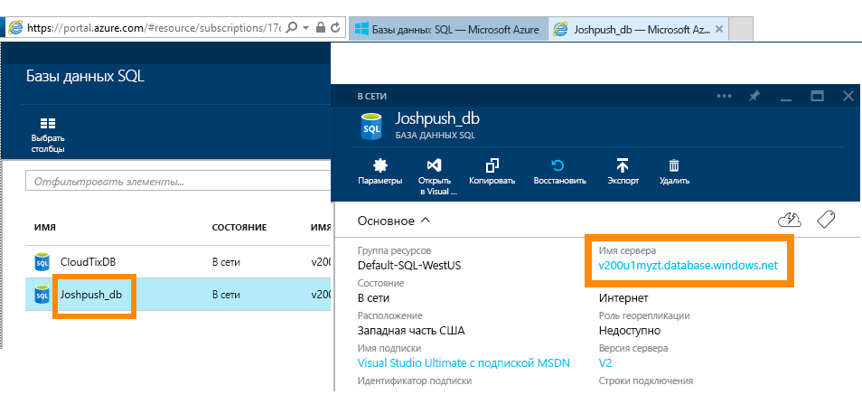
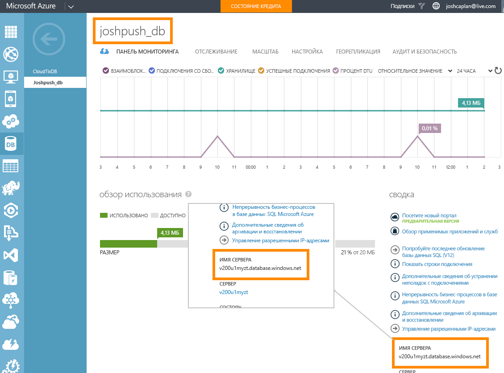

# База данных SQL Azure с DirectQuery
Узнайте, как можно подключиться непосредственно к базе данных SQL Azure и создавать отчеты, в которых используются реальные данные. Можно хранить данные в источнике, а не в Power BI.

При использовании DirectQuery запросы отправляются обратно в Базу данных SQL Azure при просмотре данных в представлении отчетов. Этот процесс рекомендуется пользователям, знакомым с базами данных и сущностями, к которым они подключаются.

**Примечания**

* Укажите полное имя сервера при подключении (см. дополнительные сведения ниже).
* Убедитесь, что настроены правила брандмауэра "[Разрешить доступ к службам Azure](https://msdn.microsoft.com/library/azure/ee621782.aspx)".
* Каждое действие, например выбор столбца или добавление фильтра, отправляет запрос в базу данных.
* Плитки обновляются примерно каждые 15 минут (обновление не требуется планировать). Его можно настроить в разделе дополнительных параметров при подключении.
* Функция вопросов и ответов для наборов данных DirectQuery недоступна.
* Изменения схемы не извлекаются автоматически.

Эти ограничения и примечания могут быть изменены по мере улучшения службы. Ниже описаны инструкции по подключению. 

## Power BI Desktop и DirectQuery
Чтобы подключиться к базе данных SQL Azure с помощью DirectQuery, необходимо использовать Power BI Desktop. Такой подход обеспечивает дополнительные возможности и гибкость работы. Отчеты, созданные с помощью Power BI Desktop, затем можно опубликовать в службе Power BI. См. дополнительные сведения о подключении к [базе данных SQL Azure с помощью DirectQuery](desktop-use-directquery.md) в Power BI Desktop. 

## Подключение через Power BI
Возможность подключения к базе данных SQL Azure непосредственно из службы Power BI больше не поддерживается. При выборе [соединителя базы данных SQL Azure](https://app.powerbi.com/getdata/bigdata/azure-sql-database-with-live-connect) вам будет предложено установить подключение в Power BI Desktop. Затем вы сможете публиковать отчеты Power BI Desktop в службе Power BI. 

### Поиск значений параметров
Полное имя сервера и имя базы данных можно найти на портале Azure.

## Дальнейшие действия
[Использование DirectQuery в Power BI Desktop](desktop-use-directquery.md)  
[Приступая к работе с Power BI](service-get-started.md)  
[Получение данных для Power BI](service-get-data.md)  
Появились дополнительные вопросы? [Ответы на них см. в сообществе Power BI.](http://community.powerbi.com/)

