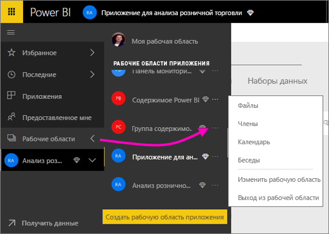
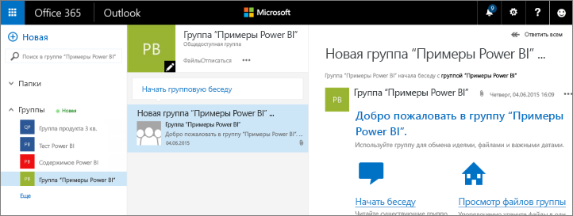
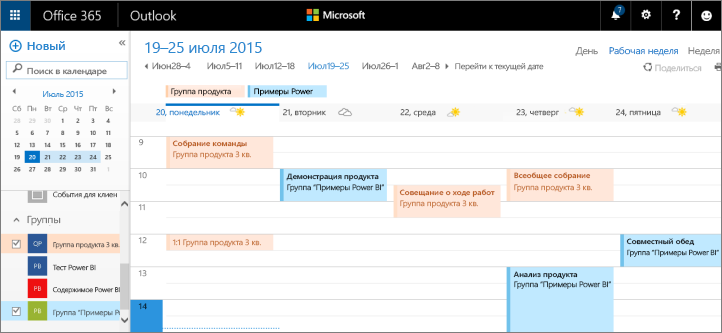

# Совместная работа в рабочей области приложения Power BI
Рабочие области приложения Power BI — место, где вы с коллегами можете совместно работать с информационными панелями, отчетами и наборами данных для создания *приложения*. Ведь эти рабочие области предназначены для совместной работы. Поработав со своими коллегами над информационными панелями и отчетами, упакуйте их в виде приложения и распространите. Дополнительные сведения о создании приложений и рабочих областей приложений в Power BI см. в [этой статье](service-create-distribute-apps.md). 

Совместная работа не ограничивается рабочими областями в Power BI. В Office 365 доступны и другие службы групп, включая решения по совместному использованию файлов в OneDrive для бизнеса, общению в Exchange, а также общий календарь, задачи и т. д. Узнайте подробнее о [группах в Office 365](https://support.office.com/article/Create-a-group-in-Office-365-7124dc4c-1de9-40d4-b096-e8add19209e9).

Рабочие области приложений доступны только в [Power BI Pro](service-free-vs-pro.md).

## Совместная работа над файлами Power BI Desktop в рабочей области приложения
Если после создания файла Power BI Desktop вы публикуете его в рабочей области приложения Power BI, все участники рабочей области могут совместно работать с ним.

1. В Power BI Desktop на ленте **Главная** выберите **Публикация**. Затем в поле **Выбор целевой папки** выберите рабочую область приложения.
   
    
2. В службе Power BI щелкните стрелку рядом с меню "Рабочие области" и выберите рабочую область своего приложения.
   
    
3. Откройте вкладку "Отчеты" и выберите отчет.
   
    
   
    Это будет такой же отчет, как и любой другой отчет в Power BI. Вы и другие участники рабочей области приложения можете [изменять отчет](service-reports.md) и сохранять плитки на информационной панели по своему выбору.

## Совместная работа в Office 365
Совместная работа в Office 365 начинается в рабочей области приложения в Power BI.

1. В службе Power BI щелкните стрелку рядом с элементом "Рабочие области" и выберите кнопку с многоточием (**…**) рядом с именем рабочей области. 
   
   
2. В этом меню вы можете сотрудничать со своей группой несколькими способами: 
   
   * [беседа в группе в Office 365](service-collaborate-power-bi-workspace.md#have-a-group-conversation-in-office-365);
   * [планирование события](service-collaborate-power-bi-workspace.md#schedule-an-event-on-the-group-workspace-calendar) в календаре рабочей области группы приложения.
   
   Первый переход в рабочую область группы приложения в Office 365 может занять некоторое время. Подождите 15–30 минут, а затем обновите страницу в браузере.

## Беседа в группе в Office 365
1. Нажмите кнопку с многоточием (…) рядом с именем рабочей области приложения и выберите \> **Беседы**. 
   
    
   
   Откроется сайт почты и беседы для вашей рабочей области группы приложения в Outlook для Office 365.
   
   
2. Узнайте больше о [групповых беседах в Outlook для Office 365](https://support.office.com/Article/Have-a-group-conversation-a0482e24-a769-4e39-a5ba-a7c56e828b22).

## Планирование события в календаре рабочей области группы приложения.
1. Нажмите кнопку с многоточием (**…**) рядом с именем рабочей области приложения и выберите \> **Календарь**. 
   
   
   
   Откроется календарь для рабочей области группы вашего приложения в Outlook для Office 365.
   
   
2. Ознакомьтесь с дополнительными сведениями о [календарях групп в Outlook в Office 365](https://support.office.com/Article/Add-edit-and-subscribe-to-group-events-0cf1ad68-1034-4306-b367-d75e9818376a).

## Управление рабочей областью приложения
Владелец или администратор рабочей области приложения может добавлять или удалять участников рабочей области. Дополнительные сведения см. в статье [Управление группой в Power BI и Office 365](service-manage-app-workspace-in-power-bi-and-office-365.md).

## Дальнейшие действия
* [Создание и распространение приложения в Power BI](service-create-distribute-apps.md)
* Появились дополнительные вопросы? [Ответы на них см. в сообществе Power BI.](http://community.powerbi.com/)
* Хотите оставить отзыв? Посетите [форум идей по улучшению Power BI](https://ideas.powerbi.com/forums/265200-power-bi).

