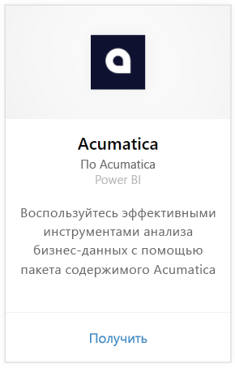
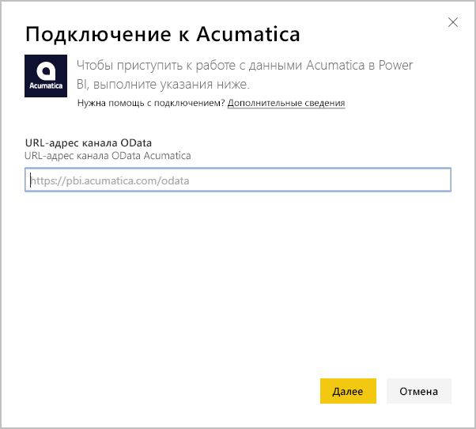
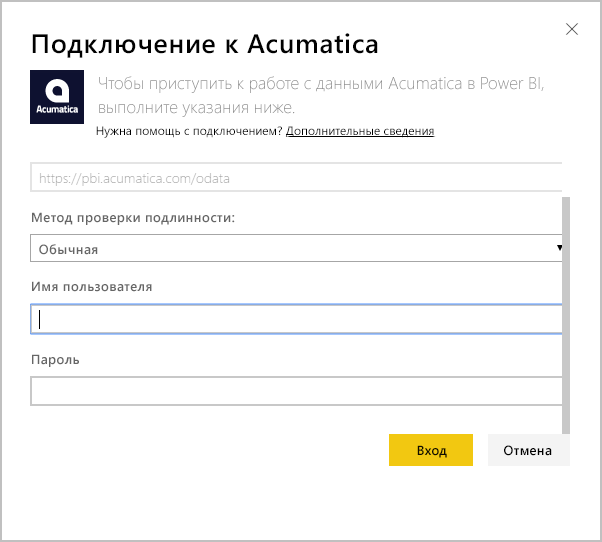
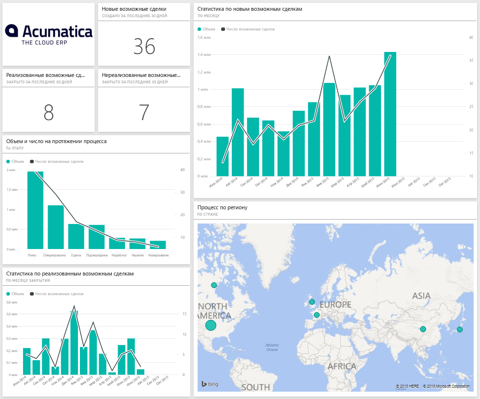
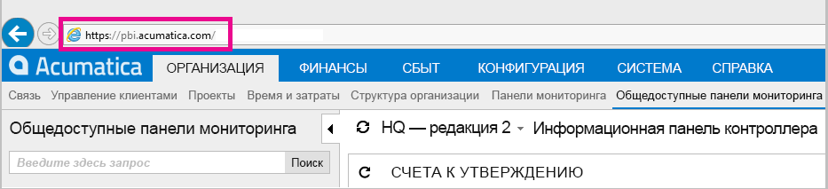
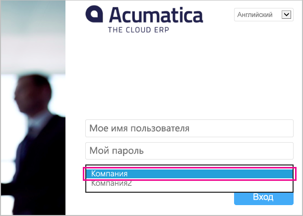

# Подключение к Acumatica с помощью Power BI
Пакет содержимого Acumatica для Power BI позволяет быстро анализировать данные возможностей. Power BI извлекает данные, включая возможности, учетные записи и клиентов, затем создает стандартную панель мониторинга и связанные отчеты, основанные на этих данных.

Подключите [пакет содержимого Acumatica](https://app.powerbi.com/getdata/services/acumatica) или прочтите дополнительные сведения об [интеграции Acumatica](https://powerbi.microsoft.com/integrations/acumatica) с Power BI.

>[!NOTE]
>Для этого пакета содержимого требуется Acumatica версии 5.2 или более поздней.

## Способы подключения
1. Нажмите кнопку **Получить данные** в нижней части левой панели навигации.
   
   
2. В поле **Службы** выберите **Получить**.
   
   
3. Выберите **Acumatica** \> **Получить**.
   
   
4. Введите конечную точку OData Acumatica. Конечная точка OData позволяет внешней системе запрашивать данные из Acumatica. Конечная точка OData Acumatica имеет следующий формат и должна использовать протокол HTTPS:
   
     https://[sitedomain]/odata/[companyname]
   
   Название организации требуется указывать, только если выполняется развертывание в нескольких компаниях. Ниже приведены дополнительные сведения о том, как найти этот параметр в вашей учетной записи Acumatica.
   
   
5. Выберите **обычную**проверку подлинности. Введите имя пользователя и пароль из учетной записи Acumatica, затем щелкните **Вход**.
   
    
6. После импорта данных в Power BI в области навигации слева появятся новая панель мониторинга, отчеты и набора данных. Новые элементы помечены желтой звездочкой (\*), которая пропадает после выбора. При выделении панели мониторинга отобразится разметка, аналогичная следующей:
   
    

**Дальнейшие действия**

* Попробуйте [задать вопрос в поле "Вопросы и ответы"](service-q-and-a.md) в верхней части информационной панели.
* [Измените плитки](service-dashboard-edit-tile.md) на информационной панели.
* [Выберите плитку](service-dashboard-tiles.md), чтобы открыть соответствующий отчет.
* Хотя набор данных будет обновляться ежедневно по расписанию, вы можете изменить график обновлений или попытаться выполнять обновления по запросу с помощью кнопки **Обновить сейчас**.

## Требования к системе
Для этого пакета содержимого требуется Acumatica версии 5.2 или более поздней. Версию можно узнать у администратора Acumatica.

## Поиск параметров
**Конечная точка Acumatica OData**

Конечная точка OData Acumatica имеет следующий формат и должна использовать протокол HTTPS:

    https://[sitedomain]/odata/[companyname]

Если вы выполнили вход в систему Acumatica, домен сайта приложения можно найти в адресной строке браузера. В приведенном ниже примере доменом сайта является https://pbi.acumatica.com, поэтому необходимой конечной точкой OData будет https://pbi.acumatica.com/odata.

 

Название организации требуется указывать, только если выполняется развертывание в нескольких компаниях. Эти сведения можно найти на странице входа Acumatica.

## Устранение неполадок
Если вы не можете войти в систему, убедитесь, что указанная вами конечная точка OData Acumatica имеет правильный формат.

    https://<application site domain>/odata/<company name>

Если возникают проблемы при подключении, узнайте у администратора, какую версию Acumatica вы используете. Этот пакет содержимого требует версию 5.2 или более позднюю.

## Дальнейшие действия
[Приступая к работе с Power BI](service-get-started.md)

[Получение данных в Power BI](service-get-data.md)

