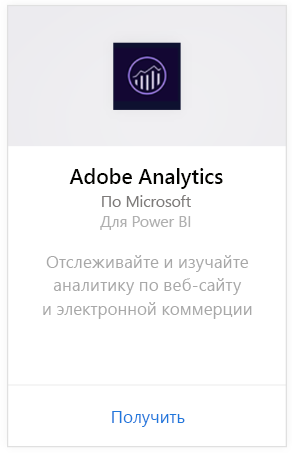
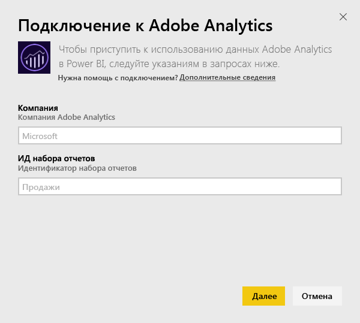
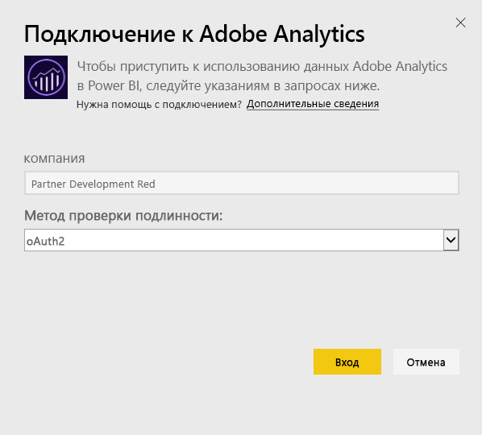
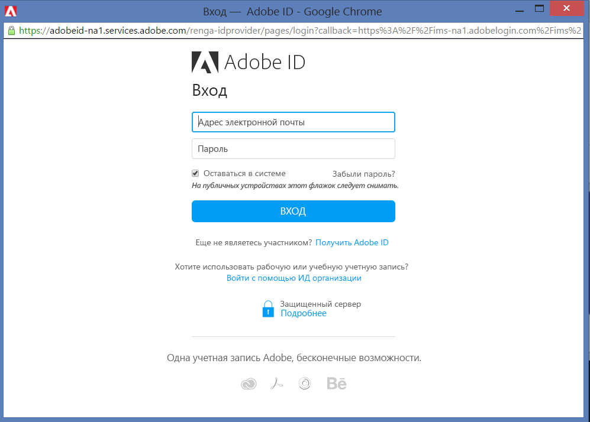
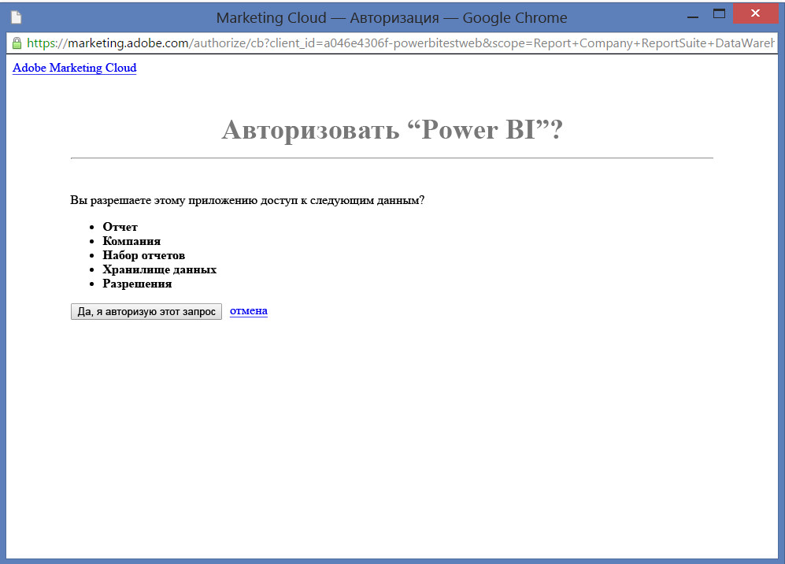
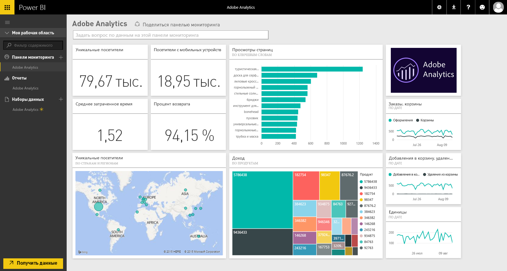
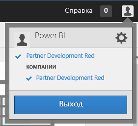
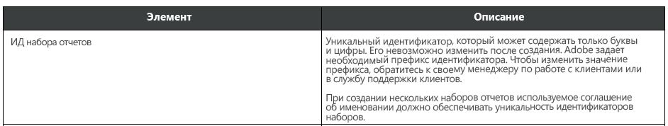

# Подключение к Adobe Analytics с помощью Power BI
Подключение к Adobe Analytics через Power BI начинается с подключения к учетной записи Adobe Analytics Marketing Cloud. Вы получите приложение с панелью мониторинга и набором отчетов Power BI, с помощью которых можно получить представление о трафике сайта и измерениях пользователей. Данные автоматически обновляются раз в день. Вы можете взаимодействовать с панелью мониторинга и отчетами, но не сохранять изменения.

Подключитесь к [Adobe Analytics](https://app.powerbi.com/getdata/services/adobe-analytics) или прочтите дополнительные сведения об [интеграции Adobe Analytics](https://powerbi.microsoft.com/integrations/adobe-analytics) с Power BI.

## Способы подключения
[!INCLUDE [powerbi-service-apps-get-more-apps](./includes/powerbi-service-apps-get-more-apps.md)]

1. Выберите **Adobe Analytics** \> **Получить**.
   
   
2. При подключении в Power BI указывается имя компании Adobe Analytics и идентификатор набора отчетов (а не имя набора отчетов). Сведения о том, как [найти эти параметры](#FindingParams), см. ниже.
   
   
3. В качестве **метода проверки подлинности** выберите **oAuth2** \> **Войти**. При появлении запроса введите учетные данные Adobe Analytics. 
   
    
   
    
4. Нажмите кнопку **Принять** , чтобы предоставить Power BI доступ к данным Adobe Analytics.
   
   
5. После подтверждения процесс импорта начнется автоматически. 

## Просмотр панели мониторинга и отчетов Adobe Analytics
[!INCLUDE [powerbi-service-apps-open-app](./includes/powerbi-service-apps-open-app.md)]

      

[!INCLUDE [powerbi-service-apps-open-app](./includes/powerbi-service-apps-what-now.md)]

## Содержимое
Power BI использует API отчетов Adobe Analytics для определения и запуска отчетов в следующих таблицах.

| **Имя таблицы** | **Сведения о столбце** |
| --- | --- |
| Продукты |elements= "product" (top 25)   metrics="cartadditions", "cartremovals", "carts", "cartviews", "checkouts", "revenue", "units" |
| Браузеры |elements= "browser" (top 25)   metrics="bounces", "bouncerate", "visitors", "visits", "uniquevisitors", "totaltimespent", "pageviews" |
| Страницы |elements= "page" (top 25)   metrics="cartadditions", "cartremovals", "carts", "cartviews", "checkouts", "revenue", "units", "visits", "uniquevisitors", "pageviews", "bounces", "bouncerate", "totaltimespent" |
| JavaScript включен |elements= "javascriptenabled", "browser" (top 25) |
| Мобильная ОС |elements= "mobileos"(top 25)  metrics="bounces", "bouncerate", "visitors", "visits", "uniquevisitors", "totaltimespent", "cartadditions", "cartremovals", "checkouts", "revenue", "units", "pageviews" |
| Ключевые слова поисковых систем |elements= "searchengine" "searchenginekeyword"   metrics="bounces", "bouncerate", "visitors", "visits", "entries", "uniquevisitors", "totaltimespent", "cartadditions", "cartremovals", "carts", "cartviews", "checkouts", "revenue", "units", "pageviews" |
| Поисковая система для продуктов |elements= "searchengine", "product"   metrics="bounces", "bouncerate", "visitors", "visits", "entries", "uniquevisitors", "totaltimespent", "cartadditions", "cartremovals", "carts", "cartviews", "checkouts", "revenue", "units", "pageviews" |
| Страницы с исходной ссылкой |elements= "referrer" (top 15), "page" (top 10)   metrics="bounces", "bouncerate", "visitors", "visits", "entries", "uniquevisitors", "totaltimespent", "cartadditions", "cartremovals", "carts", "cartviews", "checkouts", "revenue", "units", "pageviews" |
| Страницы по странам |elements= "geocountry" (Top 20), "page"   metrics="bounces", "bouncerate", "visitors", "visits", "entries", "uniquevisitors", "totaltimespent", "cartadditions", "cartremovals", "carts", "cartviews", "checkouts", "revenue", "units", "pageviews" |
| Продукты по странам |elements= "geocountry" (Top 20), "product"  metrics="bounces", "bouncerate", "visitors", "visits", "entries", "uniquevisitors", "totaltimespent", "cartadditions", "cartremovals", "carts", "cartviews", "checkouts", "revenue", "units" |
| Поиск страны и региона |elements= "geocountry" (Top 200)   metrics="bounces", "bouncerate", "visitors", "visits", "entries", "uniquevisitors", "totaltimespent", "cartadditions", "cartremovals", "carts", "cartviews", "checkouts", "revenue", "units" |
| Язык |elements= "language", "browser" (Top 25)   metrics="bounces", "bouncerate", "visitors", "visits", "uniquevisitors", "totaltimespent", "pageviews", "cartadditions", "cartremovals", "checkouts", "carts", "cartviews" |
| Поиск в поисковых системах |elements= "searchengine" (top 100)   metrics="bounces", "bouncerate", "visitors", "visits", "entries", "uniquevisitors", "totaltimespent", "cartadditions", "cartremovals", "carts", "cartviews", "checkouts", "revenue", "units" |
| Поиск в Интернете |elements= "browser" (top 25) |

## Требования к системе
Требуется доступ к [Adobe Analytics](http://www.adobe.com/marketing-cloud/web-analytics.html), включая доступ к нужным параметрам, описанным ниже.

## Поиск параметров
**Компания**

Название компании можно найти вверху справа от вашей учетной записи, когда выполнен вход в систему. В значении учитываются пробелы и регистр. Вводите его так же, как оно отображается в вашей учетной записи.

**ИД набора отчетов**

Идентификатор набора создается при создании набора отчетов. Чтобы узнать значение идентификатора, можно обратиться к администратору. Обратите внимание, что это не имя набора отчетов.

Из [документации](https://marketing.adobe.com/resources/help/en_US/reference/new_report_suite.html) Adobe:

## Устранение неполадок
Если после предоставления учетных данных отображается ошибка, указывающая, что у вас нет разрешений, обратитесь к своему администратору и проверьте наличие доступа к API Adobe Analytics. Также убедитесь, что предоставленный идентификатор Adobe связан с вашей организацией Marketing Cloud (связанной с компанией Adobe Analytics).

Если вы успешно прошли экран ввода учетных данных до того, как произошла ошибка, завершение обработки отчетов может выполняться слишком долго. Распространенное сообщение об ошибке имеет такой вид: *"Не удалось получить данные из отчета Adobe Analytics. Содержимое включало &quot;referrer, page&quot;, приблизительная продолжительность xx с."* Ознакомьтесь с разделом "Содержимое" и сравните размер с размером экземпляра Adobe. К сожалению, сейчас нет способа обойти это время ожидания. Но мы готовим к выпуску обновления, которые позволят улучшить поддержку крупных экземпляров. Оставьте отзыв для группы разработчиков Power BI на веб-сайте https://ideas.powerbi.com.

## Дальнейшие действия
* [Что из себя представляют приложения в Power BI?](service-install-use-apps.md)
* [Получение данных в Power BI](service-get-data.md)
* Появились дополнительные вопросы? [Попробуйте задать вопрос в сообществе Power BI.](http://community.powerbi.com/)

