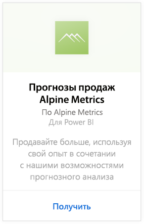
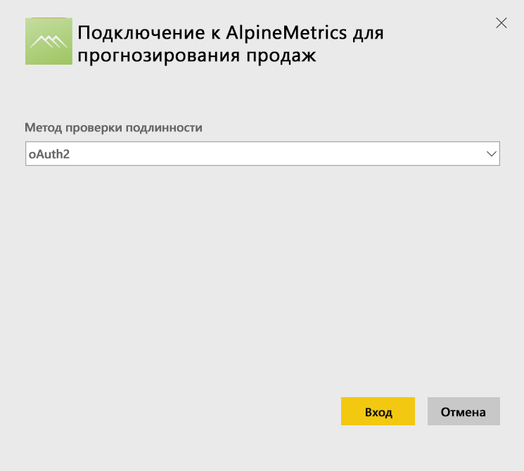
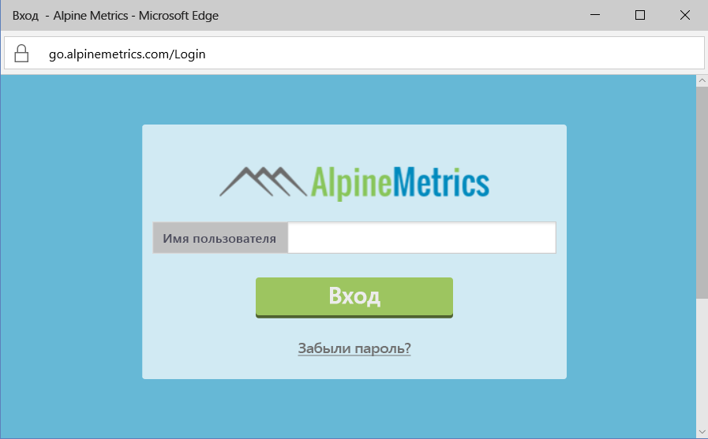
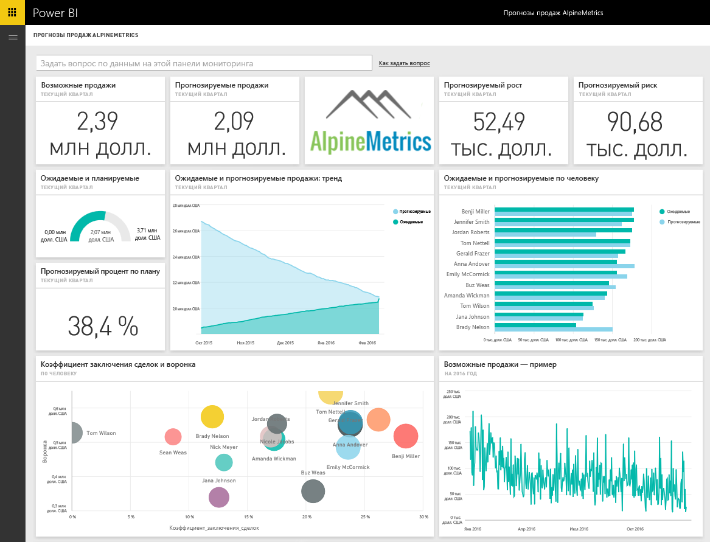

# Подключение к Alpine Metrics Sales Prediction с помощью Power BI
Alpine Metrics предоставляет современные средства оптимизации процессов для прогнозирования продаж в облачной среде и по запросу для малых и больших организаций. Пакет содержимого Alpine Metrics Sales Predictions для Power BI включает такие метрики, как потенциальные и прогнозируемые продажи и риски, что позволяет получить более глубокое представление о дальнейшем развитии вашего бизнеса. 

Подключитесь к [пакету содержимого Alpine Metrics Sales Predictions](https://app.powerbi.com/getdata/services/alpine-metrics) для Power BI.

## Способы подключения
1. Выберите "Получить данные" в нижней части левой панели навигации.  
   
    
2. В поле **Службы** выберите **Получить**.  
   
    
3. Выберите **AlpineMetrics Sales Predictions**, а затем — **Получить**.  
   
    
4. Выберите **OAuth 2**, и затем нажмите **Войти**. При появлении запроса введите учетные данные AlpineMetrics.
   
    
   
    
5. После подключения автоматически загрузятся информационная панель, отчет и набор данных. После завершения плитки обновятся в соответствии с данными из вашей учетной записи.
   
    

**Дальнейшие действия**

* Попробуйте [задать вопрос в поле "Вопросы и ответы"](consumer/end-user-q-and-a.md) в верхней части информационной панели.
* [Измените плитки](service-dashboard-edit-tile.md) на информационной панели.
* [Выберите плитку](consumer/end-user-tiles.md), чтобы открыть соответствующий отчет.
* Хотя набор данных будет обновляться ежедневно по расписанию, вы можете изменить график обновлений или попытаться выполнять обновления по запросу с помощью кнопки **Обновить сейчас**

## Содержимое
Пакет содержимого включает в себя данные из следующих таблиц.  

    - Account    
    - Бизнес    
    - Страна    
    - "Отрасль"    
    - Opportunity  
    - "Лицо"  
    - "Прогноз"    
    - "Журнал прогнозов"    
    - Product  
    - "Регион"    

## Требования к системе
Чтобы создать этот пакет содержимого, требуется учетная запись Alpine Metrics с разрешениями для вышеперечисленных таблиц.

## Дальнейшие действия
[Что такое Power BI?](power-bi-overview.md)

[Power BI — основные понятия](consumer/end-user-basic-concepts.md)

