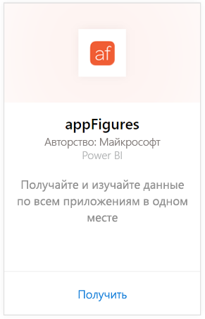
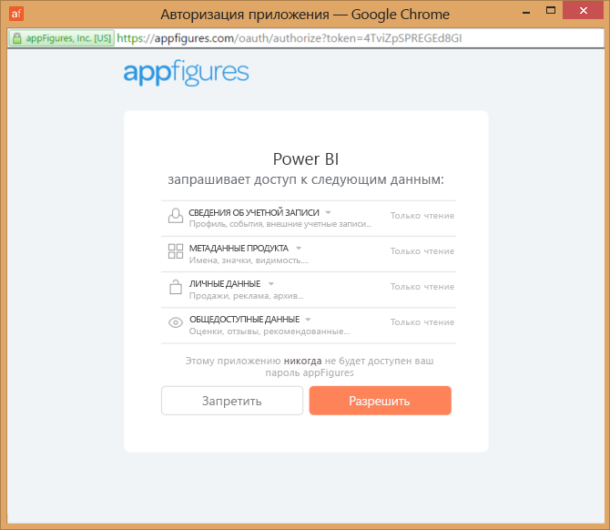
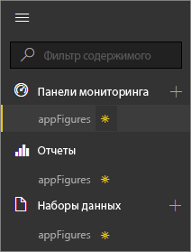
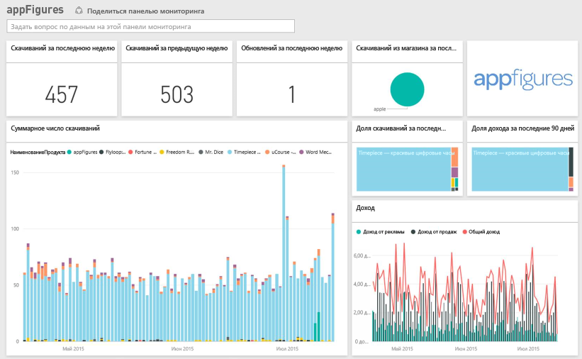
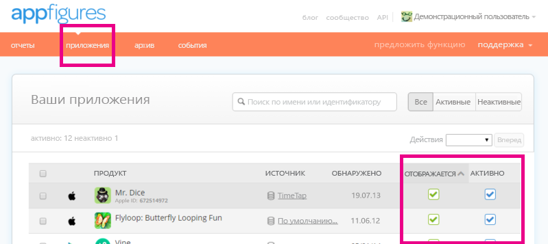

# Подключение к appFigures с помощью Power BI
Отслеживать важную статистику о приложениях с помощью Power BI и пакета содержимого appFigures очень просто. Power BI извлекает данные, включая сведения о продажах, скачиваниях приложений и статистику рекламы, а затем создает панель мониторинга по умолчанию и связанные отчеты на основе этих данных.

Подключитесь к [пакету содержимого appFigures](https://app.powerbi.com/getdata/services/appfigures) или прочтите дополнительные сведения об [интеграции appFigures](https://powerbi.microsoft.com/integrations/appfigures) с Power BI.

## Способы подключения
1. Нажмите кнопку **Получить данные** в нижней части левой панели навигации.
   
   
2. В поле **Службы** выберите **Получить**.
   
   
3. Выберите **appFigures** \> **Получить**.
   
   
4. В качестве **метода проверки подлинности** выберите **oAuth2** \> **Войти**. При появлении запроса введите учетные данные appFigures и пройдите процесс проверки подлинности.
   
   При первом подключении Power BI предлагает разрешить доступ только для чтения к вашей учетной записи. Нажмите кнопку **Разрешить** , чтобы начать импорт. Это может занять несколько минут в зависимости от объема данных в вашей учетной записи.
   
   
5. После импорта данных в Power BI в области навигации слева появятся новая панель мониторинга, отчеты и набора данных. Новые элементы отмечены желтой звездочкой \*.
   
    
6. Выберите панель мониторинга appFigures. Это панель мониторинга по умолчанию, которую Power BI создает для отображения данных. Вы можете изменить эту панель мониторинга для отображения данных любым нужным образом.
   
    

**Дальнейшие действия**

* Попробуйте [задать вопрос в поле "Вопросы и ответы"](power-bi-q-and-a.md) в верхней части информационной панели.
* [Измените плитки](service-dashboard-edit-tile.md) на информационной панели.
* [Выберите плитку](service-dashboard-tiles.md), чтобы открыть соответствующий отчет.
* Хотя набор данных будет обновляться ежедневно по расписанию, вы можете изменить график обновлений или попытаться выполнять обновления по запросу с помощью кнопки **Обновить сейчас**.

## Содержимое
В appFigures для Power BI доступны следующие данные.

| **Имя таблицы** | **Описание** |
| --- | --- |
| Страны |Эта таблица предоставляет сведения о названии страны. |
| Даты |Эта таблица содержит даты с текущей до самой ранней даты PublishDate для приложений, которые активны и видимы в вашей учетной записи appFigures. |
| События |Эта таблица содержит сведения о скачиваниях, продажах и рекламе для каждого приложения по странам на ежедневной основе. Обратите внимание, что в этой таблице содержатся сведения о покупках приложений и о покупках в приложениях. Столбец <strong>Тип</strong> поможет вам различать данные. |
| Inapps |В этой таблице содержатся данные о различных типах покупках в приложении, которые связаны с активными, видимыми приложениями в вашей учетной записи appFigures. |
| Продукты |В этой таблице содержатся данные о различных приложениях, которые активны и видимы в вашей учетной записи appFigures. |

## Устранение неполадок
Если данные из некоторых приложений не отображаются в Power BI, убедитесь, что они видимы и активны на вкладке **приложений** сайта appFigures.

## Дальнейшие действия
* [Приступая к работе с Power BI](service-get-started.md)
* [Получение данных в Power BI](service-get-data.md)

