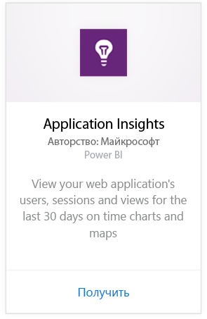
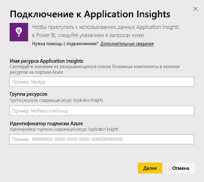
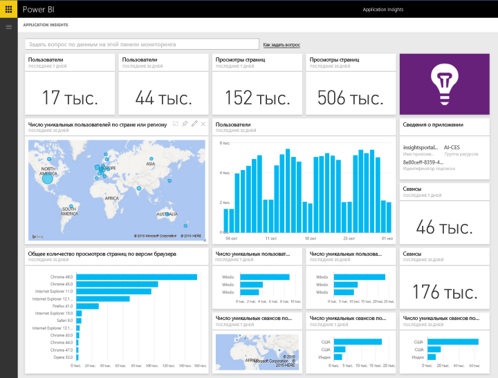
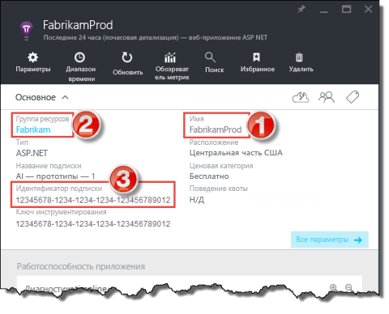
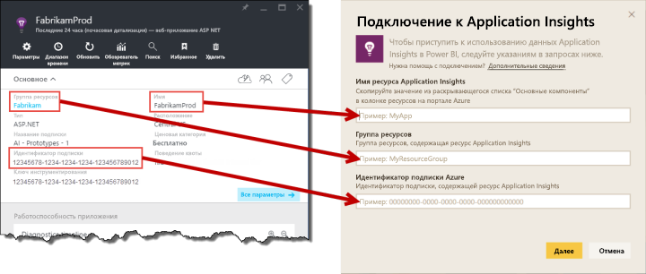

# Подключение к Application Insights с помощью Power BI
Используйте Power BI для создания эффективных пользовательских панелей мониторинга на базе телеметрии [Application Insights](/azure/application-insights/app-insights-overview/). Взгляните на данные телеметрии вашего приложения под новым углом. Сочетайте метрики из нескольких приложений или служб компонентов на одной информационной панели. Этот первый выпуск пакета содержимого Power BI для Application Insights включает в себя мини-приложения для распространенных метрик использования, например активных пользователей, просмотра страниц, сеансов, версии браузера и ОС, а также географического распределения пользователей на карте.

Подключите [пакет содержимого Application Insights для Power BI](https://app.powerbi.com/getdata/services/application-insights).

>[!NOTE]
>Сейчас этот метод интеграции является **устаревшим**. Дополнительные сведения о предпочтительном методе подключения Application Insights к Power BI см. в разделе об [экспорте запроса аналитики](https://docs.microsoft.com/azure/application-insights/app-insights-export-power-bi#export-analytics-queries).

## Способы подключения
1. Нажмите кнопку **Получить данные** в нижней части левой панели навигации.
   
    
2. В поле **Службы** выберите **Получить**.
   
    
3. Выберите **Application Insights** > **Получить**.
   
    
4. Укажите сведения о приложении, к которому вы хотите подключиться, включая **имя ресурса Application Insights**, **группу ресурсов** и **идентификатор подписки**. Дополнительные сведения см. в разделе [Поиск параметров Application Insights](#FindingAppInsightsParams) ниже.
   
        
5. Выберите **Вход** и следуйте инструкциям для подключения.
   
    
6. Процесс импорта начинается автоматически. После завершения отображается уведомление, а в области навигации появляется новая информационная панель, отчет и набор данных, отмеченные звездочкой.  Выберите панель мониторинга, чтобы просмотреть импортированные данные.
   
    

**Дальнейшие действия**

* Попробуйте [задать вопрос в поле "Вопросы и ответы"](consumer/end-user-q-and-a.md) в верхней части информационной панели.
* [Измените плитки](service-dashboard-edit-tile.md) на информационной панели.
* [Выберите плитку](consumer/end-user-tiles.md), чтобы открыть соответствующий отчет.
* Хотя набор данных будет обновляться ежедневно по расписанию, вы можете изменить график обновлений или попытаться выполнять обновления по запросу с помощью кнопки **Обновить сейчас**

## Содержимое
Пакет содержимого Application Insights включает следующие таблицы и метрики:  

    ´´´
    - ApplicationDetails  
    - UniqueUsersLast7Days   
    - UniqueUsersLast30Days   
    - UniqueUsersDailyLast30Days  
    - UniqueUsersByCountryLast7Days  
    - UniqueUsersByCountryLast30Days   
    - PageViewsDailyLast30Days   
    - SessionsLast7Days   
    - SessionsLast30Days  
    - PageViewsByBrowserVersionDailyLast30Days   
    - UniqueUsersByOperatingSystemLast7Days   
    - UniqueUsersByOperatingSystemLast30Days    
    - SessionsDailyLast30Days   
    - SessionsByCountryLast7Days   
    - SessionsByCountryLast30Days   
    - PageViewsByCountryDailyLast30Days  
    ´´´ 

## Поиск параметров
Все нужные значения — имя, группу ресурсов и идентификатор подписки — можно найти на портале Azure. При выборе имени откроется подробное представление, где с помощью раскрывающегося списка основных сведений можно найти все необходимые значения.

Скопируйте эти значения и вставьте их в поля в Power BI:

## Дальнейшие действия
[Приступая к работе с Power BI](service-get-started.md)

[Получение данных в Power BI](service-get-data.md)

