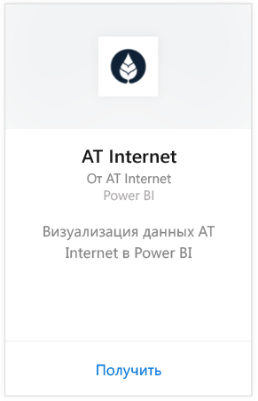
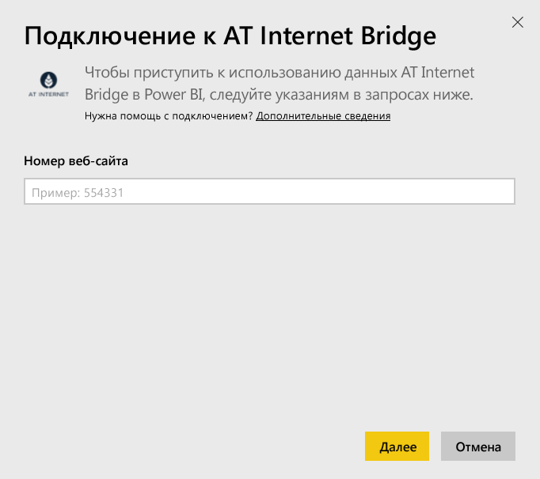
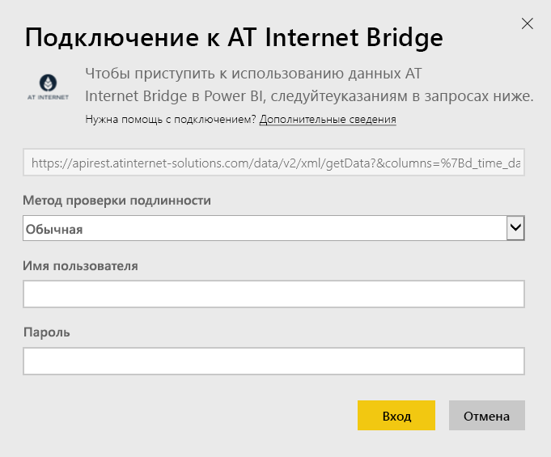

# Подключение к AT Internet Bridge с помощью Power BI
AT Internet помогает извлекать пользу из данных с помощью унифицированной платформы цифровой аналитики — Analytics Suite. Пакет содержимого AT Internet Bridge для Power BI содержит данные, связанные с посещениями, источниками, локализацией и устройствами для вашего сайта.

Подключитесь к [пакету содержимого AT Internet Bridge](https://app.powerbi.com/getdata/services/at-internet-bridge) для Power BI.

## Способы подключения
1. Нажмите кнопку **Получить данные** в нижней части левой панели навигации.
   
    
2. В поле **Службы** выберите **Получить**.
   
    
3. Выберите **AT Internet Bridge** \> **Получить**.
   
   
4. Укажите номер веб-сайта AT Internet, к которому вы хотите подключиться.
   
   
5. Выберите **Обычная** в качестве механизма проверки подлинности, укажите имя пользователя и пароль AT Internet, а затем нажмите кнопку **Вход**.
   
   
6. Нажмите кнопку **Подключить** , чтобы начать импорт. После завершения в области навигации появятся новая панель мониторинга, отчет и модель. Выберите панель мониторинга, чтобы просмотреть импортированные данные.
   
    

**Дальнейшие действия**

* Попробуйте [задать вопрос в поле "Вопросы и ответы"](consumer/end-user-q-and-a.md) в верхней части информационной панели.
* [Измените плитки](service-dashboard-edit-tile.md) на информационной панели.
* [Выберите плитку](consumer/end-user-tiles.md), чтобы открыть соответствующий отчет.
* Хотя набор данных будет обновляться ежедневно по расписанию, вы можете изменить график обновлений или попытаться выполнять обновления по запросу с помощью кнопки **Обновить сейчас**

## Содержимое
Пакет содержимого включает данные за последние 45 дней в следующих таблицах:  

    - "Преобразование";  
    - "Устройства";  
    - "Локализация";  
    - "Источники";  
    - "Глобальные посещения".  

## Дальнейшие действия
[Что такое Power BI?](power-bi-overview.md)

[Power BI — основные понятия](consumer/end-user-basic-concepts.md)

