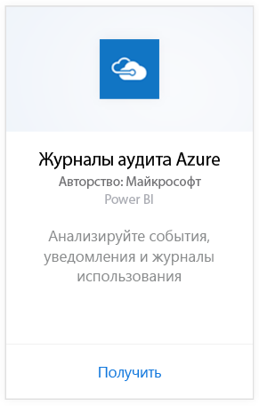
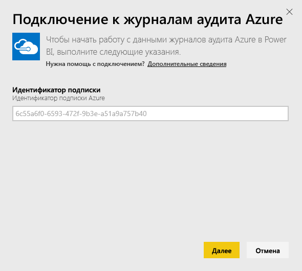
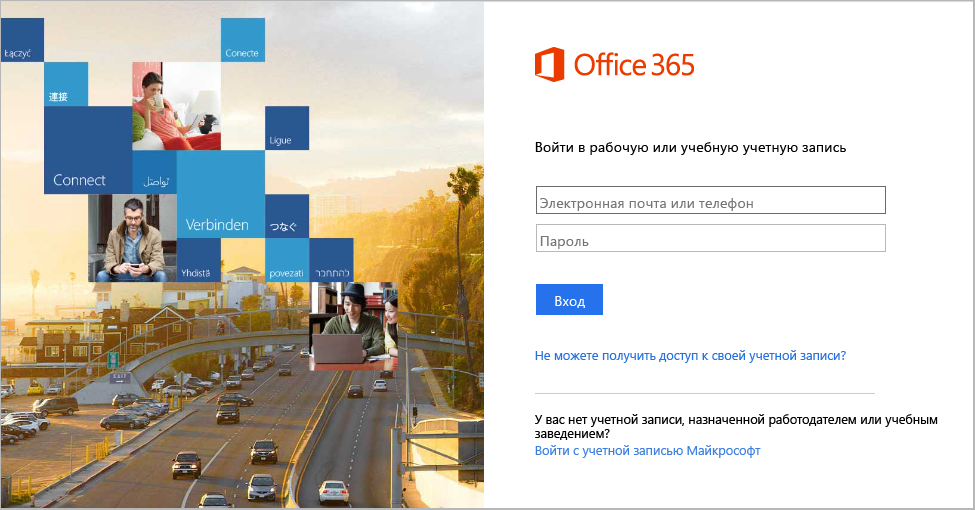
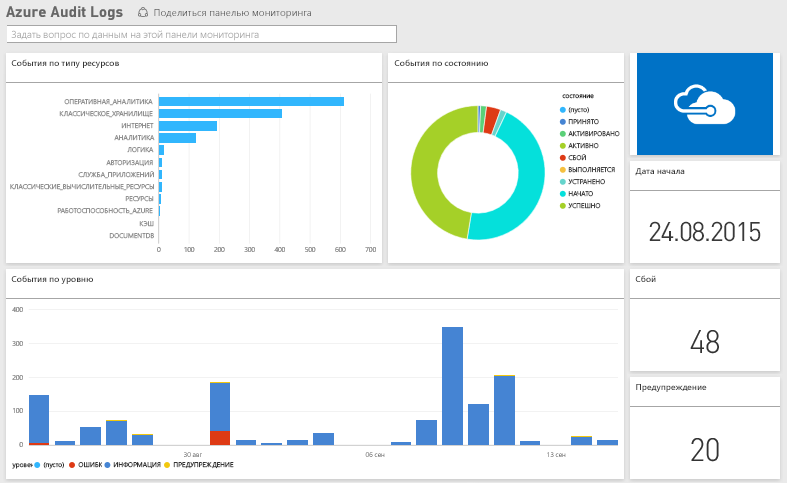

# Подключение к журналам аудита Azure с помощью Power BI
Пакет контента "Журналы аудита Azure" для Power BI позволяет анализировать и визуализировать информацию, хранящуюся в журналах аудита. Power BI извлекает данные, создает стандартную панель мониторинга и строит на основе этих данных отчеты.

[Подключитесь к пакету содержимого журналов аудита Azure](https://app.powerbi.com/getdata/services/azure-audit-logs) или прочтите дополнительные сведения об [интеграции журналов аудита Azure](https://powerbi.microsoft.com/integrations/azure-audit-logs) с Power BI.

## Способы подключения
1. Нажмите кнопку **Получить данные** в нижней части левой панели навигации.  
   
    
2. В поле **Службы** выберите **Получить**.  
   
     
3. Выберите пункты **Журналы аудита Azure** > **Получить**.  
   
   
4. При появлении запроса введите **идентификатор подписки Azure**. Сведения о том, как узнать свой [идентификатор подписки](#FindingParams), см. ниже.   
   
    
5. В качестве **метода проверки подлинности** выберите **oAuth2** \> **Войти**.
   
    
6. Введите данные своей учетной записи для входа в систему.
   
    
7. Power BI извлечет данные журналов аудита Azure и создаст информационную панель и отчет, готовые к использованию. 
   
    

**Дальнейшие действия**

* Попробуйте [задать вопрос в поле "Вопросы и ответы"](power-bi-q-and-a.md) в верхней части информационной панели.
* [Измените плитки](service-dashboard-edit-tile.md) на информационной панели.
* [Выберите плитку](service-dashboard-tiles.md), чтобы открыть соответствующий отчет.
* Хотя набор данных будет обновляться ежедневно по расписанию, вы можете изменить график обновлений или попытаться выполнять обновления по запросу с помощью кнопки **Обновить сейчас**.

## Требования к системе
Для пакета содержимого журналов аудита требуется доступ к журналам аудита на портале Azure. Дополнительные сведения см. [здесь](https://azure.microsoft.com/documentation/articles/insights-debugging-with-events/).

## Поиск параметров
Вы можете определить свой идентификатор подписки одним из двух простых способов.

1. На сайте https://portal.azure.com -&gt; "Обзор" —&gt; "Подписки" —&gt; "Идентификатор подписки"
2. На сайте https://manage.windowsazure.com -&gt; "Параметры" —&gt; "Идентификатор подписки"

Идентификатор подписки представляет собой длинную последовательность цифр и букв, как в шаге \# 4 приведенного выше примера. 

## Устранение неполадок
Если происходит ошибка из-за недопустимых учетных данных или при попытке выполнить обновление, попробуйте удалить все экземпляры пакета содержимого журналов аудита Azure и повторите попытку подключения.

## Дальнейшие действия
[Что такое Power BI?](power-bi-overview.md)  
[Power BI — основные понятия](service-basic-concepts.md)  

