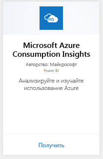
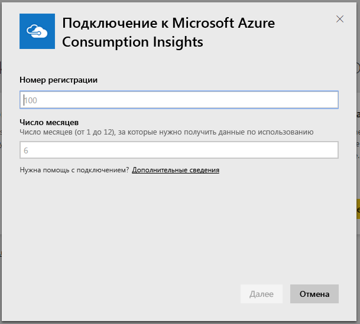
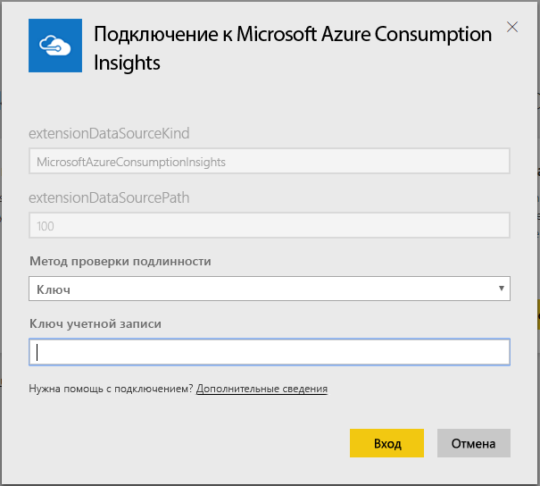
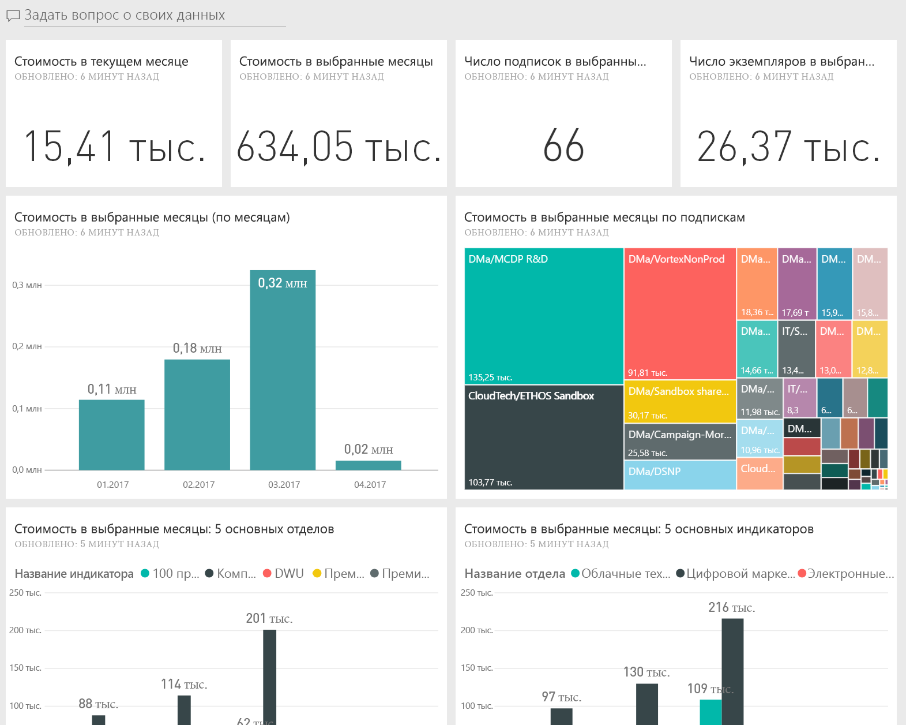
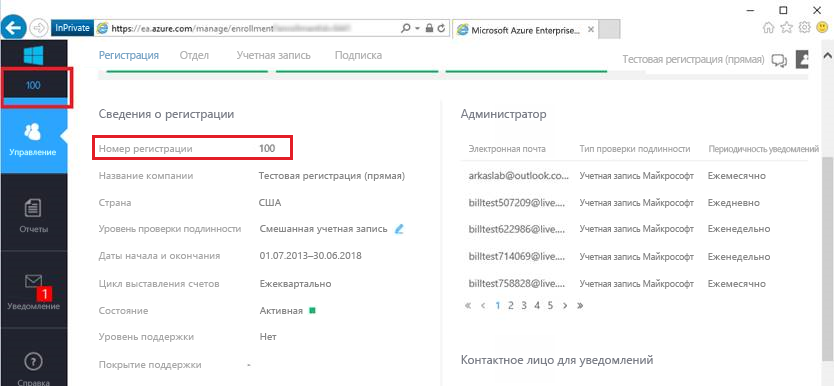
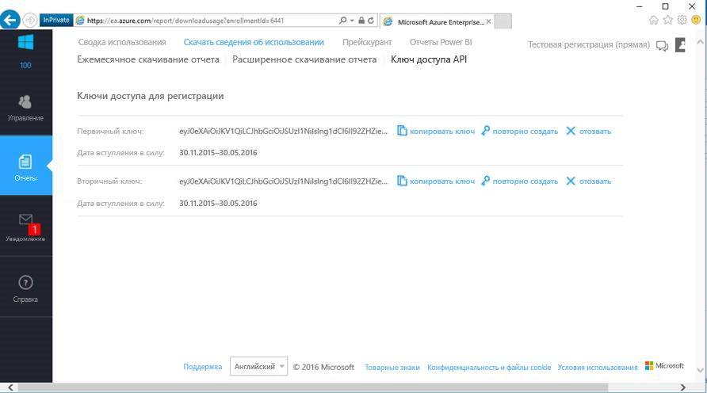

# Подключение к Microsoft Azure Consumption Insights с помощью Power BI
Просматривайте и отслеживайте данные об использовании Microsoft Azure в Power BI с помощью пакета содержимого Power BI. Данные автоматически обновляются раз в день.

Подключитесь к пакету содержимого [Microsoft Azure Consumption Insights](https://app.powerbi.com/getdata/services/azureconsumption) для Power BI.

## Способы подключения
1. Нажмите кнопку **Получить данные** в нижней части левой панели навигации.
   
    
2. В поле **Службы** выберите **Получить**.
   
   
3. Выберите **Microsoft Azure Consumption Insights** \> **получить сейчас**. 
   
   
4. Укажите число месяцев, за которое необходимо импортировать данные, и номер регистрации Azure Enterprise. Сведения о том, как найти необходимые параметры, см. [ниже](#FindingParams).
   
    
5. Укажите ключ доступа для подключения. Ключ регистрации можно найти на портале EA Azure. 
   
    
6. Процесс импорта начинается автоматически. По завершении новой панели мониторинга, отчетов и модели отображаются в области навигации. Выберите панель мониторинга, чтобы просмотреть импортированные данные.
   
   

**Дальнейшие действия**

* Попробуйте [задать вопрос в поле "Вопросы и ответы"](consumer/end-user-q-and-a.md) в верхней части информационной панели.
* [Измените плитки](service-dashboard-edit-tile.md) на информационной панели.
* [Выберите плитку](consumer/end-user-tiles.md), чтобы открыть соответствующий отчет.
* Хотя набор данных запланирована для ежедневного обновления, можно изменить график обновлений или попытаться выполнять обновления по запросу с помощью **Обновить сейчас**

## Содержимое
Пакет содержимого Microsoft Azure Consumption Insights включает в себя ежемесячных отчетов данные для диапазона месяц, который вы указали при подключении. Диапазон является скользящего окна, поэтому входящие в него даты обновляются по мере обновления набора данных.

## Требования к системе
Пакет содержимого требуется доступ к функциям Enterprise на портале Azure. 

## Поиск параметров
Отчеты Power BI доступна для EA Direct, партнеров и непрямых клиентов, кто может просматривать сведения о выставлении счетов. Ниже приведены сведения о поиске каждого значения, которые ожидает подключения.

**Число месяцев**

* Число месяцев (от 1 до 36) данных, начиная с сегодняшнего дня, которые вы хотите импортировать.

**Номер регистрации**

* Номер регистрации Azure Enterprise, который можно найти в [Azure Enterprise Portal](https://ea.azure.com/) начального экрана в разделе **сведения о регистрации**.
  
    

**Ключ доступа**

* Ключ доступа на портале Azure Enterprise, можно найти в разделе **скачать сведения об использовании** > **ключ доступа к API**.
  
    

**Дополнительная справка**

* Для дополнительных сведения о настройке пакета Azure Enterprise Power BI, войдите на корпоративный портал Azure и просмотреть файл справки по API в разделе **помочь**. Также можно найти дополнительные инструкции в разделе **отчеты** -> **скачать сведения об использовании** -> **ключ доступа к API**.

## Дальнейшие действия
[Приступая к работе с Power BI](service-get-started.md)

[Получение данных в Power BI](service-get-data.md)

