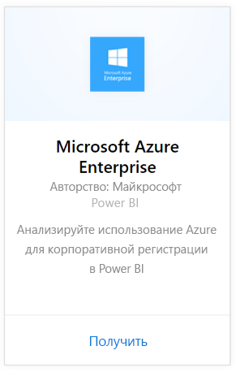
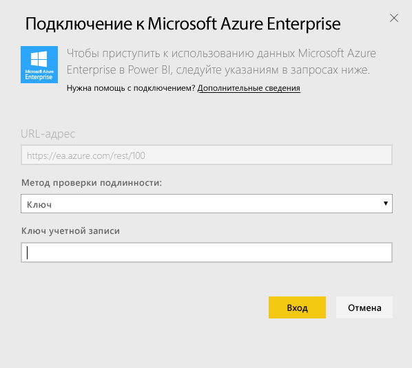
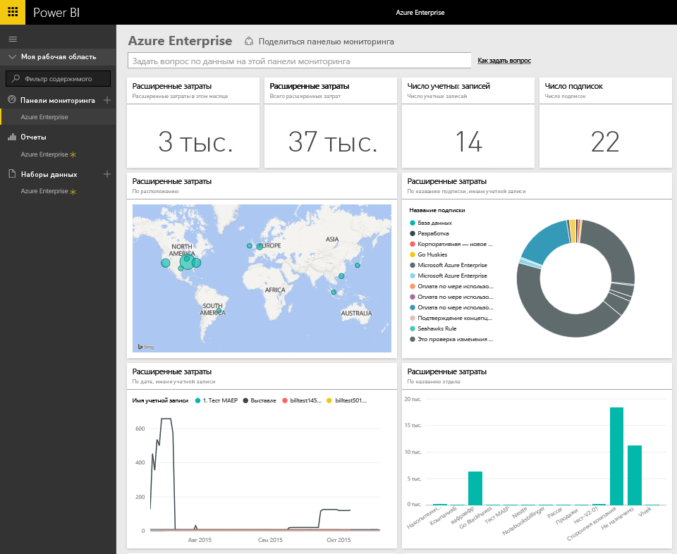
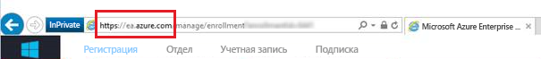
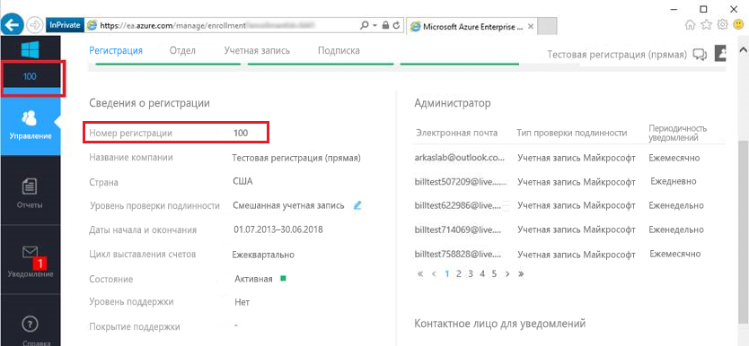
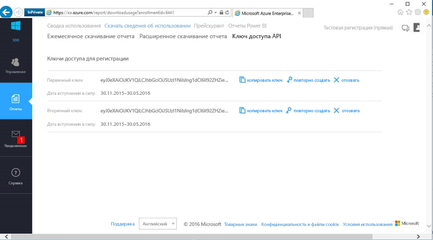

# Подключение к Microsoft Azure Enterprise с помощью Power BI
Просматривайте и отслеживайте данные Microsoft Azure Enterprise в Power BI с помощью пакета содержимого Power BI. Данные автоматически обновляются раз в день.

Подключитесь к [пакету содержимого Microsoft Azure Enterprise](https://app.powerbi.com/getdata/services/azure-enterprise) для Power BI.

## Способы подключения
1. Нажмите кнопку **Получить данные** в нижней части левой панели навигации.
   
    
2. В поле **Службы** выберите **Получить**.
   
   
3. Выберите **Microsoft Azure Enterprise** \> **Получить**.
   
   
4. Укажите URL-адрес среды Azure, число месяцев, за которое необходимо импортировать данные, и номер регистрации Azure Enterprise. URL-адрес среды Azure будет иметь вид `https://ea.azure.com` или `https://ea.windowsazure.cn`. Сведения о том, как [найти эти параметры](#FindingParams), см. ниже.
   
    
5. Укажите ключ доступа для подключения. Ключ для вашей регистрации можно найти на портале Azure EA.
   
    
6. Процесс импорта начнется автоматически. После завершения в области навигации появятся новая панель мониторинга, отчет и модель. Выберите панель мониторинга, чтобы просмотреть импортированные данные.
   
   

**Дальнейшие действия**

* Попробуйте [задать вопрос в поле "Вопросы и ответы"](service-q-and-a.md) в верхней части информационной панели.
* [Измените плитки](service-dashboard-edit-tile.md) на информационной панели.
* [Выберите плитку](service-dashboard-tiles.md), чтобы открыть соответствующий отчет.
* Хотя набор данных будет обновляться ежедневно по расписанию, вы можете изменить график обновлений или попытаться выполнять обновления по запросу с помощью кнопки **Обновить сейчас**.

## Содержимое
Пакет содержимого Azure Enterprise включает данные из ежемесячных отчетов за месяцы, которые вы указываете во время подключения. Диапазон динамический, поэтому входящие в него даты будут обновляться при обновлении набора данных.

## Требования к системе
Для пакета содержимого требуется доступ к функциям Enterprise на портале Azure.

## Поиск параметров
Отчеты Power BI доступны для прямых клиентов EA, партнеров и непрямых клиентов, которые могут просматривать сведения об оплате. Ниже приведены дополнительные сведения о поиске каждого из значений, которые потребуются во время процедуры подключения.

**URL-адрес среды Azure**

* Это значение обычно равно https://ea.azure.com, однако вы можете проверить URL-адрес после входа, чтобы подтвердить его.
  
    

**Число месяцев**

* Это число должно находиться в пределах от 1 до 36, обозначая число месяцев (с сегодняшнего дня), за которое вы хотите импортировать данные.

**Номер регистрации**

* Это номер соглашения о регистрации Azure Enterprise, который можно найти на домашней странице [портала Azure Enterprise](https://ea.azure.com/) в разделе "Сведения о соглашении о регистрации".
  
    

**Ключ доступа**

* Ключ можно найти на портале Azure Enterprise в разделе "Скачать сведения об использовании" > "API Access Key" (Ключ доступа к API).
  
    

**Дополнительная справка**

* Для дополнительной помощи в настройке пакета Azure Enterprise Power BI войдите на портал Azure Enterprise, чтобы просмотреть файл справки по API в разделе "Справка" и дополнительные инструкции в меню "Отчеты" -> "Скачать сведения об использовании" -> "Ключ доступа к API".

## Дальнейшие действия
[Приступая к работе с Power BI](service-get-started.md)

[Получение данных в Power BI](service-get-data.md)

