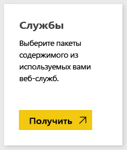
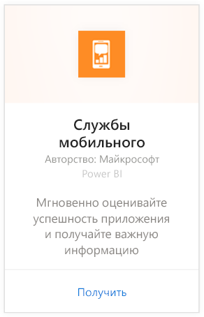
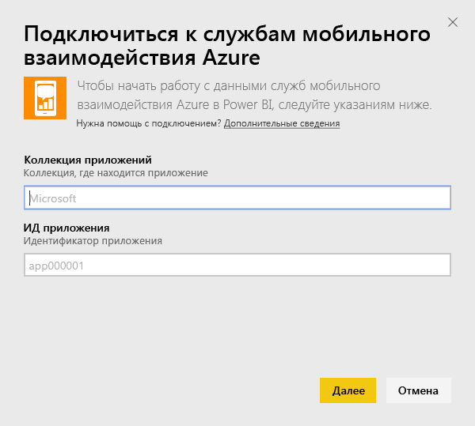
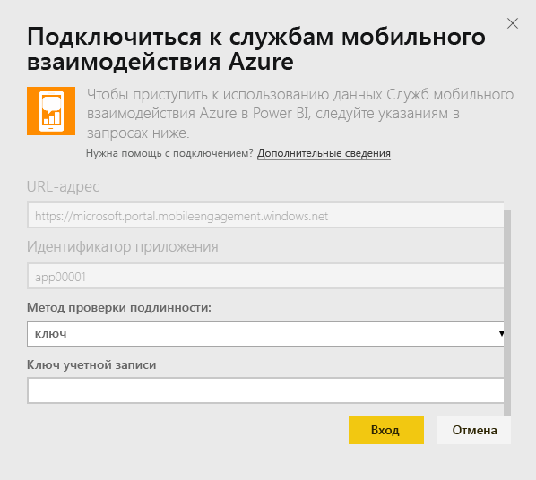
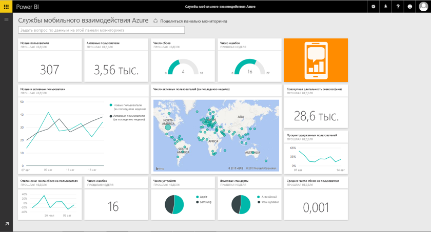

# Подключение к платформе "Службы мобильного взаимодействия" с помощью Power BI
Пакет содержимого Служб мобильного взаимодействия Azure для Power BI позволяет быстро анализировать данные приложений.

Подключитесь к [пакету содержимого Служб мобильного взаимодействия Azure](https://app.powerbi.com/groups/me/getdata/services/azme) для Power BI.

## Способы подключения
1. Нажмите кнопку **Получить данные** в нижней части левой панели навигации.
   
    
2. В поле **Службы** выберите **Получить**.
   
    
3. Выберите **Службы мобильного взаимодействия Azure**\>**Получить**.
   
     
4. Укажите коллекцию приложений и имя приложения. Эти сведения можно найти в учетной записи Служб мобильного взаимодействия Azure.
   
     
5. В качестве метода проверки подлинности укажите ключ, а затем щелкните "Вход".
   
    
6. После импорта данных в Power BI в области навигации слева появятся новая панель мониторинга, отчеты и набора данных. Новые элементы будут отмечены желтой звездочкой (\*), которая исчезает после выбора элемента:
   
    

## Дальнейшие действия

* Попробуйте [задать вопрос в поле "Вопросы и ответы"](consumer/end-user-q-and-a.md) в верхней части информационной панели.
* [Измените плитки](service-dashboard-edit-tile.md) на информационной панели.
* [Выберите плитку](consumer/end-user-tiles.md), чтобы открыть соответствующий отчет.
* Хотя набор данных будет обновляться ежедневно по расписанию, вы можете изменить график обновлений или попытаться выполнять обновления по запросу с помощью кнопки **Обновить сейчас**

## Дальнейшие действия
[Приступая к работе с Power BI](service-get-started.md)

[Получение данных в Power BI](service-get-data.md)

