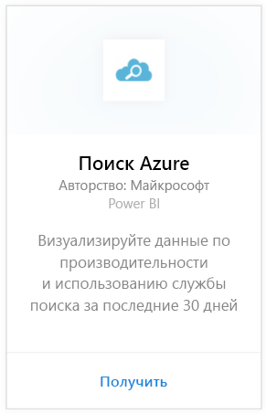
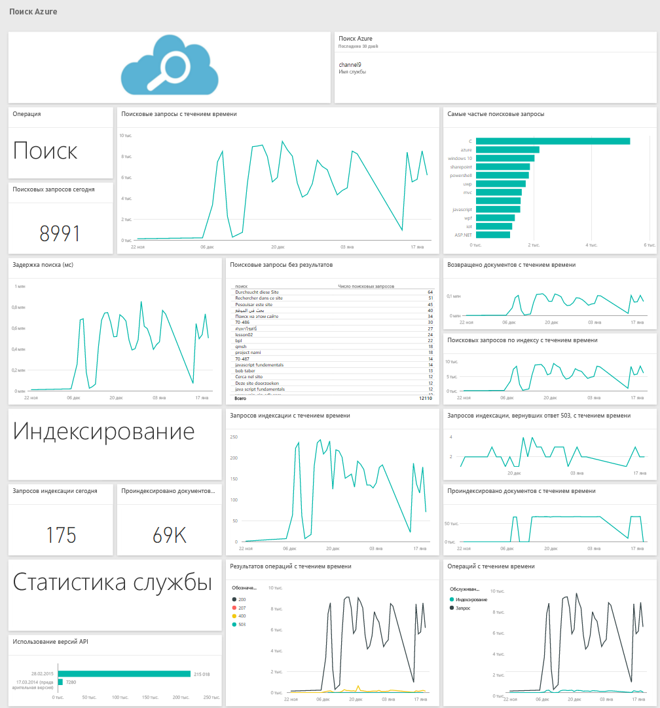

# Подключение к службе "Поиск Azure" с помощью Power BI
Аналитика трафика службы поиска Azure позволяет отслеживать трафик и получать по нему подробные сведения в службе поиска Azure. Пакет содержимого службы поиска Azure для Power BI предоставляет подробные сведения по данным службы поиска, включая поиск, индексацию, статистику служб и задержки за последние 30 дней. Дополнительные сведения см. в [записи блога Azure](https://azure.microsoft.com/en-us/blog/analyzing-your-azure-search-traffic/).

Подключите [пакет содержимого службы поиска Azure](https://app.powerbi.com/getdata/services/azure-search) для Power BI.

## Способы подключения
1. Нажмите кнопку **Получить данные** в нижней части левой панели навигации.
   
    
2. В поле **Службы** выберите **Получить**.
   
    
3. Выберите **Поиск Azure** \> **Получить**.
   
   
4. Укажите имя учетной записи хранилища таблиц, в которой хранится анализ службы поиска Azure.
   
   
5. Выберите **Ключ** в качестве механизма проверки подлинности и укажите ключ учетной записи хранения. Щелкните **Войти** , чтобы начать процесс загрузки.
   
   
6. После завершения на панели навигации появятся новая панель мониторинга, отчет и модель. Выберите панель мониторинга, чтобы просмотреть импортированные данные.
   
    

**Дальнейшие действия**

* Попробуйте [задать вопрос в поле "Вопросы и ответы"](power-bi-q-and-a.md) в верхней части информационной панели.
* [Измените плитки](service-dashboard-edit-tile.md) на информационной панели.
* [Выберите плитку](service-dashboard-tiles.md), чтобы открыть соответствующий отчет.
* Хотя набор данных будет обновляться ежедневно по расписанию, вы можете изменить график обновлений или попытаться выполнять обновления по запросу с помощью кнопки **Обновить сейчас**.

## Требования к системе
Для пакета содержимого службы поиска Azure требуется включить аналитику трафика службы поиска Azure в учетной записи.

## Устранение неполадок
Убедитесь, что имя учетной записи хранения правильно указано вместе с полным ключом доступа. Имя учетной записи хранения должно соответствовать учетной записи, настроенной в аналитике трафика службы поиска Azure.

## Дальнейшие действия
[Приступая к работе с Power BI](service-get-started.md)

[Power BI — основные понятия](service-basic-concepts.md)

