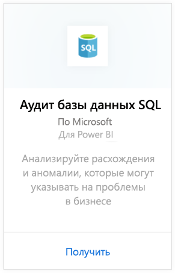
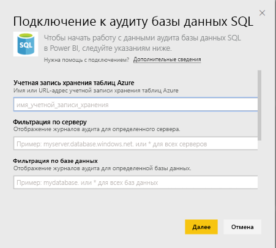
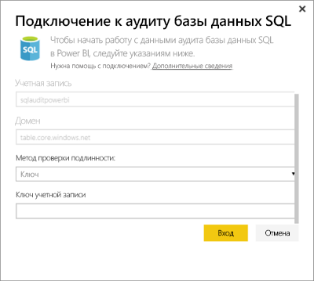
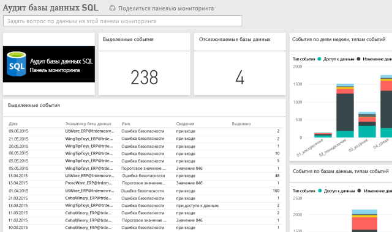

# Пакет содержимого аудита базы данных SQL для Power BI
Пакет содержимого [аудита базы данных SQL](http://azure.microsoft.com/documentation/articles/sql-database-auditing-get-started/) Azure для Power BI помогает поддерживать соответствие нормативным требованиям, лучше понимать происходящее в базах данных, а также выявлять расхождения и аномалии, которые могут указывать на проблемы в бизнесе или потенциальные нарушения безопасности. 

Подключитесь к [пакету содержимого аудита базы данных SQL](https://app.powerbi.com/getdata/services/sql-db-auditing) для Power BI.

>[!NOTE]
>Пакет содержимого импортирует данные из всех таблиц, в именах которых есть AuditLogs, и добавляет их в одну таблицу модели данных AuditLogs. В таблицу добавляются последние 250 КБ событий, и данные будут обновляться ежедневно.

## Способы подключения
1. Нажмите кнопку **Получить данные** в нижней части левой панели навигации.
   
    
2. В поле "Службы" выберите "Получить".
   
    
3. Выберите **Аудит базы данных SQL** \> **Получить**.
   
   
4. В окне подключения к аудиту базы данных SQL выполните следующие действия.
   
   - Введите имя учетной записи табличного хранилища Azure или URL-адрес, где хранятся резервные копии журналов.
   
   - Введите имя нужного вам сервера SQL Server. Введите "\*", чтобы загрузить журналы аудита для всех серверов.
   
   - Введите имя нужной вам базы данных SQL. Введите "\*", чтобы загрузить журналы аудита для всех баз данных.
   
   - Введите имя таблицы Azure, которая содержит нужные вам журналы. Введите "\*", чтобы загрузить журналы аудита из всех таблиц, содержащих AuditLogs в имени.
   
   >[!IMPORTANT]
   >Из соображений производительности мы рекомендуем всегда явно указывать имя таблицы, даже если все журналы аудита хранятся в одной таблице.
   
   - Введите дату начала нужных вам журналов аудита. Введите "\*" для загрузки журналов аудита без нижнего предела времени или "1d", чтобы загрузить журналы аудита, начиная с последнего дня.
   
   - Введите дату окончания нужных вам журналов аудита. Введите "\*" для загрузки журналов аудита без верхнего предела времени.
   
   
5. В качестве метода аутентификации выберите **Ключ**, введите **ключ учетной записи** \> **Войти**.
   
   
6. После импорта данных в Power BI в области навигации слева появятся новая панель мониторинга, отчет и набор данных. Новые элементы отмечены желтой звездочкой \*.
   
   

**Дальнейшие действия**

* Попробуйте [задать вопрос в поле "Вопросы и ответы"](power-bi-q-and-a.md) в верхней части информационной панели.
* [Измените плитки](service-dashboard-edit-tile.md) на информационной панели.
* [Выберите плитку](service-dashboard-tiles.md), чтобы открыть соответствующий отчет.
* Хотя набор данных будет обновляться ежедневно по расписанию, вы можете изменить график обновлений или попытаться выполнять обновления по запросу с помощью кнопки **Обновить сейчас**.

## Дальнейшие действия
[Data sources for the Power BI service](service-get-data.md) (Источники данных для службы PowerBI)
[Приступая к работе с Power BI](service-get-started.md)
