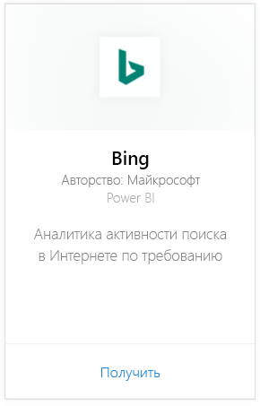
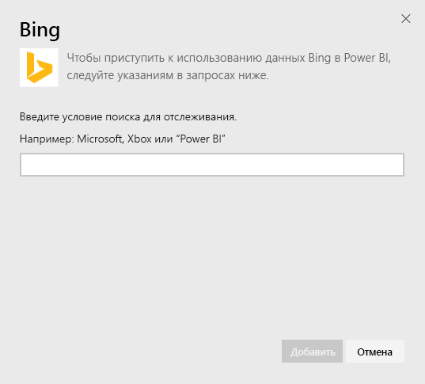
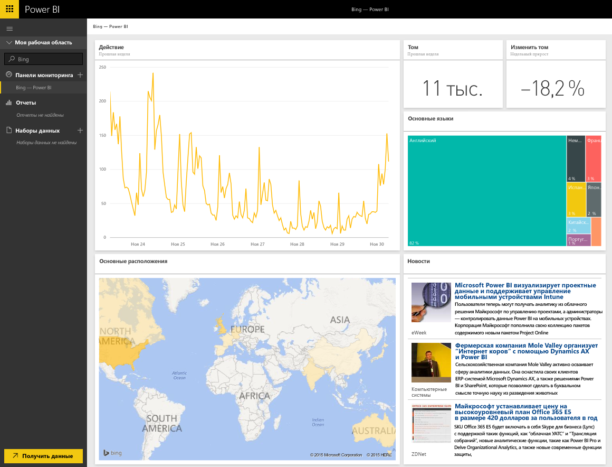

# Подключение к Bing с помощью Power BI
Пакет содержимого Bing позволяет просматривать аналитику, связанную с поиском в Интернете, за любой выбранный вами период.

Подключитесь к [пакету содержимого Bing](https://app.powerbi.com/groups/me/getdata/services/bing) для Power BI.

>[!NOTE]
>Плитки Bing автоматически обновляются примерно каждые 5 минут, и единственной плиткой, которую можно выбрать, является плитка "Новости", ведущая на соответствующую новостную статью. 

>[!NOTE]
>Плитки из пакета содержимого Bing не отображаются в мобильных приложениях. Мы работаем над решением этой проблемы.

1. Нажмите кнопку **Получить данные** в нижней части левой панели навигации.
   
    
2. В поле **Службы** выберите **Получить**.
   
    
3. Выберите **Bing** > **Получить**.
   
    
4. В диалоговом окне параметров введите критерий поиска, который нужно отследить, и нажмите кнопку "Добавить".
   
        
5. Слева в списке панелей мониторинга появится новая запись с именем Bing и указанный вами критерий поиска. Обратите внимание на то, что с этой панелью мониторинга не связан ни один набор данных или отчет. Загрузка плиток занимает определенное время, но после ее завершения откроется экран представленного ниже вида.
   
    

После завершения загрузки можно запустить анализ данных, включая закрепление плиток с данной панели мониторинга на других панелях мониторинга в вашей учетной записи.

