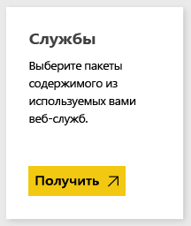
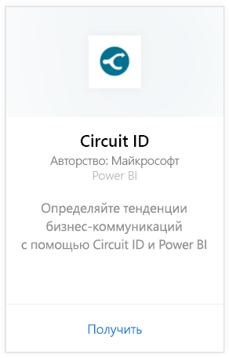
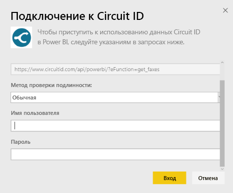
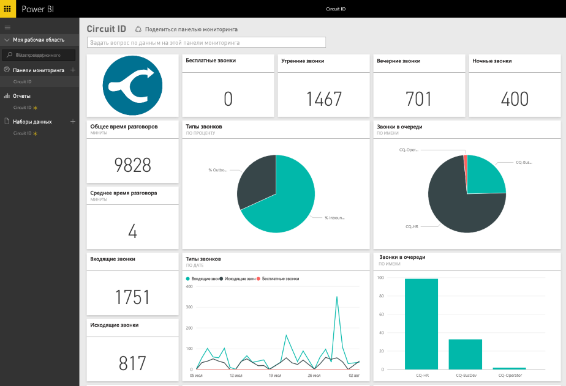

# Подключение к Circuit ID с помощью Power BI
Анализ данных взаимодействия из Circuit ID упрощается благодаря Power BI. Power BI извлекает данные, а затем создает панель мониторинга по умолчанию и связанные отчеты на основе этих данных. После подключения вы можете исследовать данные и настраивать панель мониторинга в соответствии с вашими потребностями. Данные автоматически обновляются каждый день.

[!INCLUDE [include-short-name](./includes/service-deprecate-content-packs.md)]

Подключите [пакет содержимого Circuit ID](https://app.powerbi.com/getdata/services/circuitid) для Power BI.

## Способы подключения
1. Нажмите кнопку **Получить данные** в нижней части левой панели навигации.
   
    
2. В поле **Службы** выберите **Получить**.
   
    
3. Выберите **Circuit ID** \> **Получить**.
   
    
4. Выберите обычную проверку подлинности и укажите имя пользователя и пароль. Затем нажмите кнопку "Вход".
   
    
5. После импорта данных в Power BI в области навигации слева появятся новая панель мониторинга, отчеты и набора данных. Новые элементы отмечены желтой звездочкой.
   
    

**Дальнейшие действия**

* Попробуйте [задать вопрос в поле "Вопросы и ответы"](consumer/end-user-q-and-a.md) в верхней части информационной панели.
* [Измените плитки](service-dashboard-edit-tile.md) на информационной панели.
* [Выберите плитку](consumer/end-user-tiles.md), чтобы открыть соответствующий отчет.
* Хотя набор данных будет обновляться ежедневно по расписанию, вы можете изменить график обновлений или попытаться выполнять обновления по запросу с помощью кнопки **Обновить сейчас**

## Дальнейшие действия
[Что такое Power BI?](power-bi-overview.md)

[Получение данных для Power BI](service-get-data.md)

