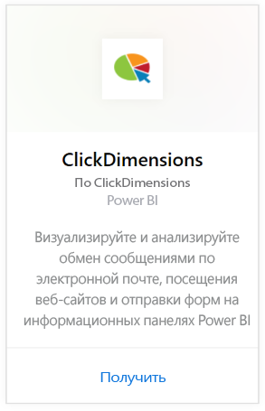
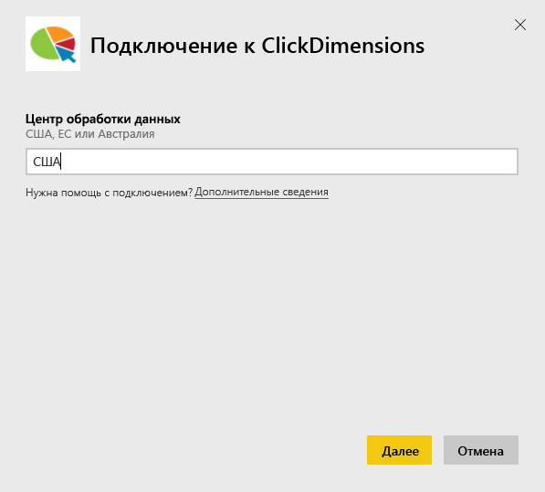
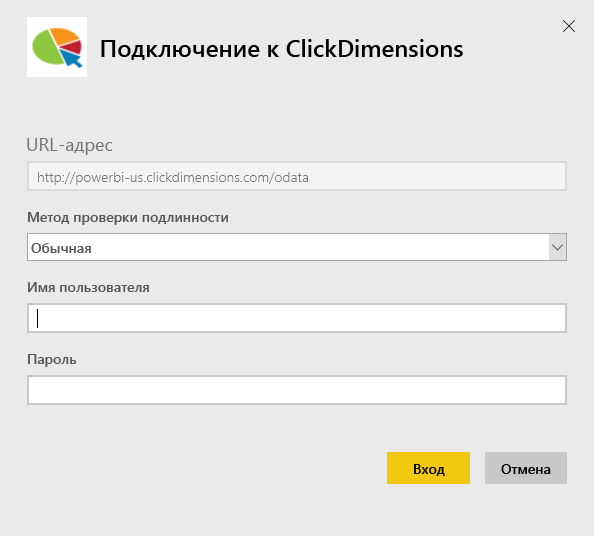
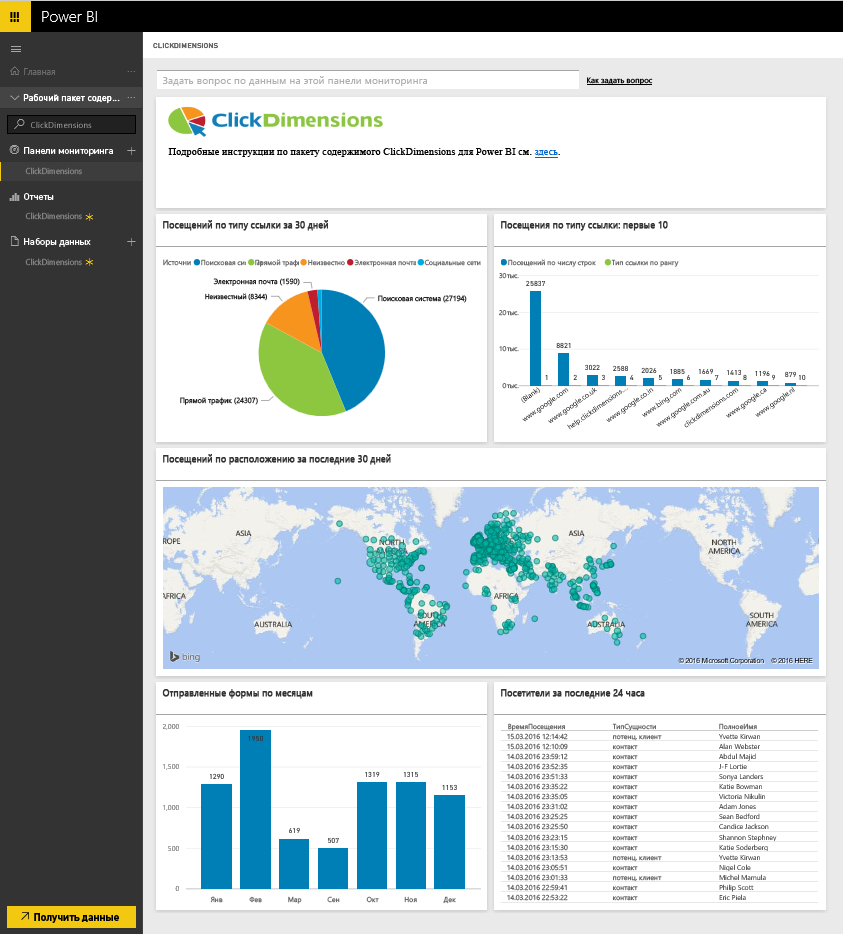
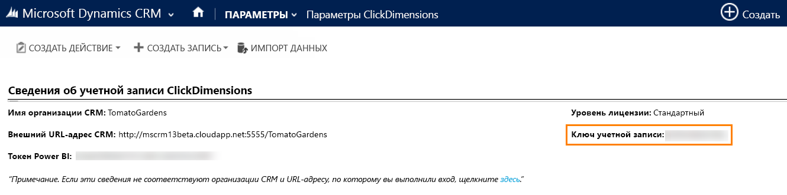
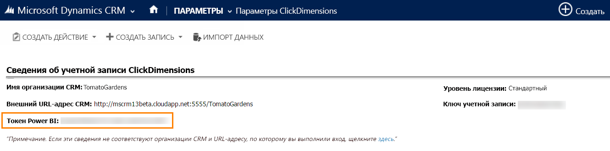

# Подключение к ClickDimensions с помощью Power BI
Пакет содержимого ClickDimensions для Power BI позволяет пользователям использовать маркетинговые данные ClickDimensions в Power BI, предоставляя группам руководства подробные сведения об успешности их усилий в области продаж и маркетинга. Визуализируйте и анализируйте обмен сообщениями по электронной почте, посещения веб-сайтов и отправки форм на информационных панелях и в отчетах Power BI.

Подключитесь к [пакету содержимого ClickDimensions](https://app.powerbi.com/getdata/services/click-dimensions) для Power BI.

## Способы подключения
1. Нажмите кнопку **Получить данные** в нижней части левой панели навигации.
   
   
2. В поле **Службы** выберите **Получить**.
   
   
3. Выберите **ClickDimensions** \> **Получить**.
   
   
4. Укажите расположение своего центра обработки данных (США, ЕС или Австралия) и нажмите кнопку **Далее**.
   
   
5. В качестве **метода проверки подлинности** выберите **Основная** \> **Войти**. При появлении запроса введите учетные данные ClickDimensions. Сведения о том, как [найти эти параметры](#FindingParams), см. ниже.
   
    
6. После утверждения процесс импорта начнется автоматически. После завершения в области навигации появятся новая панель мониторинга, отчет и модель. Выберите панель мониторинга, чтобы просмотреть импортированные данные.
   
     

**Дальнейшие действия**

* Попробуйте [задать вопрос в поле "Вопросы и ответы"](power-bi-q-and-a.md) в верхней части информационной панели.
* [Измените плитки](service-dashboard-edit-tile.md) на информационной панели.
* [Выберите плитку](service-dashboard-tiles.md), чтобы открыть соответствующий отчет.
* Хотя набор данных будет обновляться ежедневно по расписанию, вы можете изменить график обновлений или попытаться выполнять обновления по запросу с помощью кнопки **Обновить сейчас**.

## Требования к системе
Чтобы подключиться к пакету содержимого Power BI, необходимо указать центр обработки данных, соответствующий вашей учетной записи, и войти с помощью учетной записи ClickDimensions. Если вы не уверены, какой центр обработки данных указать, обратитесь к администратору.

## Поиск параметров
Ключ учетной записи находится в разделе "Параметры CRM" \> "Параметры ClickDimensions". Скопируйте ключ учетной записи из раздела "Параметры ClickDimensions" и вставьте его в поле "Имя пользователя".  

  

Скопируйте токен Power BI из раздела "Параметры ClickDimensions" и вставьте его в поле "Пароль". Маркер Power BI находится в разделе "Параметры CRM" \> "Параметры ClickDimensions".  

  

## Дальнейшие действия
[Приступая к работе с Power BI](service-get-started.md)

[Получение данных в Power BI](service-get-data.md)

