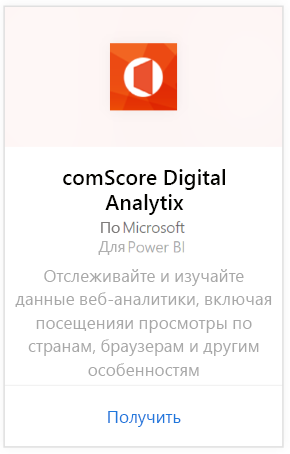
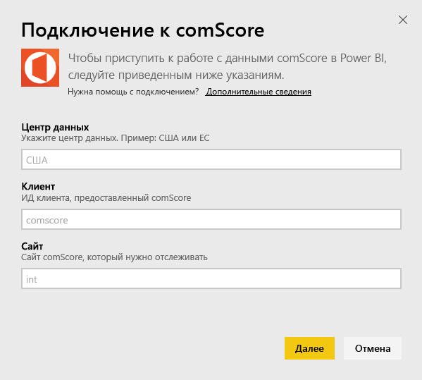
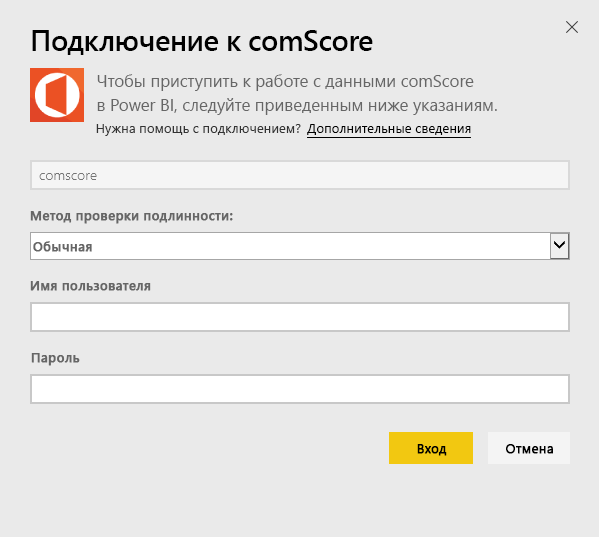
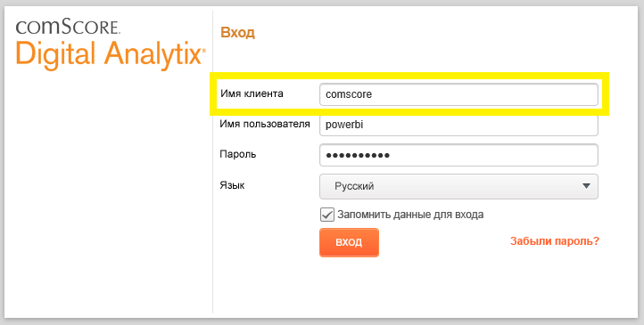
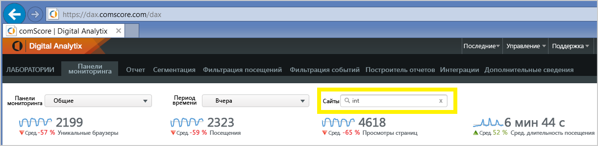

# Подключение к comScore Digital Analytix с помощью Power BI
Визуальное представление и исследование данных comScore Digital Analytix в Power BI с помощью пакета содержимого для Power BI. Данные автоматически обновляются раз в день.

Подключитесь к [пакету содержимого comScore для Power BI.](https://app.powerbi.com/getdata/services/comscore)

>[!NOTE]
>Для подключения к пакету содержимого требуется учетная запись пользователя comScore DAx и доступ к comScore API. Дополнительные [сведения](#Requirements) см. ниже.

## Способы подключения
1. Выберите "Получить данные" в нижней части левой панели навигации.
   
   
2. В поле **Службы** выберите **Получить**.
   
   
3. Выберите **comScore Digital Analytix** \> **Получить**.
   
   
4. Укажите центр обработки данных, идентификатор клиента comScore и сайт, к которому вы хотите подключиться. Дополнительные сведения о том, как найти эти значения, см. в разделе [Как найти параметры comScore](#FindingParams) ниже.
   
   
5. Укажите имя пользователя comScore и пароль для подключения. Дополнительные сведения о том, как найти это значение, см. ниже.
   
   
6. Процесс импорта начнется автоматически. После завершения в области навигации появятся новая панель мониторинга, отчет и модель. Выберите панель мониторинга, чтобы просмотреть импортированные данные.

**Дальнейшие действия**

* Попробуйте [задать вопрос в поле "Вопросы и ответы"](power-bi-q-and-a.md) в верхней части информационной панели.
* [Измените плитки](service-dashboard-edit-tile.md) на информационной панели.
* [Выберите плитку](service-dashboard-tiles.md), чтобы открыть соответствующий отчет.
* Хотя набор данных будет обновляться ежедневно по расписанию, вы можете изменить график обновлений или попытаться выполнять обновления по запросу с помощью кнопки **Обновить сейчас**.

## Требования к системе
Для подключения требуется учетная запись пользователя comScore DAx и доступ к API comScore DAx. Обратитесь к администратору comScore DAx для подтверждения вашей учетной записи.

## Поиск параметров
Сведения о том, как найти все параметры comScore, приведены ниже.

**Центр обработки данных**

Центр обработки данных, к которому вы подключаетесь, определяется по URL-адресу, по которому вы переходите в comScore.

Если вы используете https://dax.comscore.com, введите "US", если вы используете https://dax.comscore.eu, введите "EU".

 

**Клиент**

В качестве клиента необходимо указать то же имя, которое вы указываете при входе в comScore DAx.

 

**Сайт**

Сайт comScore определяет сайт, из которого вы будете просматривать данные. Список сайтов можно найти в вашей учетной записи comScore.

## Дальнейшие действия
[Приступая к работе с Power BI](service-get-started.md)

[Получение данных в Power BI](service-get-data.md)

