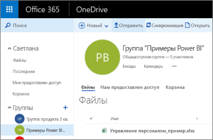

# Подключение к файлам, хранящимся в OneDrive, для рабочей области Power BI
После [создания рабочей области в Power BI](service-create-distribute-apps.md) вы можете хранить свои файлы Excel, CSV и Power BI Desktop в хранилище OneDrive для бизнеса для своей рабочей области Power BI. Вы можете продолжить обновление файлов в OneDrive. Эти обновления будут автоматически отражаться в отчетах и на панелях мониторинга Power BI на основе этих файлов. 

> [!NOTE]
> В новом интерфейсе рабочей области изменятся отношения между рабочими областями Power BI и группами Office 365. Группа Office 365 не создается автоматически при каждом создании одной из новых рабочих областей. Узнайте о [создании новых рабочих областей](service-create-the-new-workspaces.md)

Добавление файлов в рабочую область состоит из двух этапов. 

1. Сначала вам необходимо [отправить файлы в хранилище OneDrive для бизнеса](service-connect-to-files-in-app-workspace-onedrive-for-business.md#1-upload-files-to-the-onedrive-for-business-for-your-workspace) для рабочей области.
2. Затем вы [подключитесь к этим файлам из Power BI](service-connect-to-files-in-app-workspace-onedrive-for-business.md#2-import-excel-files-as-datasets-or-as-excel-online-workbooks).

> [!NOTE]
> Рабочие области доступны только в [Power BI Pro](service-features-license-type.md).
> 

## 1\. Отправка файлов в хранилище OneDrive для бизнеса для рабочей области
1. В службе Power BI щелкните стрелку рядом с элементом "Рабочие области" и выберите кнопку с многоточием ( **…** ) рядом с именем рабочей области. 
   
   
2. Выберите **Файлы**, чтобы открыть OneDrive для бизнеса для рабочей области в Office 365.
   
   > [!NOTE]
   > Если в меню рабочей области не отображается параметр **Файлы**, выберите **участников**, чтобы открыть хранилище OneDrive для бизнеса для рабочей области. Затем выберите **Файлы**. Office 365 задает расположение хранилища OneDrive для файлов рабочей области группы приложения. Этот процесс может занять некоторое время. 
   > 
   > 
3. Теперь вы можете отправить файлы в хранилище OneDrive для бизнеса для рабочей области. Выберите команду **Отправить**и перейдите к своим файлам.
   
   

## 2\. Импорт файлов Excel в качестве наборов данных или книг Excel Online
Теперь, когда файлы находятся в хранилище OneDrive для бизнеса вашей рабочей области, есть два варианта действий. Вы можете выбрать один из следующих вариантов. 

* [Импортировать данные из книги Excel в виде наборов данных](service-get-data-from-files.md), чтобы использовать эти данные для создания отчетов и панелей мониторинга. Их можно просматривать в браузере и на мобильных устройствах.
* [Подключиться к целой книге Excel в Power BI](service-excel-workbook-files.md) и отобразить ее так же, как в Excel Online.

### Импорт файлов в рабочей области или подключение к ним
1. В Power BI перейдите в рабочую область, чтобы ее имя отобразилось в левом верхнем углу. 
2. Нажмите кнопку **Получить данные** в нижней части левой панели навигации. 
   
   
3. В поле **Файлы** выберите **Получить**.
   
   
4. Выберите **OneDrive** - *имя вашей рабочей области*.
   
    
5. Щелкните нужный файл, затем — **Подключиться**.
   
    На этом этапе вы решаете, что следует делать: [импортировать данные из книги Excel](service-get-data-from-files.md) или [подключиться к книгам Excel целиком](service-excel-workbook-files.md).
6. Выберите команду **Импортировать** или **Подключиться**.
   
    
7. Если выбрать **Импортировать**, книга отобразится на вкладке **Наборы данных**. 
   
    
   
    Если выбрать **Подключиться**, книга отобразится на вкладке **Книги**.
   
    

## Дальнейшие действия
* [Создание и распространение приложений и рабочих областей в Power BI](service-create-distribute-apps.md)
* [Импорт данных из книг Excel](service-get-data-from-files.md)
* [Подключение к целым книгам Excel](service-excel-workbook-files.md)
* Появились дополнительные вопросы? [Ответы на них см. в сообществе Power BI.](http://community.powerbi.com/)
* Хотите оставить отзыв? Посетите [форум идей по улучшению Power BI](https://ideas.powerbi.com/forums/265200-power-bi).

